# Architecture Diagrams & System Visualizations

**Purpose**: Visual representations of pantherOS and OpenCode+AgentDB architectures  
**Format**: Mermaid diagrams optimized for AI agent understanding  
**Version**: 1.0  
**Last Updated**: 2025-11-15

---

## Table of Contents

1. [System Overview](#system-overview)
2. [pantherOS Layer Architecture](#pantheros-layer-architecture)
3. [Secrets Management Flow](#secrets-management-flow)
4. [OpenCode+AgentDB Data Flow](#opencode-agentdb-data-flow)
5. [Service Integration](#service-integration)
6. [Desktop Environment Stack](#desktop-environment-stack)
7. [Build and Deployment Pipeline](#build-and-deployment-pipeline)

---

## System Overview

### Complete Infrastructure Topology

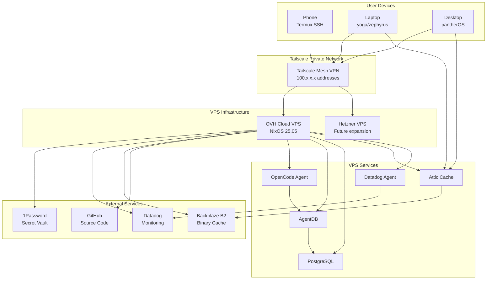

---

## pantherOS Layer Architecture

### Module Organization Hierarchy

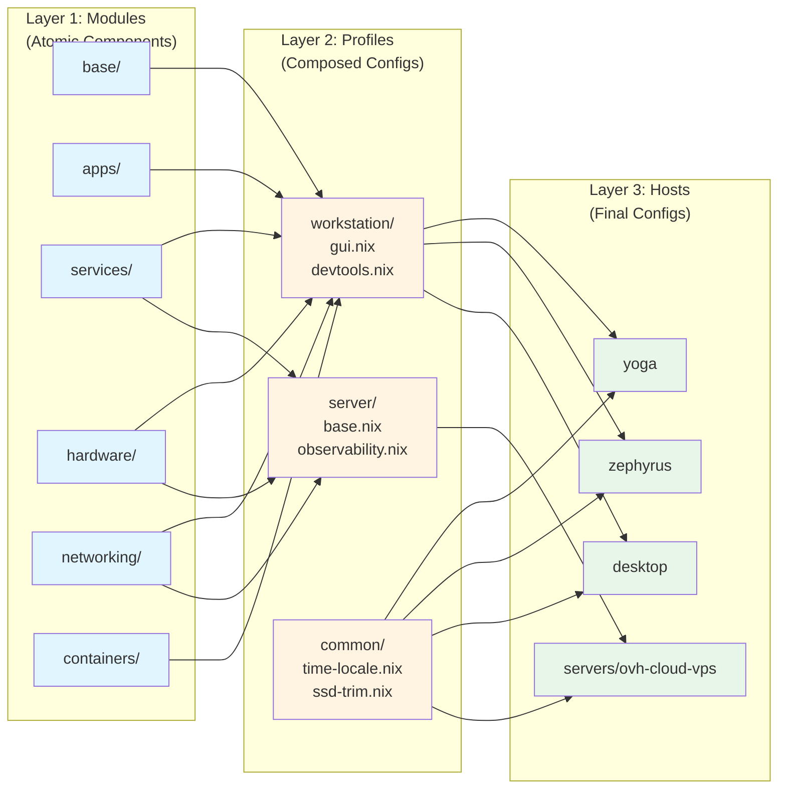

### Flake Structure and Build Process

```mermaid
graph TD
    FLAKE[flake.nix<br/>inputs + outputs]
    
    subgraph "Inputs"
        NPK[nixpkgs 25.05]
        HM[home-manager]
        DISKO[disko]
        OPNIX[opnix]
        NIRI[niri-flake]
        DMS[dankMaterialShell]
    end
    
    subgraph "Helpers"
        LIB[lib/mkSystem.nix<br/>lib/mkHome.nix]
    end
    
    subgraph "Outputs"
        NIXOS[nixosConfigurations<br/>yoga, zephyrus, desktop, ovh]
        HOME[homeConfigurations<br/>hayden@yoga]
        DEV[devShells<br/>default]
    end
    
    FLAKE --> NPK
    FLAKE --> HM
    FLAKE --> DISKO
    FLAKE --> OPNIX
    FLAKE --> NIRI
    FLAKE --> DMS
    
    FLAKE --> LIB
    
    LIB --> NIXOS
    LIB --> HOME
    FLAKE --> DEV
    
    NIXOS --> BUILD[System Build<br/>activationScript]
    HOME --> HMBUILD[HM Build<br/>homeActivation]
    
    BUILD --> SWITCH[nixos-rebuild switch]
    HMBUILD --> HMSWITCH[home-manager switch]
```

---

## Secrets Management Flow

### OpNix Secret Materialization Process

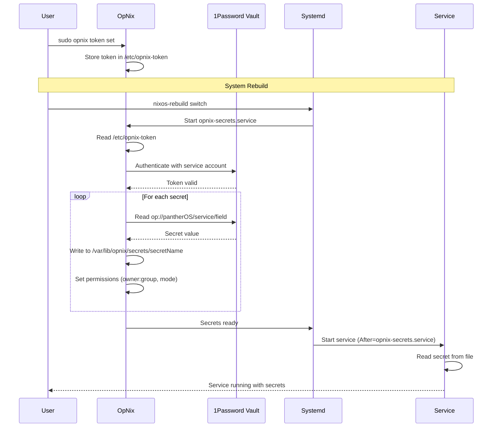

### Secret File Layout

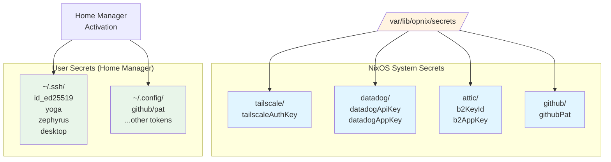

---

## OpenCode+AgentDB Data Flow

### Agent Knowledge Lifecycle

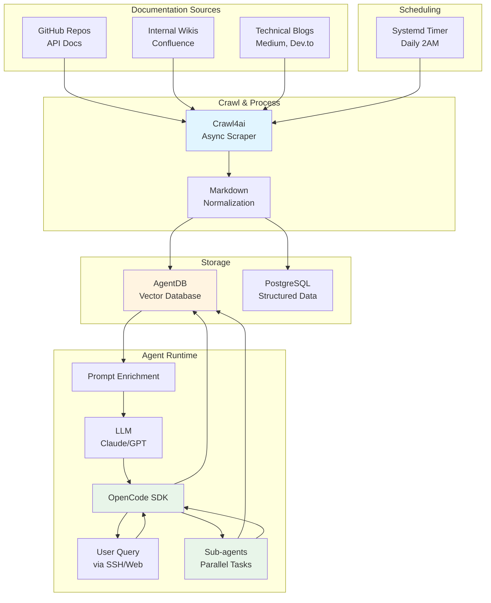

### OpenCode Agent Phases

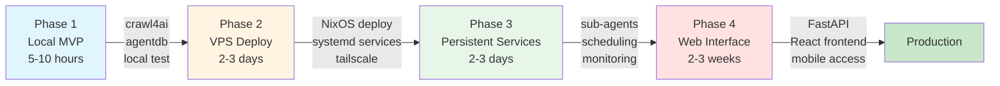

---

## Service Integration

### Service Dependency Graph

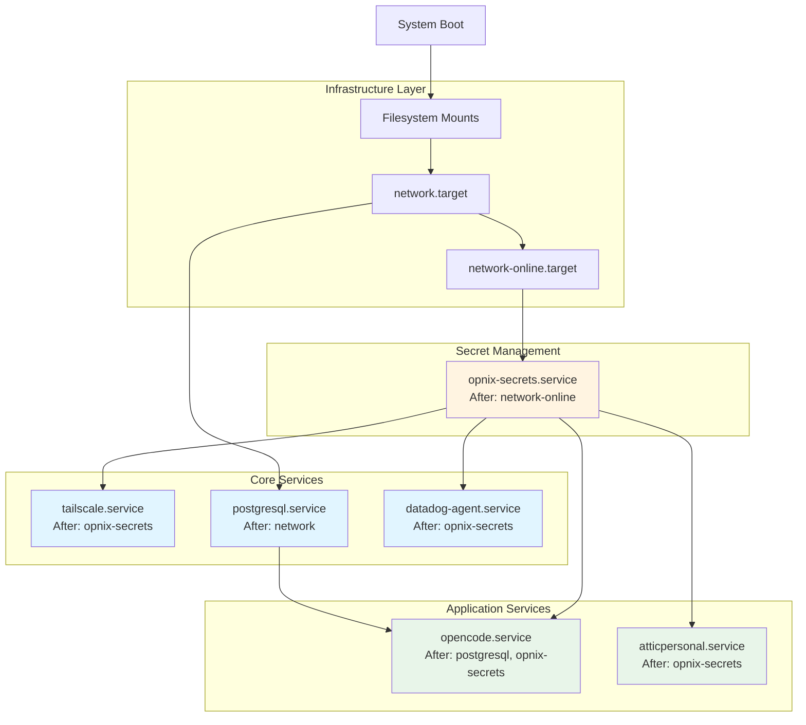

---

## Desktop Environment Stack

### Niri + DankMaterialShell Architecture

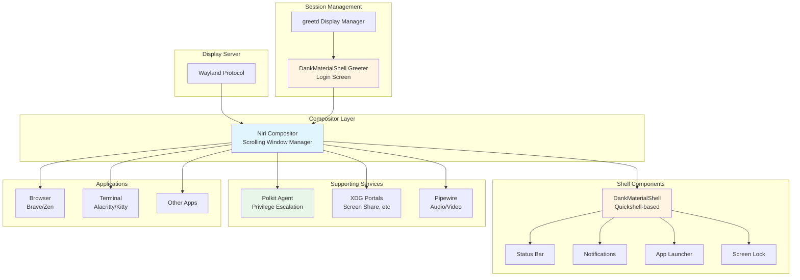

---

## Build and Deployment Pipeline

### NixOS Rebuild Workflow

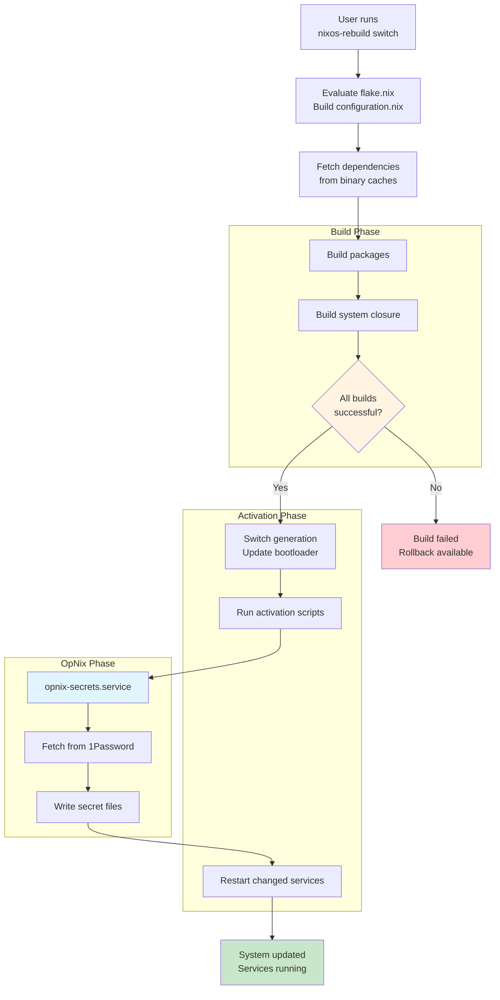

### Multi-Host Deployment Strategy

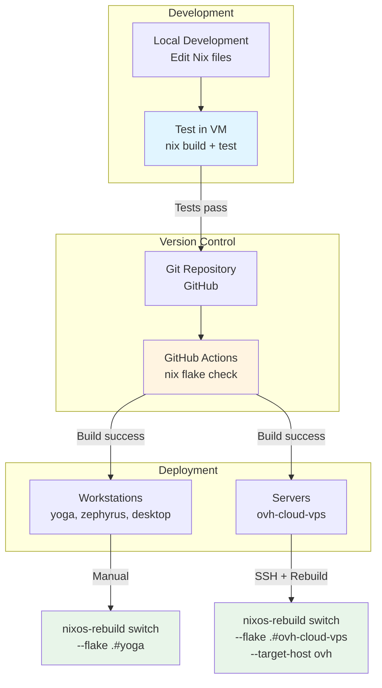

---

## Network Topology

### Tailscale Mesh Network

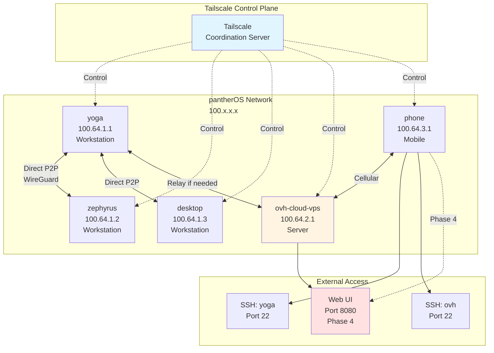

---

## Version History

| Version | Date | Changes |
|---------|------|---------|
| 1.0 | 2025-11-15 | Initial architecture diagrams |

---

**Note for AI Agents**: These diagrams represent the current architecture as of 2025-11-15. Always cross-reference with the latest project brief and implementation guides for up-to-date information.
