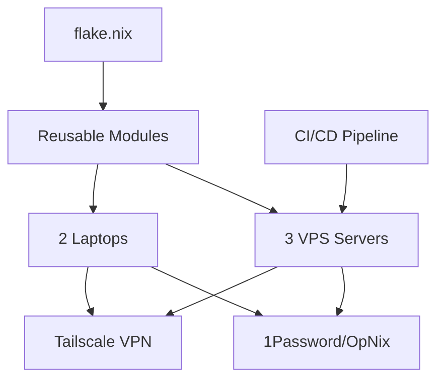
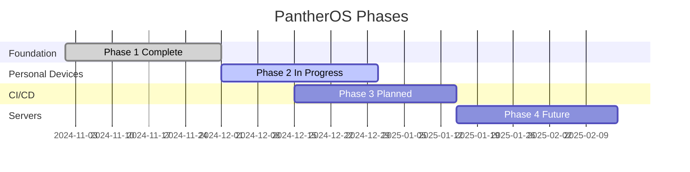

# PantherOS Documentation

> **Complete documentation for the PantherOS NixOS configuration project**  
> **Last Updated:** 2025-12-04

## 📚 Documentation Structure

This documentation is organized into focused areas for easy navigation:

### 🎯 [Overview](overview/)
Quick-start guides and project overview
- **[Project Overview](../README.md)**: Main project README
- **[Implementation Summary](../IMPLEMENTATION-SUMMARY.md)**: GitHub Actions CI/CD implementation

### 🏗️ [Architecture](architecture/)
System design and technical architecture
- **[System Architecture](roadmap/ARCHITECTURE.md)**: Comprehensive architecture documentation with diagrams
- **[Component Overview](#)**: Detailed component breakdowns (TODO)

### 🗺️ [Roadmap](roadmap/)
Project planning and tracking
- **[Project Roadmap](roadmap/PROJECT_ROADMAP.md)**: Phases, milestones, and timeline
- **[GitHub Issues](roadmap/GITHUB_ISSUES.md)**: Issue templates for project board
- **[Dependency Graph](#)**: Visual dependency tracking (in roadmap docs)

### 📋 [Implementation](implementation/)
Technical guides and implementation details
- **[Implementation Roadmap](IMPLEMENTATION_ROADMAP.md)**: Detailed micro-steps for all phases
- **[Hardware Detection](HARDWARE_DETECTION.md)**: Hardware scanning procedures
- **[Hardware Detection Implementation](HARDWARE_DETECTION_IMPLEMENTATION.md)**: Implementation details
- **[Hardware Scanning Workflow](hardware-scanning-workflow.md)**: Step-by-step workflow

### 🎨 [Terminal & Desktop](./)**
Terminal and desktop environment setup
- **[Fish Completions Module](FISH_COMPLETIONS_MODULE.md)**: Fish shell completions
- **[Fish Completions Summary](FISH_COMPLETIONS_SUMMARY.md)**: Implementation summary
- **[Fish Completions Verification](FISH_COMPLETIONS_VERIFICATION.md)**: Testing guide
- **[Zellij Usage](ZELLIJ_USAGE.md)**: Terminal multiplexer guide
- **[Terminal Implementation Roadmap](TERMINAL_IMPLEMENTATION_ROADMAP.md)**: Terminal tools roadmap

### 🚀 [Deployment](./)**
Deployment guides and procedures
- **[Hetzner Deployment](HETZNER_DEPLOYMENT.md)**: Hetzner VPS deployment guide
- **[Contabo Quickstart](CONTABO_QUICKSTART.md)**: Contabo VPS setup

### 🤖 [AI Integration](./)**
AI tools and agent integration
- **[OpenAgent Integration Guide](openagent-integration-guide.md)**: AI agent setup
- **[OpenSpec Implementation Plan](openspec-implementation-plan.md)**: OpenSpec workflow
- **[OpenSpec Implementation Status](OPENSPEC_IMPLEMENTATION_STATUS.md)**: Current status
- **[OpenSpec Completion Summary](OPENSPEC_COMPLETION_SUMMARY.md)**: Completion tracking
- **[OpenSpec Zephyrus Migration](openspec-zephyrus-migration-plan.md)**: Migration planning

### 💡 [Decisions](decisions/)
Architectural Decision Records (ADRs)
- **[ADR Index](decisions/README.md)**: All architectural decisions
- 16 ADRs covering configuration, infrastructure, and tooling choices

### 🔧 [Development](./)**
Development environment and context
- **[Development Environment](DEV_ENVIRONMENT.md)**: Dev environment setup
- **[Context](CONTEXT.md)**: CachyOS optimization context

### 📦 [Hardware](hardware/)**
Hardware specifications and reports
- **[Yoga Facter Report](hardware/yoga-facter.json)**: Lenovo Yoga hardware detection
- **[Zephyrus Facter Report](hardware/)**: ASUS Zephyrus hardware (pending)

### 📝 [Examples](examples/)**
Configuration examples and templates
- Example configurations
- Template files
- Common patterns

---

## 🗂️ Documentation Categories

### By User Type

#### **Administrators**
- [Deployment Guides](#deployment)
- [Architecture Documentation](#architecture)
- [Roadmap & Planning](#roadmap)
- [Hardware Setup](#hardware)

#### **Developers**
- [Development Environment](#development)
- [Implementation Guides](#implementation)
- [OpenSpec Workflow](#ai-integration)
- [Terminal Setup](#terminal--desktop)

#### **Contributors**
- [Decision Records](#decisions)
- [Project Roadmap](#roadmap)
- [GitHub Issues](#roadmap)
- [Architecture](#architecture)

### By Topic

#### **Getting Started**
1. Read [Project Overview](../README.md)
2. Review [Architecture](roadmap/ARCHITECTURE.md)
3. Check [Roadmap](roadmap/PROJECT_ROADMAP.md)
4. Follow deployment guide for your target host

#### **System Configuration**
- [Modular Configuration](#)
- [Home Manager Integration](#)
- [Hardware Detection](hardware-scanning-workflow.md)
- [Secrets Management](../openspec/specs/secrets-management/spec.md)

#### **Infrastructure**
- [Networking](../openspec/specs/networking/spec.md)
- [SSH Hardening](../openspec/specs/ssh-hardening/spec.md)
- [Container Runtime](../openspec/specs/container-runtime/spec.md)
- [CI/CD Pipeline](../IMPLEMENTATION-SUMMARY.md)

#### **Desktop Environment**
- [DankMaterialShell](../openspec/changes/add-dank-material-shell/)
- [Niri Window Manager](../openspec/changes/add-niri-window-manager/)
- [Terminal Tools](../openspec/specs/terminal-tools/spec.md)
- [Terminal Emulator](../openspec/specs/terminal-emulator/spec.md)

---

## 📊 Quick Reference Diagrams

### System Architecture



### Project Phases



---

## 🔍 Finding Documentation

### By File Type

- **Markdown (`.md`)**: All documentation
- **JSON (`.json`)**: Hardware reports, configuration data
- **Nix (`.nix`)**: Actual configuration files (in parent directories)

### Search Tips

```bash
# Find docs by topic
rg -i "tailscale" docs/

# Find all markdown files
find docs/ -name "*.md"

# Search OpenSpec files
rg "Requirement:" openspec/

# Find hardware reports
find docs/hardware/ -name "*.json"
```

### Common Questions

**Q: Where do I start?**  
A: Begin with [Project Overview](../README.md), then [Architecture](roadmap/ARCHITECTURE.md), then [Roadmap](roadmap/PROJECT_ROADMAP.md).

**Q: How do I add a new host?**  
A: See [Hardware Scanning Workflow](hardware-scanning-workflow.md) and [Implementation Roadmap](IMPLEMENTATION_ROADMAP.md).

**Q: Where are the specs?**  
A: Technical specifications are in `../openspec/specs/`, design documents in `../openspec/changes/`.

**Q: How do I deploy changes?**  
A: See deployment guides in [Hetzner Deployment](HETZNER_DEPLOYMENT.md) or use CI/CD pipeline.

**Q: Where are architectural decisions documented?**  
A: All major decisions are in [ADR Index](decisions/README.md).

---

## 📈 Documentation Status

### Completion Status

| Area | Status | Coverage |
|------|--------|----------|
| **Overview** | ✅ Complete | 100% |
| **Architecture** | ✅ Complete | 100% |
| **Roadmap** | ✅ Complete | 100% |
| **ADRs** | ✅ Complete | 16 decisions documented |
| **Implementation** | 🔄 In Progress | ~80% |
| **Deployment** | 🔄 In Progress | ~70% |
| **Desktop** | 📋 Planned | ~30% |
| **Examples** | 📋 Planned | ~20% |

### Recent Updates

- **2025-12-04**: Created comprehensive roadmap and GitHub issues documentation
- **2025-12-04**: Added system architecture diagrams and documentation
- **2025-12-04**: Created ADR index with 16 decisions
- **2024-12-03**: Documented Yoga hardware detection
- **2024-12-02**: Completed GitHub Actions implementation summary

---

## 🤝 Contributing to Documentation

### Documentation Standards

1. **Use Markdown**: All docs in Markdown format
2. **Include Diagrams**: Mermaid diagrams where helpful
3. **Link Extensively**: Cross-reference related docs
4. **Update Dates**: Keep "Last Updated" current
5. **ADHD-Friendly**: TL;DR sections, clear headers, visual aids

### Creating New Documentation

```bash
# Choose appropriate directory
cd docs/[category]/

# Create markdown file
touch new-doc.md

# Follow template structure:
# - Title and metadata
# - TL;DR / Overview
# - Detailed content with headers
# - Diagrams (Mermaid)
# - References and links
# - Last updated date

# Update this README with link to new doc
```

### Documentation Templates

See `.github/ISSUE_TEMPLATE/` for issue templates.

---

## 🔗 External Resources

### NixOS Resources
- [NixOS Manual](https://nixos.org/manual/nixos/stable/)
- [Nix Pills](https://nixos.org/guides/nix-pills/)
- [Home Manager Manual](https://nix-community.github.io/home-manager/)
- [NixOS Wiki](https://nixos.wiki/)

### Tools & Services
- [OpenSpec Documentation](https://github.com/fission-ai/openspec)
- [Tailscale Documentation](https://tailscale.com/kb/)
- [DankMaterialShell](https://github.com/AvengeMedia/DankMaterialShell)
- [Niri Compositor](https://github.com/YaLTeR/niri)

### Development
- [GitHub Copilot](https://github.com/features/copilot)
- [Nix Language](https://nixos.org/manual/nix/stable/language/)

---

## 📝 Documentation Roadmap

### Immediate Priorities
- [ ] Create example configurations
- [ ] Add troubleshooting guides
- [ ] Document common workflows
- [ ] Add video tutorials (optional)

### Short Term
- [ ] Expand implementation guides
- [ ] Add more diagrams
- [ ] Create quickstart guides
- [ ] Document all OpenSpec changes

### Long Term
- [ ] Interactive documentation site
- [ ] Automated docs generation
- [ ] Multi-language support (optional)
- [ ] Community contributions

---

## 📞 Support & Feedback

- **Issues**: Open GitHub issue for documentation problems
- **Improvements**: Submit PR with documentation updates
- **Questions**: Check existing docs first, then ask in discussions

---

**Maintained by**: GitHub Copilot AI Agent  
**Documentation Policy**: Keep docs up-to-date with each code change  
**Review Cycle**: Weekly for active areas, monthly for stable areas  

**Last Major Update**: 2025-12-04  
**Total Documentation Files**: 35+  
**Total Size**: ~300KB of technical documentation
