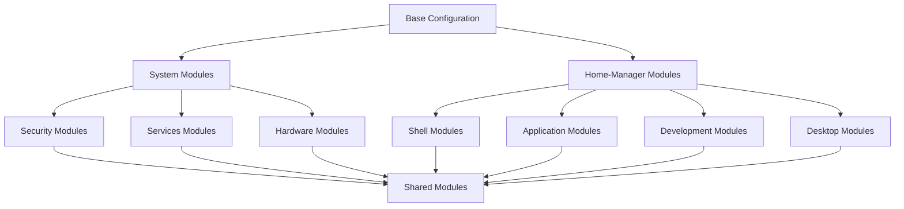

# Module Organization Architecture

This document defines the modular structure, organization principles, and design patterns for the pantherOS configuration modules.

## Modular Architecture Overview

pantherOS implements a comprehensive modular architecture that separates configuration concerns into focused, reusable modules. This approach ensures maintainability, testability, and scalability across 4 different host types with varying requirements.

### Core Modular Principles

1. **Single Concern Principle**: Each module handles one specific functionality
2. **Separation of Concerns**: Clear boundaries between system and user configuration
3. **Composability**: Modules can be combined in different configurations
4. **Testability**: Individual modules can be tested in isolation
5. **Host Type Independence**: Modules work across different host classifications
6. **Dependency Management**: Clear dependency relationships without circular dependencies

## Module Categories

### System Modules (modules/nixos/)

System modules handle operating system configuration, services, and infrastructure.

#### Core System Modules
```nix
modules/nixos/core/
├── base/              # Fundamental system configuration
│   ├── network.nix           # Network configuration
│   ├── users.nix             # User and group management
│   ├── systemd.nix           # Systemd configuration
│   ├── time.nix              # Time and timezone configuration
│   ├── locale.nix            # Localization settings
│   └── boot/                 # Bootloader and initrd
│       ├── grub.nix          # GRUB bootloader
│       ├── initrd.nix        # Initrd configuration
│       └── kernel.nix        # Kernel parameters
```

**Design Pattern**: Core modules provide fundamental system services that all other modules depend on.

```nix
# modules/nixos/core/base/network.nix
{ config, lib, ... }:

{
  options.networking.pantherOS = {
    enable = lib.mkEnableOption "pantherOS networking";
    hostType = lib.mkOption {
      type = lib.types.enum [ "workstation" "server" ];
      description = "Network configuration based on host type";
    };
  };
  
  config = lib.mkIf config.networking.pantherOS.enable {
    # Network configuration based on host type
    networking = lib.mkMerge [
      (lib.mkIf (config.networking.pantherOS.hostType == "workstation") {
        networkManager.enable = true;
        usePredictableInterfaceNames = false;
      })
      (lib.mkIf (config.networking.pantherOS.hostType == "server") {
        systemd.network.enable = true;
        usePredictableInterfaceNames = true;
      })
    ];
  };
}
```

#### Services Modules
```nix
modules/nixos/services/
├── ssh/
│   ├── server.nix            # SSH server configuration
│   └── client.nix            # SSH client configuration
├── tailscale/
│   ├── enable.nix            # Tailscale service enablement
│   ├── config.nix            # Tailscale configuration
│   └── acl.nix               # Access control list management
├── reverse-proxy/
│   ├── caddy.nix             # Caddy reverse proxy
│   └── nginx.nix             # Nginx reverse proxy (alternative)
├── containers/
│   ├── podman.nix            # Podman container runtime
│   └── docker.nix            # Docker container runtime (legacy)
├── databases/
│   ├── postgresql.nix        # PostgreSQL database
│   └── redis.nix             # Redis cache/database
└── monitoring/
    ├── prometheus.nix        # Metrics collection
    └── grafana.nix           # Metrics visualization
```

**Design Pattern**: Services modules are self-contained and can be enabled independently.

```nix
# modules/nixos/services/tailscale/enable.nix
{ config, lib, ... }:

{
  options.services.tailscale = {
    enable = lib.mkEnableOption "Tailscale mesh networking";
    exitNode = lib.mkEnableOption "Enable this host as Tailscale exit node";
    acl = lib.mkEnableOption "Enable Tailscale ACL management";
  };
  
  config = lib.mkIf config.services.tailscale.enable {
    imports = [
      ./config.nix
      (lib.mkIf config.services.tailscale.exitNode ./exit-node.nix)
      (lib.mkIf config.services.tailscale.acl ./acl.nix)
    ];
    
    environment.systemPackages = [ pkgs.tailscale ];
    
    systemd.services.tailscale = {
      enable = true;
      wantedBy = [ "multi-user.target" ];
      after = [ "network-pre.target" ];
    };
  };
}
```

#### Security Modules
```nix
modules/nixos/security/
├── firewall/
│   ├── workstation.nix       # Workstation firewall rules
│   └── server.nix            # Server firewall rules
├── ssh/
│   ├── hardening.nix         # SSH security hardening
│   └── keys.nix              # SSH key management
├── certificates/
│   ├── acme.nix              # Let's Encrypt certificate automation
│   └── cloudflare.nix        # Cloudflare DNS integration
└── audit/
    ├── auditd.nix            # Linux audit subsystem
    └── fail2ban.nix          # Intrusion prevention
```

**Design Pattern**: Security modules provide defense-in-depth with host-specific configurations.

```nix
# modules/nixos/security/firewall/workstation.nix
{ config, lib, ... }:

{
  options.networking.firewall = {
    enable = lib.mkEnableOption "Workstation firewall";
    trustedInterfaces = lib.mkOption {
      type = lib.types.listOf lib.types.str;
      default = [ "lo" "tailscale0" ];
    };
  };
  
  config = lib.mkIf config.networking.firewall.enable {
    networking.firewall = {
      enable = true;
      defaultInputPolicy = "DROP";
      trustedInterfaces = config.networking.firewall.trustedInterfaces;
      allowedTCPPorts = [ 22 80 443 ];
      allowedUDPPorts = [ 53 67 ];
      allowedOutgoingPorts = [ "*" ];
    };
  };
}
```

#### Hardware Modules
```nix
modules/nixos/hardware/
├── yoga/                     # Yoga-specific hardware configuration
│   ├── battery.nix           # Battery optimization
│   ├── touch.nix             # Touchscreen configuration
│   └── rotation.nix          # Display rotation handling
├── zephyrus/                 # Zephyrus-specific hardware configuration
│   ├── gpu.nix               # NVIDIA/AMD GPU configuration
│   ├── thermal.nix           # Thermal management
│   └── multi-ssd.nix         # Multi-SSD configuration
└── servers/                  # Server-specific hardware
    ├── virtualisation.nix    # Virtualization support
    └── cloud.nix             # Cloud provider integration
```

**Design Pattern**: Hardware modules provide device-specific optimizations and work with hardware detection.

```nix
# modules/nixos/hardware/yoga/battery.nix
{ config, lib, ... }:

{
  options.hardware.battery = {
    enable = lib.mkEnableOption "Battery optimization";
    powerProfiles = lib.mkEnableOption "TLP power profiles";
  };
  
  config = lib.mkIf config.hardware.battery.enable {
    # Battery-focused kernel parameters
    boot.kernelParams = [
      "intel_pstate=passive"      # CPU frequency scaling
      "nvme.noacpi=1"             # NVMe power management
      "rfkill.default_state=0"    # WiFi power management
    ];
    
    # Power management services
    services.tlp = {
      enable = lib.mkIf config.hardware.battery.powerProfiles true;
      settings = {
        CPU_SCALING_GOVERNOR_ON_AC = "performance";
        CPU_SCALING_GOVERNOR_ON_BAT = "powersave";
        WIFI_PWR_ON_AC = "on";
        WIFI_PWR_ON_BAT = "off";
      };
    };
  };
}
```

### Home-Manager Modules (modules/home-manager/)

Home-manager modules handle user-level configuration, applications, and development environment.

#### Shell Modules
```nix
modules/home-manager/shell/
├── fish/
│   ├── base.nix              # Fish shell configuration
│   ├── completions.nix       # Shell completions
│   └── functions.nix         # Custom shell functions
├── ghostty/
│   ├── configuration.nix     # Terminal configuration
│   ├── theme.nix             # Visual theme
│   └── keybindings.nix       # Keyboard shortcuts
├── terminal/
│   ├── clipboard.nix         # Clipboard integration
│   └── color-scheme.nix      # Color management
└── terminal-multiplexer/
    ├── tmux.nix              # TMUX configuration
    └── zellij.nix            # Zellij configuration
```

**Design Pattern**: Shell modules provide consistent terminal experience across all hosts.

```nix
# modules/home-manager/shell/fish/base.nix
{ config, lib, ... }:

{
  options.programs.fish = {
    enable = lib.mkEnableOption "Fish shell";
    plugins = lib.mkOption {
      type = lib.types.listOf lib.types.str;
      default = [ "fish" "fzf" "zoxide" ];
      description = "Fish plugins to install";
    };
  };
  
  config = lib.mkIf config.programs.fish.enable {
    programs.fish = {
      enable = true;
      vendor = {
        plugins = config.programs.fish.plugins;
      };
      
      # Shell configuration
      shellInit = ''
        # Auto-activate devShell in ~/dev
        if test -d "$HOME/dev" -a "$PWD" = "$HOME/dev"
          nix develop .#devShell --command fish
        end
      '';
      
      # Environment variables
      interactiveShellInit = ''
        # Set development environment
        set -gx EDITOR "zed"
        set -gx VISUAL "zed"
        set -gx TERMINAL "ghostty"
      '';
    };
    
    # Fish shell package
    home.packages = [ pkgs.fish ];
  };
}
```

#### Applications Modules
```nix
modules/home-manager/applications/
├── 1password/
│   ├── gui.nix               # 1Password GUI application
│   ├── cli.nix               # 1Password CLI
│   └── integration.nix       # System integration
├── zed/
│   ├── configuration.nix     # Zed IDE settings
│   ├── extensions.nix        # Zed extensions
│   └── themes.nix            # Color themes
├── browser/
│   ├── firefox.nix           # Firefox configuration
│   ├── zen-browser.nix       # Zen Browser (privacy-focused)
│   └── chromium.nix          # Chromium configuration
└── productivity/
    ├── calculator.nix        # Calculator applications
    ├── notes.nix             # Note-taking applications
    └── pdf.nix               # PDF reader configuration
```

**Design Pattern**: Applications modules provide declarative configuration for user applications.

```nix
# modules/home-manager/applications/zed/configuration.nix
{ config, lib, ... }:

{
  options.programs.zed = {
    enable = lib.mkEnableOption "Zed IDE";
    extensions = lib.mkOption {
      type = lib.types.listOf lib.types.str;
      default = [
        "rust-analyzer"
        "typescript-language-server"
        "pyright"
        "gopls"
      ];
    };
    theme = lib.mkOption {
      type = lib.types.str;
      default = "One Dark";
      description = "Color theme for Zed";
    };
  };
  
  config = lib.mkIf config.programs.zed.enable {
    programs.zed = {
      enable = true;
      
      # Zed configuration
      settings = {
        "theme" = config.programs.zed.theme;
        "editor" = {
          "font_size" = 14;
          "font_family" = "JetBrains Mono";
          "line_height" = 1.5;
        };
        "terminal" = {
          "shell" = "fish";
          "font_family" = "JetBrains Mono";
        };
      };
      
      # Extensions
      extensions = config.programs.zed.extensions;
    };
    
    home.packages = [ pkgs.zed-editor ];
  };
}
```

#### Development Modules
```nix
modules/home-manager/development/
├── languages/
│   ├── node.nix              # Node.js configuration
│   ├── python.nix            # Python configuration
│   ├── go.nix                # Go configuration
│   ├── rust.nix              # Rust configuration
│   └── nix.nix               # Nix configuration
├── tools/
│   ├── git.nix               # Git configuration
│   ├── docker.nix            # Docker CLI configuration
│   ├── podman.nix            # Podman CLI configuration
│   └── kubernetes.nix        # Kubernetes tools
├── ai-tools/
│   ├── claude-code.nix       # Claude Code CLI
│   ├── opencode.nix          # OpenCode.ai
│   └── qwen-code.nix         # Qwen Code
└── lsp/
    ├── typescript.nix        # TypeScript LSP servers
    ├── python.nix            # Python LSP servers
    ├── rust.nix              # Rust LSP servers
    └── go.nix                # Go LSP servers
```

**Design Pattern**: Development modules provide consistent development environment across all hosts.

```nix
# modules/home-manager/development/languages/node.nix
{ config, lib, ... }:

{
  options.programs.node = {
    enable = lib.mkEnableOption "Node.js development environment";
    version = lib.mkOption {
      type = lib.types.str;
      default = "lts";
      description = "Node.js version to use";
    };
    globalPackages = lib.mkOption {
      type = lib.types.listOf lib.types.str;
      default = [
        "typescript"
        "prettier"
        "eslint"
        "jest"
        "yarn"
      ];
    };
  };
  
  config = lib.mkIf config.programs.node.enable {
    # Node.js via nix
    nixpkgs.overlays = [
      (final: prev: {
        nodejs = prev.nodejs-18_x;
        yarn = prev.yarn-1_x;
      })
    ];
    
    # Global packages via npm
    programs.npm = {
      enable = true;
      # NixOS npm requires special handling
      package = config.lib.nix.getPackage "npm";
    };
    
    home.packages = builtins.map (pkg: pkgs.${pkg}) config.programs.node.globalPackages;
    
    # Environment setup
    home.sessionVariables = {
      NODE_ENV = "development";
      NPM_CONFIG_PREFIX = "$HOME/.npm-global";
    };
  };
}
```

#### Desktop Modules
```nix
modules/home-manager/desktop/
├── window-manager/
│   ├── niri.nix              # Niri window manager
│   ├── i3.nix                # i3 window manager (legacy)
│   └── wayfire.nix           # Wayfire compositor
├── dms/                      # DankMaterialShell components
│   ├── greeter.nix           # DankGreeter login screen
│   ├── system.nix            # DankGop system monitoring
│   ├── search.nix            # DankSearch application launcher
│   └── shell.nix             # DankMaterialShell UI layer
├── workspace/
│   ├── panels.nix            # Taskbar/panel configuration
│   ├── notifications.nix     # Notification system
│   └── keybindings.nix       # Global keyboard shortcuts
└── graphics/
    ├── display.nix           # Display configuration
    ├── cursor.nix            # Cursor themes
    └── wallpaper.nix         # Dynamic wallpapers
```

**Design Pattern**: Desktop modules provide complete desktop environment configuration.

```nix
# modules/home-manager/desktop/window-manager/niri.nix
{ config, lib, ... }:

{
  options.programs.niri = {
    enable = lib.mkEnableOption "Niri window manager";
    theme = lib.mkOption {
      type = lib.types.str;
      default = "dark";
      description = "Niri color theme";
    };
    multiMonitor = lib.mkEnableOption "Multi-monitor support";
  };
  
  config = lib.mkIf config.programs.niri.enable {
    programs.niri = {
      enable = true;
      
      # Niri configuration
      config = {
        startup = [
          "dms start"
          "wl-clipboard daemon"
          "xfce4-power-manager"
        ];
        
        layout = {
          "theme" = config.programs.niri.theme;
          "border_radius" = 8;
          "border_width" = 2;
        };
        
        workspaces = {
          "per_monitor" = config.programs.niri.multiMonitor;
          "count" = 10;
        };
        
        keybindings = {
          "mod+Return" = "spawn terminal";
          "mod+Q" = "close-window";
          "mod+Space" = "dms search";
          "Print" = "screenshot";
        };
      };
    };
    
    # Desktop integration
    xdg.welcome.enable = true;
    xdg.sessionManagement.enable = true;
    
    # Required packages
    home.packages = [
      pkgs.niri
      pkgs.dms
      pkgs.wl-clipboard
      pkgs.screenshot-tools
    ];
  };
}
```

### Shared Modules (modules/shared/)

Shared modules provide common functionality used by both system and home-manager modules.

#### Base Configuration
```nix
modules/shared/
├── base/
│   ├── options.nix           # Common options definition
│   ├── utils.nix             # Utility functions
│   └── constants.nix         # Shared constants
├── validation/
│   ├── config.nix            # Configuration validation
│   └── testing.nix           # Module testing utilities
└── integration/
    ├── host-type.nix         # Host type detection
    ├── profiles.nix          # Profile management
    └── compatibility.nix     # Cross-module compatibility
```

**Design Pattern**: Shared modules centralize common functionality and prevent duplication.

```nix
# modules/shared/base/options.nix
{ config, lib, ... }:

{
  options.pantherOS = {
    hostType = lib.mkOption {
      type = lib.types.enum [ "workstation" "server" ];
      default = "workstation";
      description = "Host classification for configuration selection";
    };
    
    environment = lib.mkOption {
      type = lib.types.enum [ "development" "production" "testing" ];
      default = "development";
      description = "Environment type for feature flags";
    };
    
    profile = lib.mkOption {
      type = lib.types.str;
      default = "base";
      description = "Configuration profile to apply";
    };
  };
}
```

## Module Dependencies

### Dependency Hierarchy



### Dependency Management

#### Explicit Dependencies
```nix
# modules/nixos/services/caddy.nix
{ config, lib, ... }:

{
  options.services.caddy = {
    enable = lib.mkEnableOption "Caddy reverse proxy";
  };
  
  config = lib.mkIf config.services.caddy.enable {
    # Explicit dependency on security modules
    imports = [
      <modules/nixos/security/certificates/acme.nix>
      <modules/shared/integration/host-type.nix>
    ];
    
    # Dependency on firewall
    config.networking.firewall.allowedTCPPorts = [ 80 443 ];
  };
}
```

#### Implicit Dependencies
```nix
# modules/nixos/services/tailscale.nix
{ config, lib, ... }:

{
  options.services.tailscale = {
    enable = lib.mkEnableOption "Tailscale networking";
  };
  
  config = lib.mkIf config.services.tailscale.enable {
    # Implicit dependency on network configuration
    networking.firewall.trustedInterfaces = [ "tailscale0" ];
    
    # Configure based on host type (implicit dependency)
    services.tailscale.exitNode = config.pantherOS.hostType == "server";
  };
}
```

#### No Dependencies Pattern
```nix
# modules/home-manager/applications/browser/firefox.nix
{ config, lib, ... }:

{
  options.programs.firefox = {
    enable = lib.mkEnableOption "Firefox browser";
  };
  
  config = lib.mkIf config.programs.firefox.enable {
    # Self-contained module with no dependencies
    programs.firefox = {
      enable = true;
      policies = {
        DisableTelemetry = true;
        EnableTrackingProtection = true;
      };
    };
    
    home.packages = [ pkgs.firefox ];
  };
}
```

## Module Import Patterns

### Host Configuration Imports
```nix
# hosts/yoga/default.nix
{ config, lib, ... }:

{
  # Base imports
  imports = [
    <modules/shared/base/options.nix>
    <modules/nixos/core/base>
    <modules/nixos/security/firewall/workstation.nix>
    <modules/home-manager/shell/fish.nix>
  ];
  
  # Host-specific configuration
  config = {
    pantherOS.hostType = "workstation";
    pantherOS.profile = "yoga";
    
    # Apply workstation-specific modules
    imports = [
      <modules/nixos/hardware/yoga>
      <modules/home-manager/desktop/niri>
      <modules/home-manager/applications/zed>
    ];
  };
}
```

### Profile-Based Imports
```nix
# profiles/workstation.nix
{ config, lib, ... }:

{
  options.pantherOS.profile = {
    workstation = lib.mkOption {
      type = lib.types.str;
      default = "workstation-base";
    };
  };
  
  imports = [
    <profiles/base>
    <profiles/desktop>
    <profiles/development>
    <profiles/applications>
  ];
}
```

## Module Testing

### Unit Testing
```nix
# modules/testing/utils.nix
{ config, lib, ... }:

{
  options.pantherOS.testing = {
    enable = lib.mkEnableOption "Module testing utilities";
    dryRun = lib.mkEnableOption "Perform dry-run testing";
  };
  
  config = lib.mkIf config.pantherOS.testing.enable {
    # Testing utilities
    environment.systemPackages = [ pkgs.nix-instantiate ];
    
    # Test script
    environment.etc."test-modules.sh".text = ''
      #!/bin/sh
      set -e
      
      for module in $1; do
        echo "Testing module: $module"
        nix-instantiate --strict --eval --json "$module" > /dev/null
        echo "✓ Module $module passes validation"
      done
    '';
    
    system.activationScripts."module-testing" = {
      text = ''
        #!/bin/sh
        ${config.pantherOS.testing.dryRun} && echo "Testing module configuration..." || true
      '';
      deps = [ "nix-instantiate" ];
    };
  };
}
```

### Integration Testing
```nix
# modules/testing/host-integration.nix
{ config, lib, ... }:

{
  options.pantherOS.testing.integration = {
    enable = lib.mkEnableOption "Host integration testing";
    buildTest = lib.mkEnableOption "Build host configurations for testing";
  };
  
  config = lib.mkIf config.pantherOS.testing.integration.enable {
    # Integration test script
    environment.etc."test-hosts.sh".text = ''
      #!/bin/sh
      set -e
      
      hosts="yoga zephyrus hetzner-vps ovh-vps"
      
      for host in $hosts; do
        echo "Testing host configuration: $host"
        nixos-rebuild build --flake .#$host
        echo "✓ Host $host builds successfully"
      done
    '';
    
    # Make test script executable
    system.activationScripts."test-hosts" = {
      text = ''
        chmod +x /etc/test-hosts.sh
      '';
      deps = [ "test-hosts.sh" ];
    };
  };
}
```

## Module Documentation

### Module Documentation Template
```nix
# modules/nixos/services/example-service.nix
{ config, lib, ... }:

{
  meta = {
    # Module metadata for documentation
    description = "Example service module";
    maintainers = [ "hbohlen" ];
    # See documentation at: ../modules/nixos/services/example-service.md
  };
  
  options.services.example-service = {
    enable = lib.mkEnableOption "example service";
    port = lib.mkOption {
      type = lib.types.port;
      default = 8080;
      description = "Port to run example service on";
    };
    host = lib.mkOption {
      type = lib.types.str;
      default = "localhost";
      description = "Host interface to bind to";
    };
  };
  
  config = lib.mkIf config.services.example-service.enable {
    # Service configuration
    systemd.services.example-service = {
      enable = true;
      wantedBy = [ "multi-user.target" ];
      serviceConfig = {
        ExecStart = "${pkgs.example-service}/bin/example-service --port ${toString config.services.example-service.port} --host ${config.services.example-service.host}";
        Restart = "on-failure";
      };
    };
    
    # Network configuration
    networking.firewall.allowedTCPPorts = [ config.services.example-service.port ];
    
    # Package requirement
    environment.systemPackages = [ pkgs.example-service ];
  };
  
  # Module import documentation
  imports = [
    <modules/shared/validation/config.nix>
  ];
}
```

### Documentation Cross-References
```markdown
# modules/nixos/services/example-service.md
# Example Service Module

This module provides configuration for the example service.

## Usage

Enable the module in your host configuration:

```nix
{
  services.example-service = {
    enable = true;
    port = 8080;
    host = "0.0.0.0";
  };
}
```

## Dependencies

- `modules/nixos/core/base/network.nix` - Network configuration
- `modules/nixos/security/firewall/*.nix` - Firewall configuration

## Related Modules

- [Reverse Proxy Configuration](../reverse-proxy/)
- [Security Hardening](../../security/)

## Host Compatibility

- **Workstations**: Enabled with GUI integration
- **Servers**: Enabled with network access control
```

## Cross-Reference Integration

### Host Type Integration
```nix
# modules/shared/integration/host-type.nix
{ config, lib, ... }:

{
  options.pantherOS.hostType = {
    # Host type is used throughout the module system
    type = lib.types.enum [ "workstation" "server" ];
  };
  
  config = {
    # Provide host type information to all modules
    assertions = [
      {
        assertion = config.pantherOS.hostType != null;
        message = "Host type must be defined";
      }
    ];
    
    # Host type determines default module selection
    systemModules = lib.mkIf (config.pantherOS.hostType == "server") [
      <modules/nixos/services/tailscale>
      <modules/nixos/services/caddy>
      <modules/nixos/security/firewall/server>
    ];
    
    userModules = lib.mkIf (config.pantherOS.hostType == "workstation") [
      <modules/home-manager/desktop/niri>
      <modules/home-manager/applications/zed>
    ];
  };
}
```

### Profile Integration
```nix
# modules/shared/integration/profiles.nix
{ config, lib, ... }:

{
  options.pantherOS.profiles = {
    base = lib.mkEnableOption "Base profile - all hosts";
    workstation = lib.mkEnableOption "Workstation profile";
    server = lib.mkEnableOption "Server profile";
    development = lib.mkEnableOption "Development profile";
    security = lib.mkEnableOption "Security-hardened profile";
  };
  
  config = {
    # Profile-based module selection
    imports = [
      (lib.mkIf config.pantherOS.profiles.base <modules/shared/base>)
      (lib.mkIf config.pantherOS.profiles.workstation <modules/home-manager/desktop>)
      (lib.mkIf config.pantherOS.profiles.server <modules/nixos/services>)
      (lib.mkIf config.pantherOS.profiles.security <modules/nixos/security>)
    ];
  };
}
```

## Related Documentation

- [System Architecture Overview](./overview.md)
- [Host Classification](./host-classification.md)
- [Security Model](./security-model.md)
- [Disk Layouts](./disk-layouts.md)
- [Module Development Guide](../guides/module-development.md)
- [Module Creation Checklist](../../AGENTS.md#module-creation-checklist)

---

**Maintained by:** hbohlen  
**Last Updated:** 2025-11-20  
**Version:** 1.0