# Architecture Diagrams - Cross-System Integration

**Last Updated:** 2025-11-15 10:16:10  
**Author:** MiniMax Agent  
**Purpose:** Visual architecture documentation for optimized documentation systems

## System Integration Overview

### Integrated Ecosystem Architecture

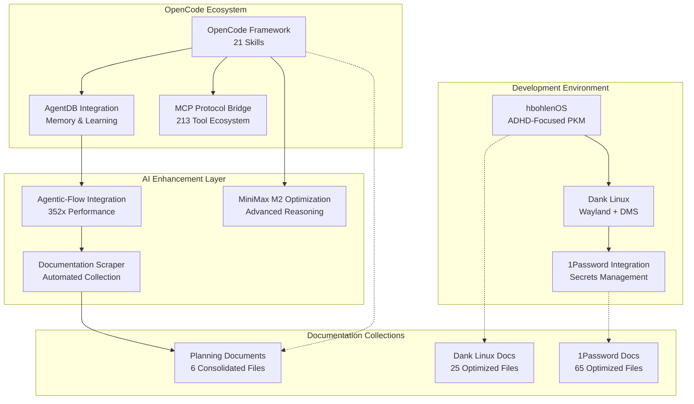

## AgentDB-OpenCode Integration Architecture

### Memory-Enhanced AI Agent System

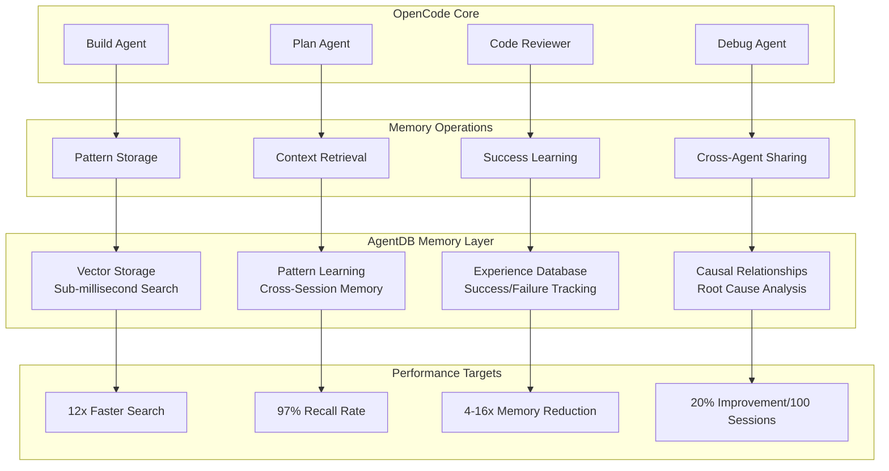

## hbohlenOS Architecture

### ADHD-Focused Personal Knowledge Management

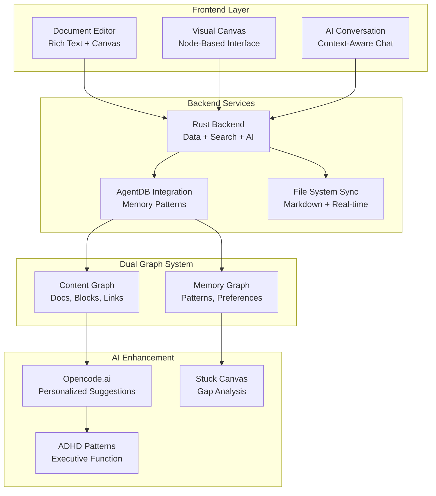

## Dank Linux Architecture

### Integrated Wayland Desktop Environment

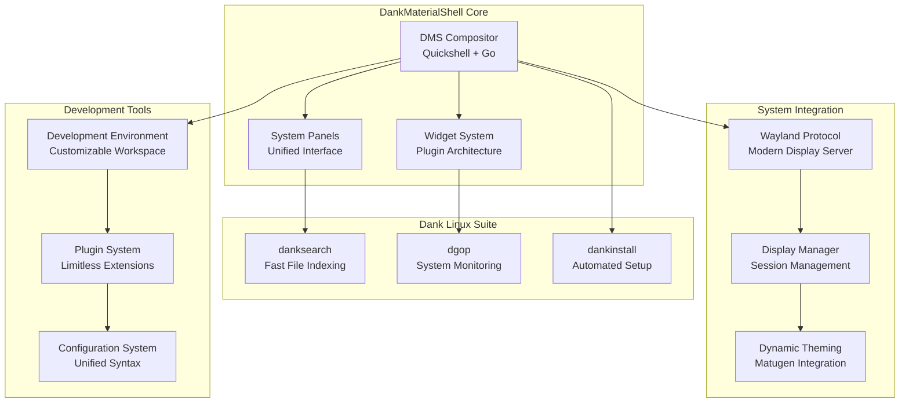

## 1Password Developer Integration

### Comprehensive Secrets Management Ecosystem

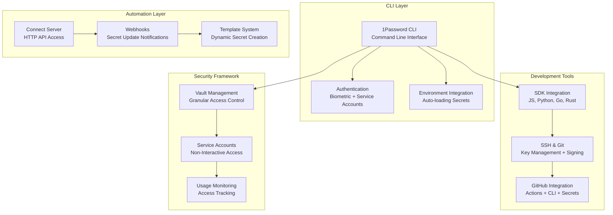

## Documentation Scraper System Architecture

### AI-Powered Knowledge Collection

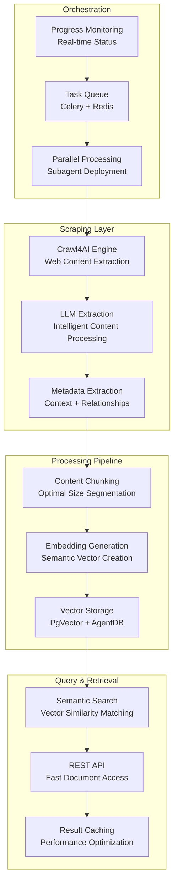

## MiniMax M2 Optimization Architecture

### Enhanced AI Model Configuration

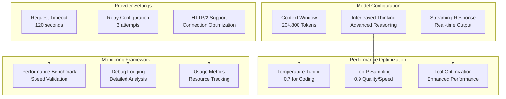

## Agentic-Flow Integration Architecture

### High-Performance Tool Ecosystem Bridge

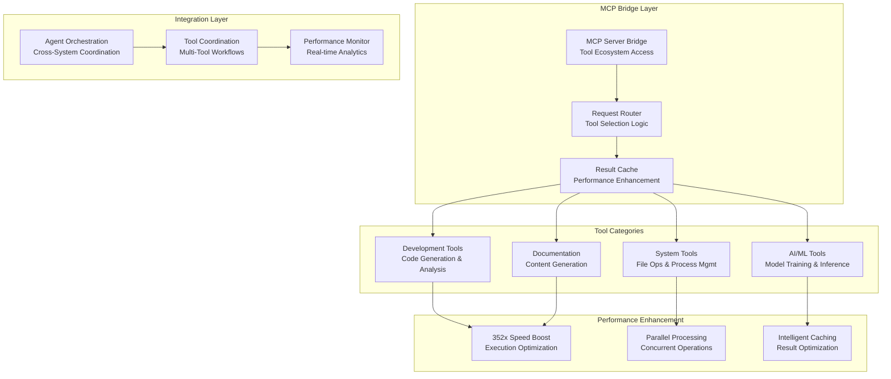

## Cross-System Data Flow

### Integrated Information Architecture

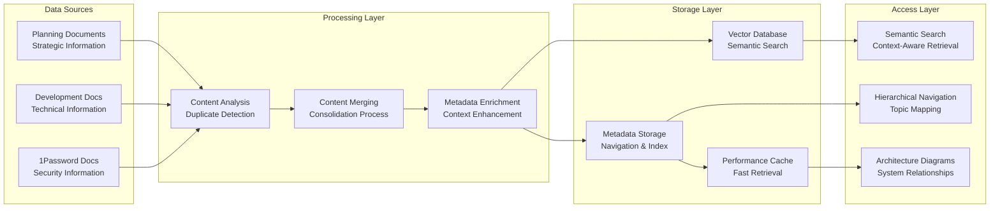

## Performance Optimization Network

### System-Wide Performance Architecture

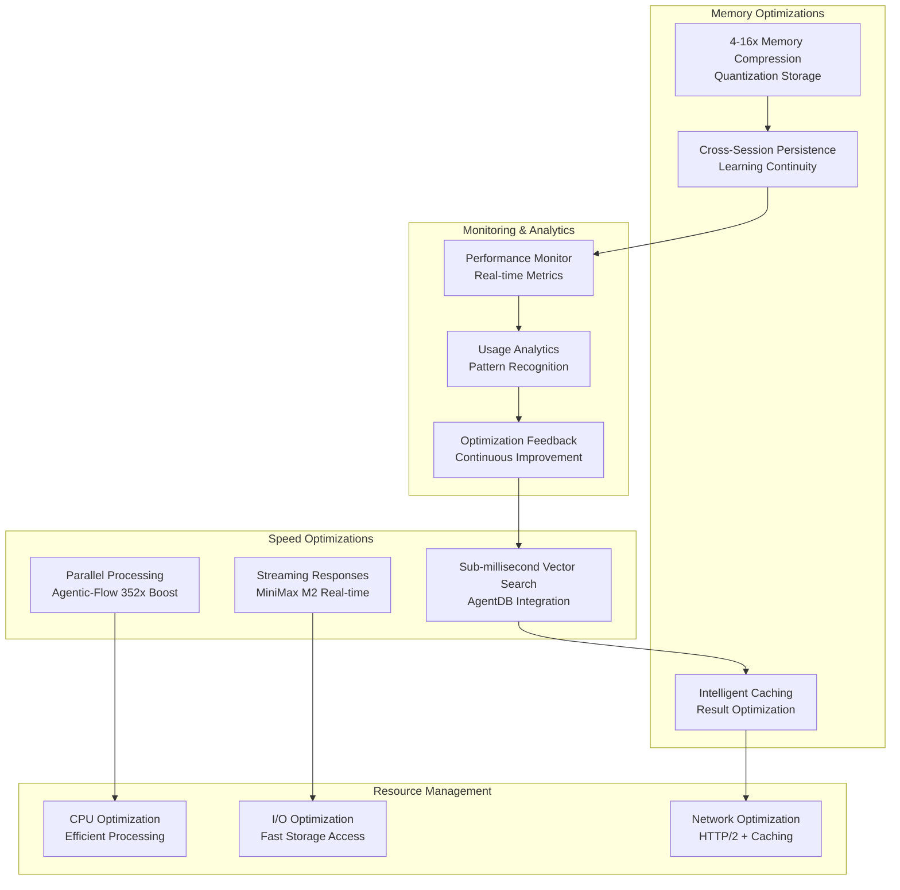

## Security Architecture

### Comprehensive Security Framework

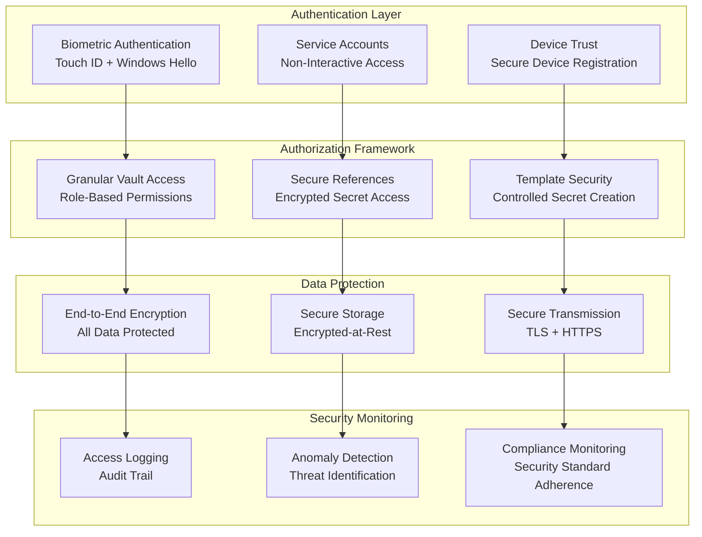

## Deployment Architecture

### Production Environment Architecture

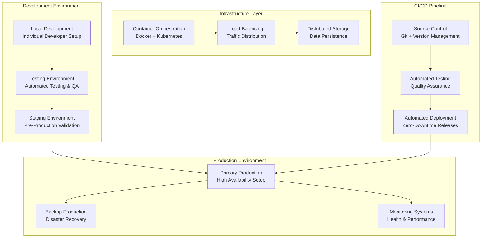

## User Experience Architecture

### Integrated User Journey

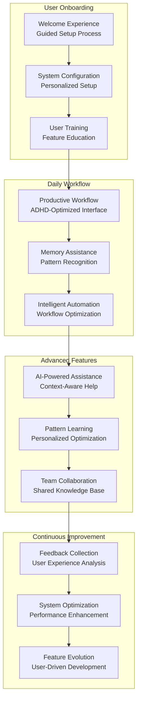

---

## Summary

These architecture diagrams illustrate the comprehensive integration across all optimized documentation collections:

### Key Integration Points:
1. **OpenCode Ecosystem** with AgentDB memory and Agentic-Flow performance
2. **hbohlenOS** as ADHD-focused development environment
3. **Dank Linux** providing unified Wayland desktop experience
4. **1Password** securing all development workflows
5. **Documentation Scraper** enabling automated knowledge collection

### Performance Optimizations:
- **352x speed improvement** through Agentic-Flow integration
- **Sub-millisecond vector search** via AgentDB
- **4-16x memory compression** through quantization
- **Real-time streaming** with MiniMax M2 optimization

### Security Framework:
- **Biometric authentication** with Touch ID/Windows Hello
- **Service accounts** for automated access
- **Granular vault permissions** for role-based access
- **End-to-end encryption** for all sensitive data

This architecture enables a truly integrated, high-performance, secure development environment optimized for productivity and ADHD-specific needs.

---

**Related Documents:**
- [Master Topic Map](../00_MASTER_TOPIC_MAP.md)
- [Planning Documents](../planning_documents/00_MASTER_PROJECT_PLANS.md)
- [Dank Linux Guide](../dank_linux_docs/00_dank_linux_master_guide.md)
- [1Password Guide](../onepassword_docs/MASTER_1PASSWORD_GUIDE.md)