# PantherOS System Architecture

> **Last Updated:** 2025-12-04  
> **Status:** Living Document  
> **Purpose:** Comprehensive architectural overview of the PantherOS project

## Table of Contents

1. [System Overview](#system-overview)
2. [Component Architecture](#component-architecture)
3. [Data Flow](#data-flow)
4. [Infrastructure Layout](#infrastructure-layout)
5. [Security Architecture](#security-architecture)
6. [Development Workflow](#development-workflow)

---

## System Overview

PantherOS is a multi-host NixOS configuration system managing both server and personal device infrastructure through declarative configuration.

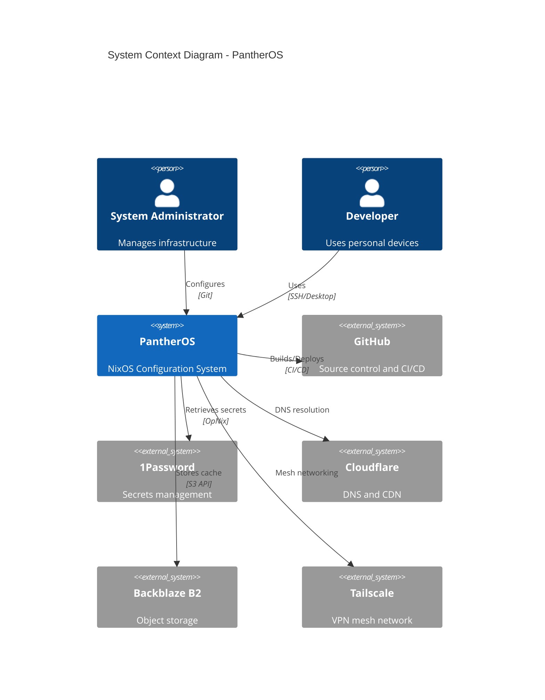

### Key Characteristics

- **Declarative**: All configuration in Nix language
- **Reproducible**: Identical builds from same inputs
- **Multi-Host**: Manages 5 hosts (3 servers + 2 laptops)
- **Automated**: CI/CD for testing and deployment
- **Secure**: Centralized secrets management

---

## Component Architecture

### Layer Architecture

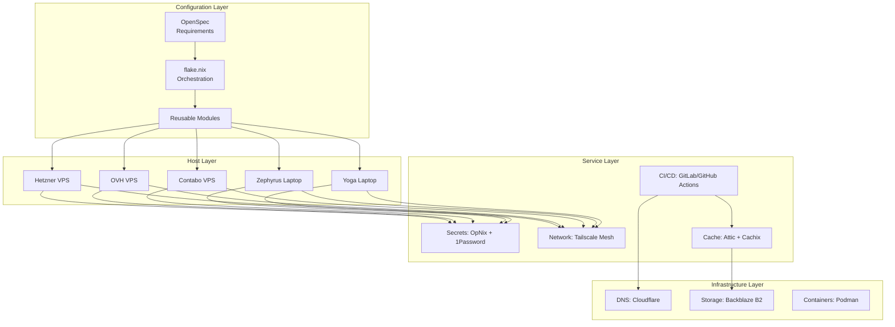

### Module Structure

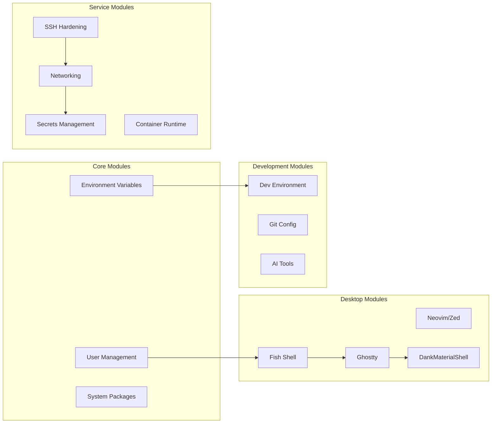

---

## Data Flow

### Configuration Build Flow

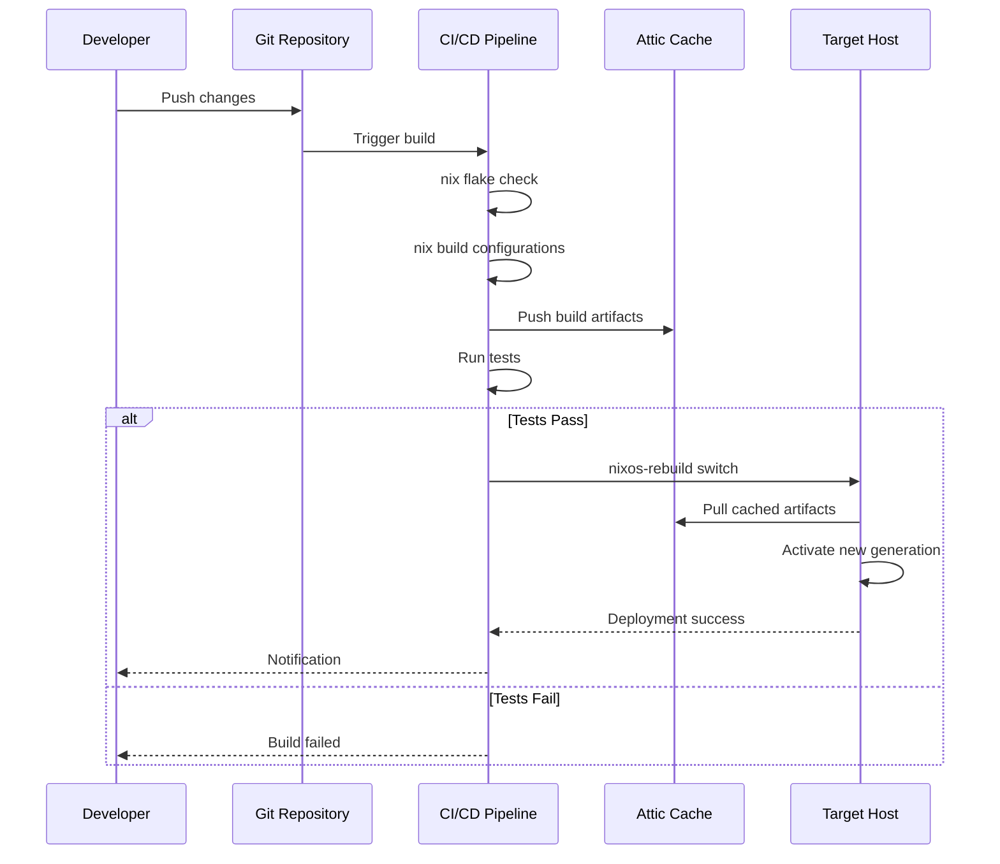

### Secrets Management Flow

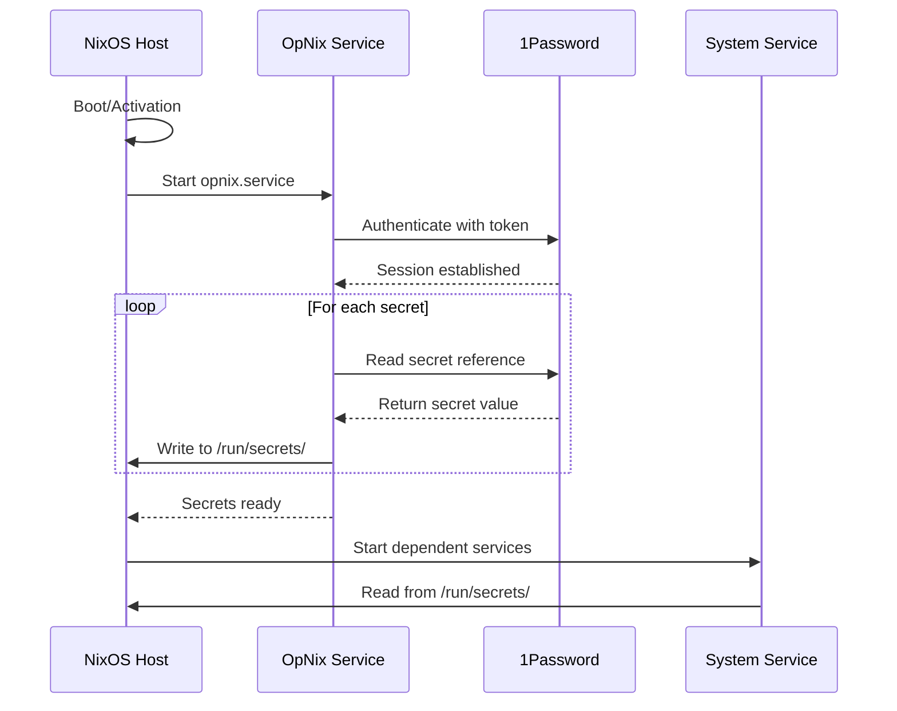

### Development Workflow

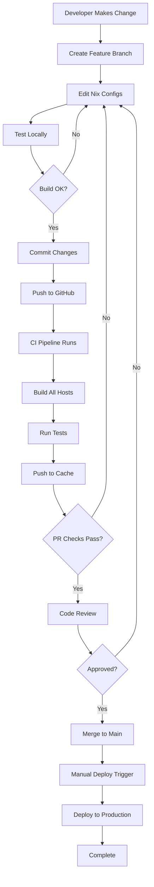

---

## Infrastructure Layout

### Network Topology

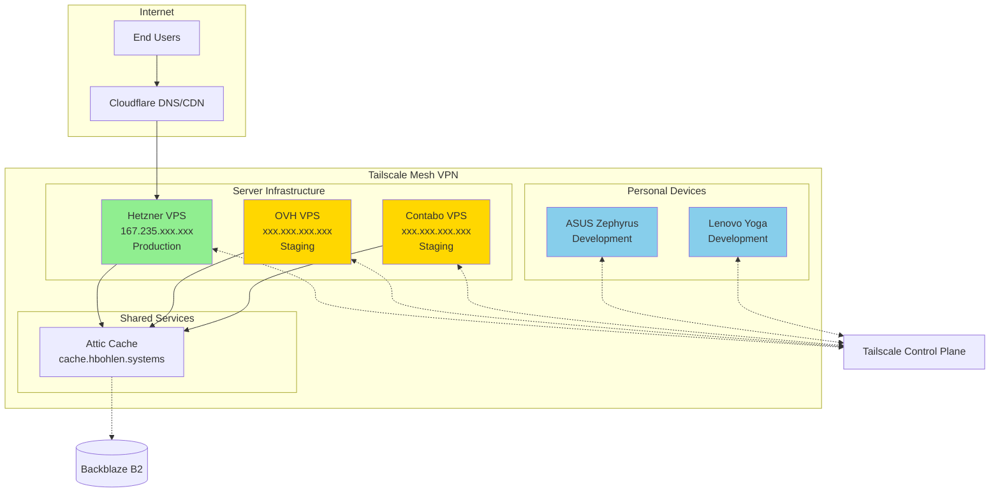

### Host Specifications

#### Hetzner VPS (Production)
- **Role**: Primary production server
- **Location**: Germany
- **CPU**: 2 vCPU
- **RAM**: 4GB
- **Storage**: 40GB SSD
- **Network**: 20TB traffic
- **Services**: 
  - SSH (port 22)
  - Attic cache server
  - PostgreSQL
  - Caddy reverse proxy
  - Tailscale

#### OVH VPS (Staging)
- **Role**: Staging/testing server
- **Location**: France
- **CPU**: 2 vCPU
- **RAM**: 4GB
- **Storage**: 40GB SSD
- **Services**: Mirror of production

#### Contabo VPS (Staging)
- **Role**: Secondary staging server
- **Location**: Germany
- **CPU**: 4 vCPU
- **RAM**: 8GB
- **Storage**: 200GB SSD
- **Services**: To be defined

#### ASUS ROG Zephyrus (Development)
- **Role**: Primary development laptop
- **CPU**: AMD Ryzen (TBD)
- **RAM**: 16GB+
- **Storage**: 2TB NVMe (Crucial P310 Plus) + default SSD
- **GPU**: NVIDIA (likely)
- **Desktop**: DankMaterialShell + Niri
- **Filesystem**: BTRFS with subvolumes

#### Lenovo Yoga (Development)
- **Role**: Secondary development laptop
- **CPU**: AMD Ryzen AI 7 350 (8 cores/16 threads)
- **RAM**: 16GB
- **Storage**: 2 disks detected
- **Network**: 2 interfaces
- **Desktop**: DankMaterialShell + Niri
- **Filesystem**: BTRFS with subvolumes

---

## Security Architecture

### Defense in Depth

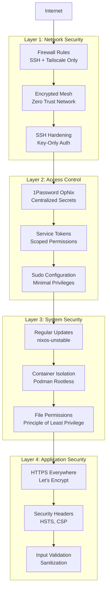

### Secrets Management

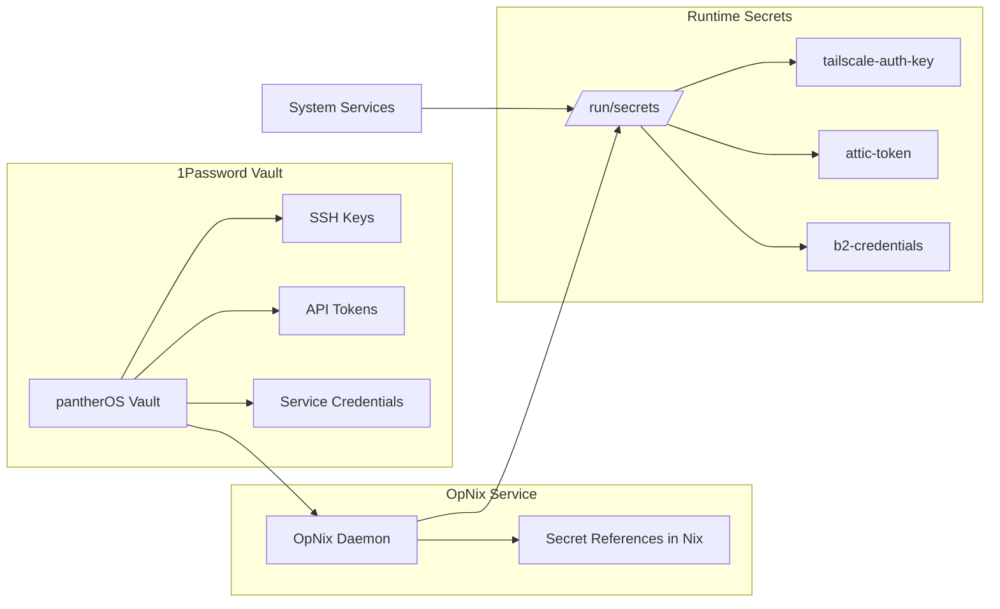

### SSH Hardening

- **Authentication**: Public key only, no passwords
- **Root Login**: Disabled for direct access
- **Port**: Standard 22 (behind firewall)
- **Ciphers**: Modern algorithms only
- **Failed Attempts**: Rate limiting enabled
- **Tailscale**: Preferred access method

---

## Development Workflow

### Local Development

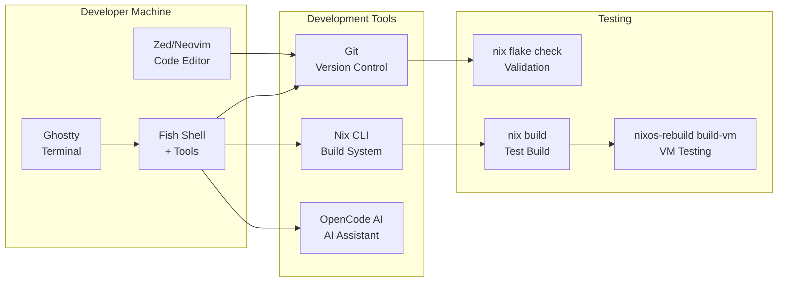

### CI/CD Pipeline Architecture

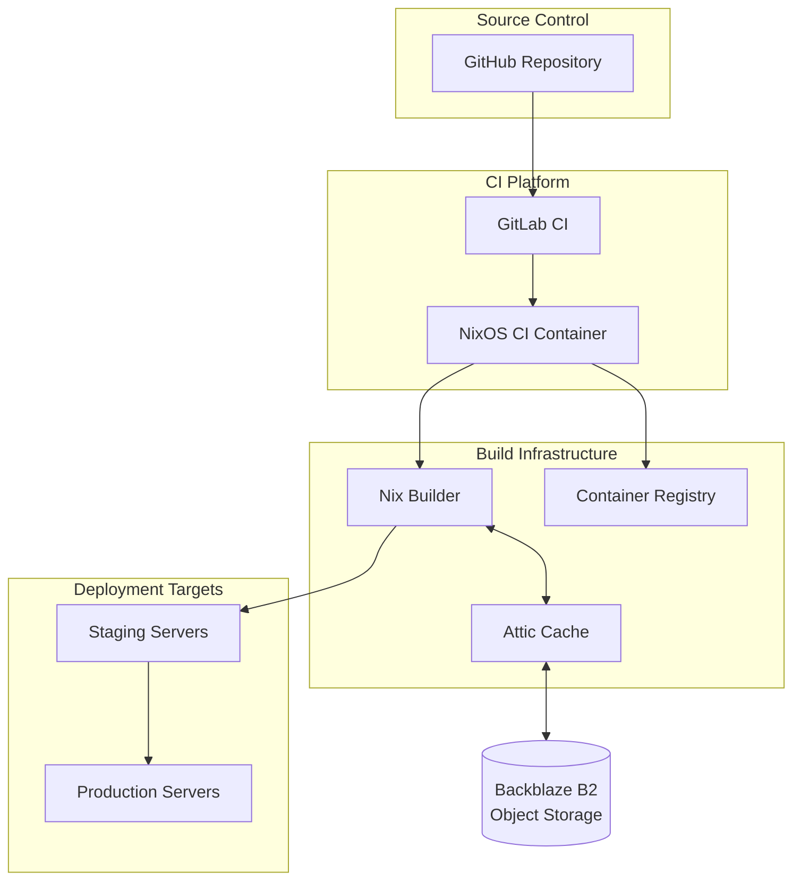

### Release Process

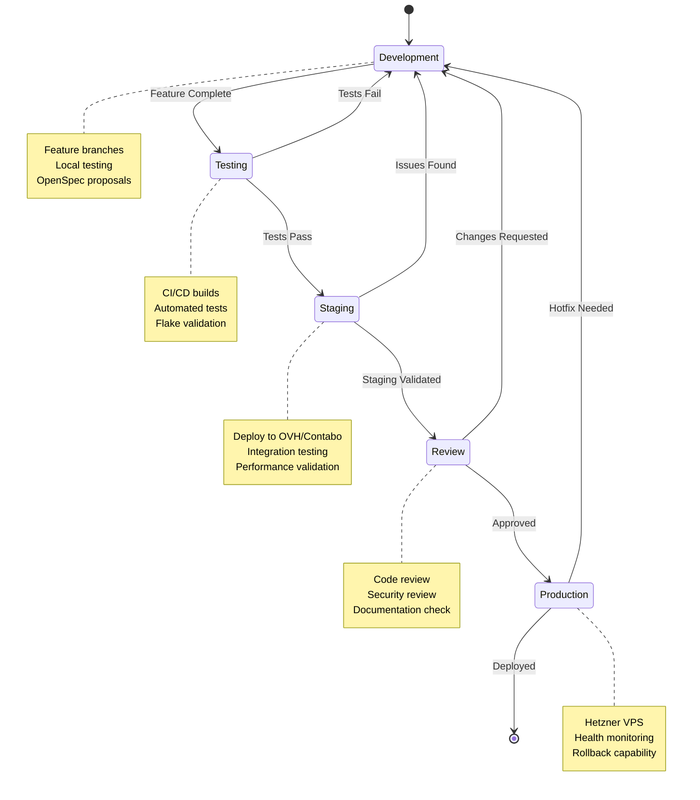

---

## Technology Stack

### Core Technologies

| Layer | Technology | Purpose |
|-------|-----------|---------|
| **OS** | NixOS | Declarative Linux distribution |
| **Package Manager** | Nix | Reproducible package management |
| **Config Language** | Nix Language | System configuration DSL |
| **User Config** | Home Manager | Declarative user environment |
| **Secrets** | OpNix + 1Password | Centralized secrets management |

### Infrastructure Technologies

| Component | Technology | Purpose |
|-----------|-----------|---------|
| **VPN** | Tailscale | Mesh VPN network |
| **DNS** | Cloudflare | DNS and CDN |
| **Cache** | Attic | Binary artifact cache |
| **Storage** | Backblaze B2 | Object storage (S3-compatible) |
| **CI/CD** | GitLab CI / GitHub Actions | Build and deployment |
| **Containers** | Podman | Rootless container runtime |
| **Database** | PostgreSQL | Relational database |
| **Proxy** | Caddy | Reverse proxy with auto-HTTPS |

### Desktop Technologies

| Component | Technology | Purpose |
|-----------|-----------|---------|
| **Compositor** | Niri | Scrollable tiling compositor |
| **Desktop Shell** | DankMaterialShell | Material Design desktop environment |
| **UI Framework** | Quickshell | QML-based shell framework |
| **Terminal** | Ghostty | Modern GPU-accelerated terminal |
| **Shell** | Fish | User-friendly command shell |
| **Editor** | Neovim + Zed | Code editors |
| **Theming** | Matugen | Material Design color generation |

### Development Tools

| Tool | Purpose |
|------|---------|
| **fzf** | Fuzzy finder |
| **eza** | Modern ls replacement |
| **ripgrep** | Fast text search |
| **fd** | Fast file finder |
| **bat** | Cat with syntax highlighting |
| **git** | Version control |
| **direnv** | Environment management |
| **OpenCode AI** | AI coding assistant |

---

## Filesystem Architecture

### BTRFS Subvolume Layout

```mermaid
graph TB
    Root[/ Root Subvolume]
    
    Root --> Nix[/nix<br/>Nix Store<br/>CoW disabled]
    Root --> Containers[/var/lib/containers<br/>Podman Storage<br/>CoW disabled]
    Root --> Dev[~/dev<br/>Development Workspace]
    Root --> Var[/var<br/>System Variables]
    Root --> VarLog[/var/log<br/>System Logs]
    Root --> VarCache[/var/cache<br/>System Cache]
    
    Nix --> NixStore[immutable packages]
    Containers --> Images[container images]
    Containers --> Volumes[container volumes]
    Dev --> Projects[project directories]
```

### Mount Options by Use Case

| Subvolume | Mount Options | Reasoning |
|-----------|---------------|-----------|
| `/nix` | `noatime,nodatacow,compress=none` | Nix store is already compressed, no CoW needed |
| `/var/lib/containers` | `noatime,nodatacow` | Container images don't benefit from CoW |
| `~/dev` | `noatime,compress=zstd:3` | Balance compression and performance |
| `/var/log` | `noatime,compress=zstd:6` | Logs compress well, read-heavy |
| `/var/cache` | `noatime,compress=zstd:1` | Fast access priority |

---

## Scalability Considerations

### Horizontal Scaling

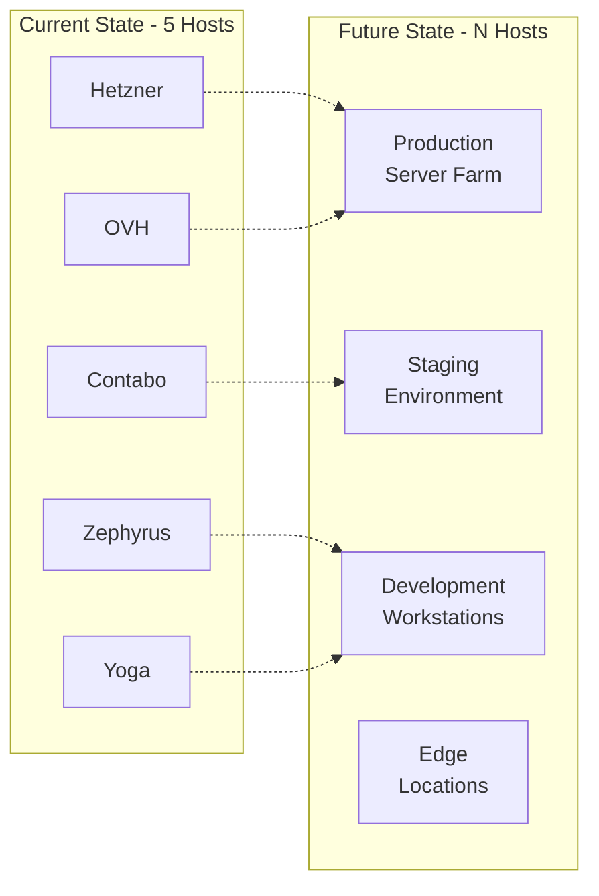

### Module Extensibility

New hosts can be added by:
1. Creating host configuration in `hosts/`
2. Running hardware detection with facter
3. Importing shared modules
4. Adding to `flake.nix` outputs
5. CI/CD automatically picks up new host

### Cache Scaling

- **Current**: Single Attic instance
- **Future**: Multi-region cache replication
- **CDN**: Cloudflare caching layer
- **Local**: Developer machine caches

---

## Monitoring and Observability

### Metrics to Track

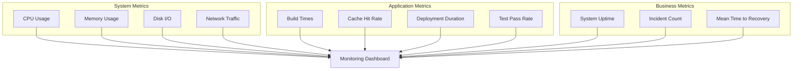

### Future Monitoring Stack
- **Metrics**: Prometheus
- **Logging**: Loki
- **Visualization**: Grafana
- **Alerting**: AlertManager
- **Tracing**: Tempo (if needed)

---

## Disaster Recovery

### Backup Strategy

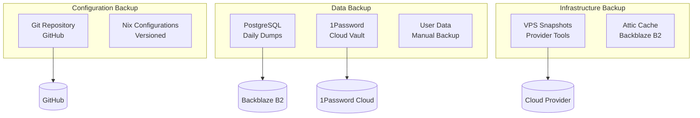

### Recovery Procedures

1. **Configuration Corruption**: Roll back to previous git commit
2. **Host Failure**: Deploy to new VPS from scratch using nixos-anywhere
3. **Data Loss**: Restore from PostgreSQL backups
4. **Cache Loss**: Rebuild from source (slower but functional)
5. **Secrets Compromise**: Rotate credentials in 1Password, redeploy

### RTO/RPO Targets

| Scenario | RTO (Recovery Time) | RPO (Data Loss) |
|----------|--------------------|--------------------|
| Configuration issue | 10 minutes | 0 (git rollback) |
| Host failure | 1 hour | 0 (stateless servers) |
| Database corruption | 2 hours | 24 hours (daily backup) |
| Cache corruption | 4 hours | 0 (rebuild from source) |
| Complete disaster | 8 hours | 24 hours |

---

## Future Architecture Evolution

### Planned Enhancements

1. **Multi-Region Deployment**
   - Additional VPS providers
   - Geographic distribution
   - Failover capabilities

2. **Advanced Monitoring**
   - Prometheus + Grafana stack
   - Custom dashboards
   - Automated alerting

3. **Enhanced Security**
   - Age-encrypted secrets (migrate from OpNix)
   - Hardware security keys
   - Audit logging

4. **Performance Optimization**
   - CDN for static assets
   - Database replication
   - Advanced BTRFS tuning

5. **Developer Experience**
   - IDE configurations
   - Development containers
   - Pre-commit hooks

---

## References

- [NixOS Manual](https://nixos.org/manual/nixos/stable/)
- [Home Manager Manual](https://nix-community.github.io/home-manager/)
- [Nix Flakes](https://nixos.wiki/wiki/Flakes)
- [BTRFS Documentation](https://btrfs.readthedocs.io/)
- [Tailscale Documentation](https://tailscale.com/kb/)
- [Attic Documentation](https://github.com/zhaofengli/attic)

---

**Document Maintenance:**
- Review quarterly or after major architectural changes
- Update diagrams when components added/removed
- Keep technology stack table current
- Validate all links and references

**Contributors:**
- System Architecture: GitHub Copilot Agent
- Last Major Revision: 2025-12-04
