# GitHub Issues for PantherOS Project

> **Generated:** 2025-12-04  
> **Purpose:** Issue templates for GitHub Project board creation  
> **Status:** Ready for import

This document contains structured issue templates for all work items in the PantherOS project. Each issue is atomic (15-90 minutes of focused work) and includes metadata, checklists, acceptance criteria, and visual diagrams where appropriate.

---

## Table of Contents

- [Phase 1: Foundation (Complete)](#phase-1-foundation-complete)
- [Phase 2: Personal Device Support](#phase-2-personal-device-support)
- [Phase 3: CI/CD Infrastructure](#phase-3-cicd-infrastructure)
- [Phase 4: Enhanced Server Infrastructure](#phase-4-enhanced-server-infrastructure)
- [Phase 5: Desktop Experience](#phase-5-desktop-experience)
- [Phase 6: Advanced Features](#phase-6-advanced-features)

---

## Phase 1: Foundation (Complete)

### Epic: Foundation Infrastructure

**Status:** ✅ Done  
**Priority:** High  
**Size:** XL  
**Iteration:** MVP  
**Spec ID:** OS-C-001

All Phase 1 work is complete. Issues are archived for reference.

---

## Phase 2: Personal Device Support

### Epic: Personal Device Configuration

**Title:** Configure Personal Development Devices  
**Status:** In Progress  
**Priority:** High  
**Size:** XL  
**Iteration:** MVP  
**OpenSpec ID:** `add-personal-device-hosts`  
**Doc Path:** `openspec/changes/add-personal-device-hosts/`

**Description:**

Set up full NixOS configurations for personal development laptops (ASUS ROG Zephyrus and Lenovo Yoga) with hardware detection, device-specific optimizations, and desktop environment integration.

**Dependencies:**
- Blocked by: None (foundation complete)
- Blocks: Desktop environment features

**Acceptance Criteria:**
- ✅ Both devices have complete hardware configurations
- ✅ Devices build successfully with `nix flake check`
- ✅ Home Manager configurations deployed
- ✅ All hardware features functional (WiFi, GPU, power management)

**Progress:** 50% complete (Yoga done, Zephyrus pending)

---

#### Issue: Complete Zephyrus Hardware Scan

**Title:** Run hardware detection on ASUS ROG Zephyrus laptop  
**Status:** Todo  
**Priority:** High  
**Size:** S  
**Estimate:** 30 minutes  
**Labels:** `area/hardware`, `type/task`, `device/zephyrus`  
**OpenSpec ID:** `add-personal-device-hosts`

**Description:**

Run `nixos-facter` on the ASUS ROG Zephyrus laptop to generate complete hardware configuration.

**Why:** Need accurate hardware detection for proper device configuration

**How:**
1. Boot Zephyrus with NixOS live USB or existing Linux
2. Run hardware scanning script
3. Transfer JSON output to repository
4. Commit hardware report

**Checklist:**
- [ ] Access Zephyrus laptop physically
- [ ] Run `sudo scripts/scan-hardware.fish zephyrus`
- [ ] Verify JSON report generated at `docs/hardware/zephyrus-facter.json`
- [ ] Review hardware specifications detected
- [ ] Commit hardware report to repository

**Acceptance Criteria:**
- Hardware JSON file exists at `docs/hardware/zephyrus-facter.json`
- File contains CPU, GPU, RAM, storage, and network interface data
- File validates as proper JSON

**Dependencies:** Requires physical access to Zephyrus laptop

**Reference:** `docs/hardware-scanning-workflow.md`

---

#### Issue: Create Zephyrus Host Configuration

**Title:** Create NixOS configuration for Zephyrus laptop  
**Status:** Todo  
**Priority:** High  
**Size:** M  
**Estimate:** 60 minutes  
**Labels:** `area/configuration`, `type/feature`, `device/zephyrus`  
**OpenSpec ID:** `add-personal-device-hosts`  
**Depends on:** #[Zephyrus Hardware Scan]

**Description:**

Create complete NixOS host configuration for ASUS ROG Zephyrus using hardware detection data and nixos-facter-modules.

**Flow Diagram:**

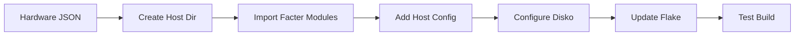

**Checklist:**
- [ ] Create directory structure `hosts/zephyrus/`
- [ ] Create `hosts/zephyrus/default.nix` with base configuration
- [ ] Import nixos-facter-modules with hardware JSON
- [ ] Create `hosts/zephyrus/disko.nix` for disk partitioning
- [ ] Configure device-specific settings (power management, GPU)
- [ ] Add zephyrus to `flake.nix` nixosConfigurations
- [ ] Run `nix flake check` to validate
- [ ] Run `nix build .#nixosConfigurations.zephyrus.config.system.build.toplevel`

**Acceptance Criteria:**
- Configuration builds without errors
- Hardware detection modules properly imported
- Disk configuration matches Zephyrus hardware
- Flake check passes
- All nixos-facter detected features enabled

**Code Snippet:**
```nix
# hosts/zephyrus/default.nix
{ config, pkgs, inputs, ... }:
{
  imports = [
    inputs.nixos-facter-modules.nixosModules.facter
    { config.facter.reportPath = ../../docs/hardware/zephyrus-facter.json; }
    ./disko.nix
    ../../modules
  ];

  networking.hostName = "zephyrus";
  
  # Device-specific optimizations
  # ...
}
```

**Reference:** `hosts/yoga/default.nix` (similar structure)

---

#### Issue: Configure Zephyrus Power Management

**Title:** Optimize power management for Zephyrus laptop  
**Status:** Todo  
**Priority:** Medium  
**Size:** S  
**Estimate:** 45 minutes  
**Labels:** `area/power`, `type/enhancement`, `device/zephyrus`  
**OpenSpec ID:** `add-personal-device-hosts`  
**Depends on:** #[Zephyrus Host Configuration]

**Description:**

Configure ASUS-specific power management tools and profiles for optimal battery life and performance switching.

**Power Profile Flow:**

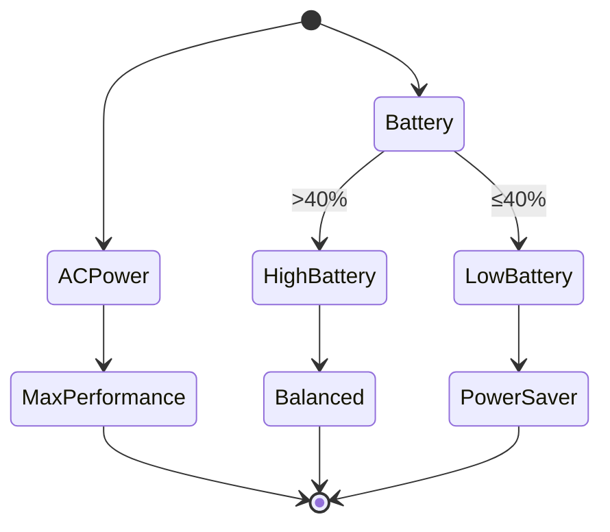

**Checklist:**
- [ ] Enable `asusctl` for ASUS laptop control
- [ ] Configure `power-profiles-daemon` with three profiles
- [ ] Set up battery charge limit (80%) for longevity
- [ ] Configure GPU switching if hybrid graphics detected
- [ ] Test AC/battery profile switching
- [ ] Verify fan control and thermal management

**Acceptance Criteria:**
- Power profiles switch automatically based on AC/battery state
- Battery charge limit enforced at 80%
- Fan curves appropriate for workload
- System thermal management functional
- All ASUS-specific features working

**Reference:** 
- `docs/CONTEXT.md` (Power Management section)
- NixOS option: `services.asusctl`

---

### Epic: Desktop Environment Setup

**Title:** Deploy DankMaterialShell Desktop Environment  
**Status:** Todo  
**Priority:** High  
**Size:** XL  
**Iteration:** MVP  
**OpenSpec ID:** `add-dank-material-shell`  
**Doc Path:** `openspec/changes/add-dank-material-shell/`

**Description:**

Install and configure DankMaterialShell (DMS) desktop environment with quickshell backend, material design theming, and Niri compositor integration.

**Architecture:**

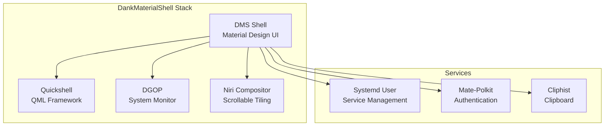

**Dependencies:**
- Requires: Personal device hosts configured
- Blocks: Compositor configuration, theming

**Acceptance Criteria:**
- DMS installs and launches on both personal devices
- Material Design theme applied
- System monitoring functional
- Clipboard history working
- Systemd integration complete

**Tasks:** 39 subtasks (see individual issues below)

---

#### Issue: Install DankMaterialShell Base Package

**Title:** Install dms-shell-bin package on personal devices  
**Status:** Todo  
**Priority:** High  
**Size:** XS  
**Estimate:** 20 minutes  
**Labels:** `area/desktop`, `type/feature`, `package/dms`  
**OpenSpec ID:** `add-dank-material-shell`

**Description:**

Add DankMaterialShell flake input and enable the package in Home Manager configuration for personal devices.

**Checklist:**
- [ ] Add DankMaterialShell flake input to `flake.nix`
- [ ] Add dgop flake input (DMS dependency)
- [ ] Configure `follows` for nixpkgs consistency
- [ ] Import DMS homeModules in personal device configs
- [ ] Enable DMS in Home Manager
- [ ] Test build with `nix flake check`

**Code Snippet:**
```nix
# flake.nix
inputs = {
  # ... existing inputs ...
  
  dgop = {
    url = "github:AvengeMedia/dgop";
    inputs.nixpkgs.follows = "nixpkgs";
  };
  
  DankMaterialShell = {
    url = "github:AvengeMedia/DankMaterialShell";
    inputs.nixpkgs.follows = "nixpkgs";
    inputs.dgop.follows = "dgop";
  };
};
```

```nix
# home/profiles/desktop/default.nix
{ inputs, ... }:
{
  imports = [
    inputs.DankMaterialShell.homeModules.default
  ];
  
  services.dankMaterialShell.enable = true;
}
```

**Acceptance Criteria:**
- Flake inputs added correctly
- Home Manager imports DMS modules
- Build succeeds without errors
- DMS package available in PATH

---

#### Issue: Configure DMS System Integration

**Title:** Set up DMS systemd services and autostart  
**Status:** Todo  
**Priority:** High  
**Size:** S  
**Estimate:** 30 minutes  
**Labels:** `area/desktop`, `type/configuration`, `service/systemd`  
**OpenSpec ID:** `add-dank-material-shell`  
**Depends on:** #[Install DMS Base]

**Description:**

Configure DankMaterialShell to start automatically with the user session and integrate with systemd for service management.

**Service Flow:**

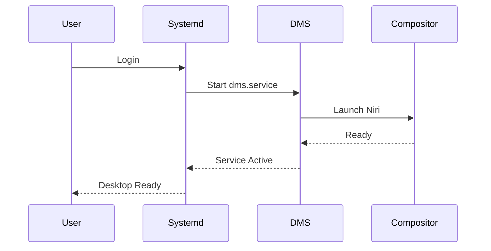

**Checklist:**
- [ ] Enable systemd user service for DMS
- [ ] Configure auto-start on login
- [ ] Set up restart-on-change functionality
- [ ] Configure service dependencies (compositor, polkit)
- [ ] Test manual service start/stop
- [ ] Verify service logs are accessible

**Acceptance Criteria:**
- DMS starts automatically on user login
- Service restarts on configuration changes
- Service status shows "active (running)"
- Logs available via `journalctl --user -u dms.service`

**Reference:** `openspec/changes/add-dank-material-shell/tasks.md`

---

#### Issue: Install Required DMS Dependencies

**Title:** Install all DMS runtime dependencies  
**Status:** Todo  
**Priority:** High  
**Size:** S  
**Estimate:** 25 minutes  
**Labels:** `area/desktop`, `type/dependencies`, `package/dms`  
**OpenSpec ID:** `add-dank-material-shell`  
**Depends on:** #[Install DMS Base]

**Description:**

Install all required packages for DankMaterialShell functionality: quickshell, accountsservice, matugen, dgop, cliphist, and mate-polkit.

**Dependency Graph:**

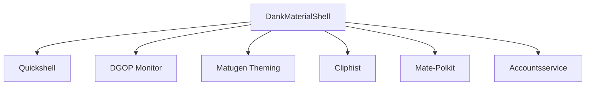

**Checklist:**
- [ ] Add `quickshell` to system packages
- [ ] Add `dgop` package
- [ ] Add `matugen` for color theming
- [ ] Add `cliphist` for clipboard management
- [ ] Add `mate-polkit` for authentication
- [ ] Add `accountsservice` for user management
- [ ] Verify all packages install correctly

**Code Snippet:**
```nix
# home/profiles/desktop/packages.nix
{ pkgs, inputs, ... }:
{
  home.packages = with pkgs; [
    quickshell
    inputs.dgop.packages.${system}.default
    matugen
    cliphist
    mate-polkit
    accountsservice
  ];
}
```

**Acceptance Criteria:**
- All dependencies present in system PATH
- No missing library errors when running DMS
- Each tool functions independently

---

### Epic: Terminal and Editor Setup

**Title:** Configure Terminal Emulator and Code Editors  
**Status:** Todo  
**Priority:** Medium  
**Size:** L  
**Iteration:** MVP  
**OpenSpec IDs:** `set-ghostty-as-default-terminal`, `add-zed-ide`

**Description:**

Set up Ghostty as the default terminal emulator and configure Zed IDE for code editing on personal devices.

---

#### Issue: Install and Configure Ghostty Terminal

**Title:** Deploy Ghostty as default terminal emulator  
**Status:** Todo  
**Priority:** Medium  
**Size:** S  
**Estimate:** 30 minutes  
**Labels:** `area/terminal`, `type/feature`, `package/ghostty`  
**OpenSpec ID:** `set-ghostty-as-default-terminal`

**Description:**

Install Ghostty terminal emulator and configure it as the default terminal for personal devices, integrating with existing fish shell configuration.

**Terminal Stack:**

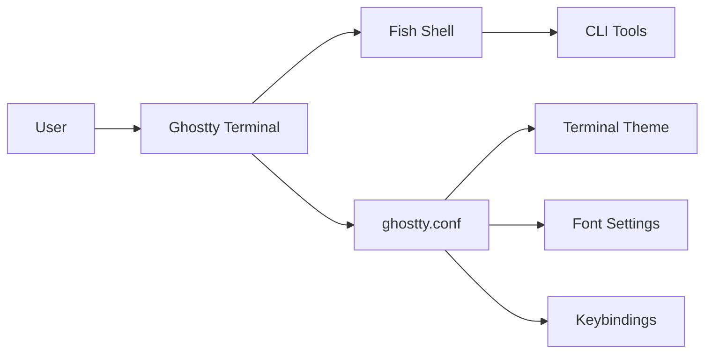

**Checklist:**
- [ ] Add `ghostty` package to Home Manager
- [ ] Create `~/.config/ghostty/config` configuration file
- [ ] Set ghostty as default terminal in desktop environment
- [ ] Configure font (JetBrainsMono Nerd Font or similar)
- [ ] Set up color theme matching system theme
- [ ] Configure key bindings
- [ ] Test terminal functionality with fish shell

**Code Snippet:**
```nix
# home/profiles/terminal/ghostty.nix
{ pkgs, ... }:
{
  home.packages = [ pkgs.ghostty ];
  
  xdg.configFile."ghostty/config".text = ''
    font-family = "JetBrainsMono Nerd Font"
    font-size = 11
    theme = "Material"
    shell-integration = true
    confirm-close-surface = false
  '';
  
  # Set as default terminal
  home.sessionVariables.TERMINAL = "ghostty";
}
```

**Acceptance Criteria:**
- Ghostty launches successfully
- Fish shell runs inside Ghostty
- Font rendering correct
- Theme applied properly
- Shell integration features work

---

#### Issue: Install Zed IDE

**Title:** Install Zed code editor on personal devices  
**Status:** Todo  
**Priority:** Medium  
**Size:** XS  
**Estimate:** 20 minutes  
**Labels:** `area/editor`, `type/feature`, `package/zed`  
**OpenSpec ID:** `add-zed-ide`

**Description:**

Install Zed IDE from the Zed flake input for modern code editing experience on personal devices.

**Checklist:**
- [ ] Add Zed flake input to `flake.nix`
- [ ] Add Zed package to Home Manager for personal devices
- [ ] Verify Zed launches successfully
- [ ] Test basic editing functionality
- [ ] Confirm language server protocols work

**Code Snippet:**
```nix
# flake.nix
inputs.zed-editor = {
  url = "github:zed-industries/zed";
  inputs.nixpkgs.follows = "nixpkgs";
};

# home/profiles/development/editors.nix
{ inputs, system, ... }:
{
  home.packages = [
    inputs.zed-editor.packages.${system}.default
  ];
}
```

**Acceptance Criteria:**
- Zed installs without errors
- Zed appears in application menu
- Zed launches and can open files
- Basic editing features functional

---

## Phase 3: CI/CD Infrastructure

### Epic: GitLab CI Pipeline

**Title:** Implement GitLab CI/CD Pipeline with Binary Caching  
**Status:** Todo  
**Priority:** High  
**Size:** XXL  
**Iteration:** Beta  
**OpenSpec ID:** `add-gitlab-ci-infrastructure`  
**Doc Path:** `openspec/changes/add-gitlab-ci-infrastructure/`

**Description:**

Comprehensive CI/CD infrastructure using GitLab CI for automated testing, building, and deployment of NixOS configurations with Attic binary cache for build optimization.

**Pipeline Architecture:**

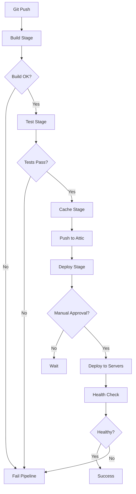

**Dependencies:**
- Requires: Foundation complete
- Requires: Backblaze B2 account
- Requires: GitLab CI runners

**Tasks:** 138 subtasks across 7 phases

---

#### Issue: Set Up PostgreSQL Database for Attic

**Title:** Configure PostgreSQL database for Attic server  
**Status:** Todo  
**Priority:** High  
**Size:** M  
**Estimate:** 45 minutes  
**Labels:** `area/ci-cd`, `type/infrastructure`, `service/postgresql`  
**OpenSpec ID:** `add-gitlab-ci-infrastructure`

**Description:**

Configure PostgreSQL service on Hetzner VPS to provide metadata storage for Attic binary cache server.

**Database Architecture:**

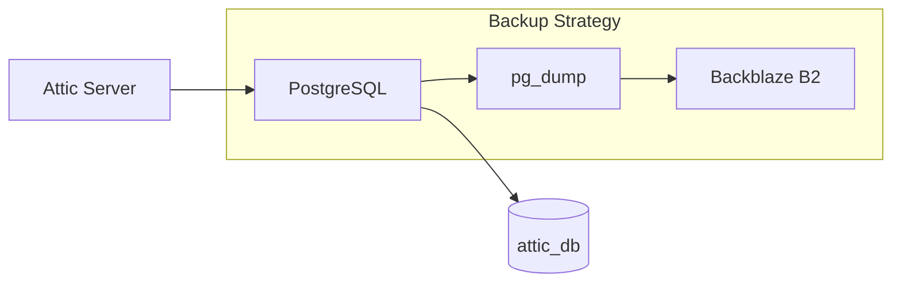

**Checklist:**
- [ ] Enable PostgreSQL service in NixOS configuration
- [ ] Create `attic` database and user
- [ ] Grant necessary permissions to attic user
- [ ] Configure connection settings (socket/TCP)
- [ ] Enable automated backups with `services.postgresqlBackup`
- [ ] Set backup retention policy (7 days)
- [ ] Test database connectivity
- [ ] Verify backups are created successfully

**Code Snippet:**
```nix
# hosts/servers/hetzner-vps/services/postgresql.nix
{ config, pkgs, ... }:
{
  services.postgresql = {
    enable = true;
    package = pkgs.postgresql_15;
    
    ensureDatabases = [ "attic" ];
    ensureUsers = [{
      name = "attic";
      ensureDBOwnership = true;
    }];
    
    authentication = ''
      local attic attic trust
    '';
  };
  
  services.postgresqlBackup = {
    enable = true;
    databases = [ "attic" ];
    startAt = "*-*-* 02:00:00";  # Daily at 2 AM
    location = "/var/backup/postgresql";
  };
}
```

**Acceptance Criteria:**
- PostgreSQL service running
- Database `attic` exists
- User `attic` can connect
- Backups created on schedule
- Connection from Attic server works

**Reference:** `openspec/changes/add-gitlab-ci-infrastructure/tasks.md` (Phase 1.1)

---

#### Issue: Configure Backblaze B2 Storage

**Title:** Set up Backblaze B2 bucket for Attic cache storage  
**Status:** Todo  
**Priority:** High  
**Size:** S  
**Estimate:** 30 minutes  
**Labels:** `area/ci-cd`, `type/infrastructure`, `service/s3`  
**OpenSpec ID:** `add-gitlab-ci-infrastructure`

**Description:**

Create and configure Backblaze B2 bucket for storing Nix binary cache artifacts with appropriate lifecycle policies.

**Storage Flow:**

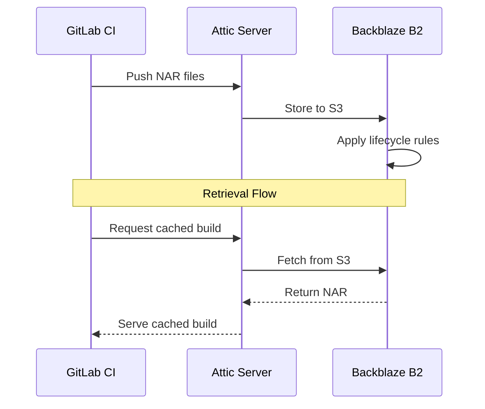

**Checklist:**
- [ ] Create Backblaze B2 account (if not exists)
- [ ] Create bucket `pantheros-nix-cache`
- [ ] Set bucket to private access
- [ ] Generate application key with read/write permissions
- [ ] Store credentials in 1Password vault `pantherOS`
- [ ] Configure lifecycle rules (30-day retention for old objects)
- [ ] Test S3 API access with credentials
- [ ] Document bucket configuration

**Acceptance Criteria:**
- Bucket exists and is accessible
- Credentials stored securely in 1Password
- Lifecycle rules configured correctly
- S3 API responds to test requests
- Storage costs estimated and acceptable

**Reference:** Backblaze B2 S3-compatible API documentation

---

#### Issue: Deploy Attic Server

**Title:** Install and configure Attic binary cache server  
**Status:** Todo  
**Priority:** High  
**Size:** L  
**Estimate:** 90 minutes  
**Labels:** `area/ci-cd`, `type/feature`, `service/attic`  
**OpenSpec ID:** `add-gitlab-ci-infrastructure`  
**Depends on:** #[PostgreSQL Setup], #[B2 Storage]

**Description:**

Deploy Attic server on Hetzner VPS with PostgreSQL metadata storage and Backblaze B2 object storage backend.

**Attic Architecture:**

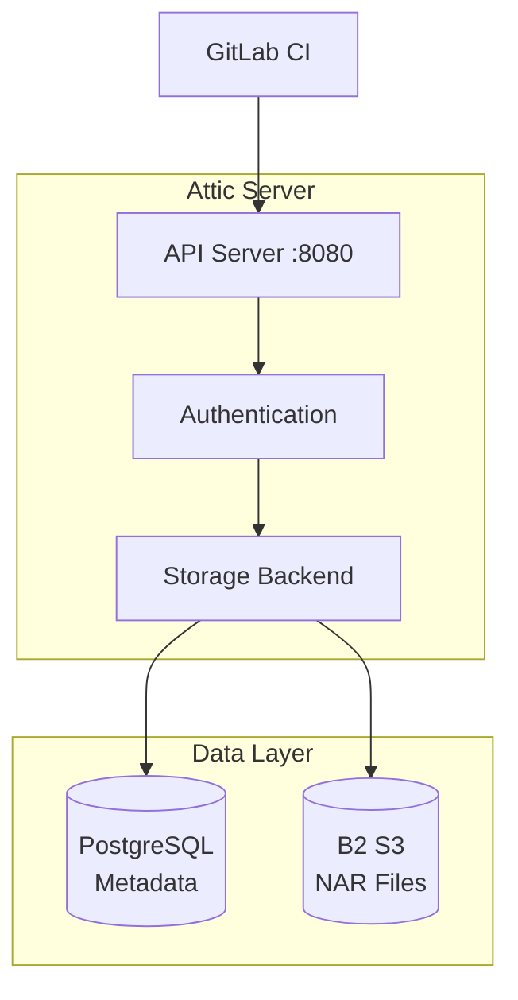

**Checklist:**
- [ ] Add `attic-server` package to system
- [ ] Create Attic configuration file
- [ ] Configure PostgreSQL connection string
- [ ] Configure S3 storage backend with B2 credentials
- [ ] Set up chunking parameters (4MB chunks recommended)
- [ ] Enable compression (zstd level 6)
- [ ] Create systemd service for Attic
- [ ] Start Attic service
- [ ] Verify service is listening on port 8080
- [ ] Check logs for errors

**Code Snippet:**
```nix
# hosts/servers/hetzner-vps/services/attic.nix
{ config, pkgs, ... }:
{
  services.attic-server = {
    enable = true;
    package = pkgs.attic-server;
    
    settings = {
      database.url = "postgresql:///attic?host=/run/postgresql";
      
      storage = {
        type = "s3";
        region = "us-west-000";
        bucket = "pantheros-nix-cache";
        endpoint = "s3.us-west-000.backblazeb2.com";
      };
      
      chunking = {
        nar-size-threshold = 65536;  # 64KB
        min-size = 16384;  # 16KB
        avg-size = 65536;  # 64KB
        max-size = 262144;  # 256KB
      };
      
      compression = {
        type = "zstd";
        level = 6;
      };
    };
    
    credentialsFile = config.age.secrets.attic-credentials.path;
  };
  
  systemd.services.attic-server = {
    serviceConfig = {
      DynamicUser = true;
      SupplementaryGroups = [ "postgres" ];
    };
  };
}
```

**Acceptance Criteria:**
- Attic service running and healthy
- Can connect to PostgreSQL
- Can connect to B2 storage
- API responds on port 8080
- Logs show no errors

---

#### Issue: Configure Caddy Reverse Proxy for Attic

**Title:** Set up HTTPS reverse proxy for Attic cache  
**Status:** Todo  
**Priority:** High  
**Size:** M  
**Estimate:** 45 minutes  
**Labels:** `area/ci-cd`, `type/infrastructure`, `service/caddy`  
**OpenSpec ID:** `add-gitlab-ci-infrastructure`  
**Depends on:** #[Attic Server]

**Description:**

Configure Caddy web server as reverse proxy for Attic with automatic HTTPS via Let's Encrypt and Cloudflare DNS.

**Proxy Flow:**

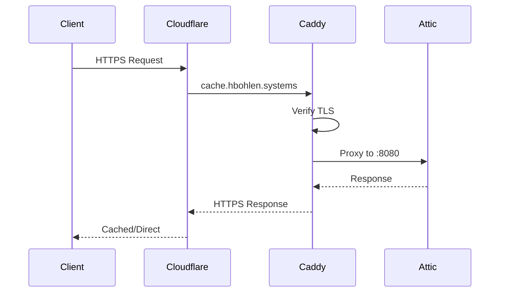

**Checklist:**
- [ ] Enable Caddy service on Hetzner VPS
- [ ] Configure virtual host for `cache.hbohlen.systems`
- [ ] Set up automatic HTTPS with Let's Encrypt
- [ ] Configure reverse proxy to localhost:8080
- [ ] Add Cloudflare DNS A record
- [ ] Configure firewall to allow HTTPS (port 443)
- [ ] Test HTTPS access
- [ ] Verify certificate auto-renewal works

**Code Snippet:**
```nix
# hosts/servers/hetzner-vps/services/caddy.nix
{ config, ... }:
{
  services.caddy = {
    enable = true;
    
    virtualHosts."cache.hbohlen.systems" = {
      extraConfig = ''
        reverse_proxy localhost:8080
        
        # Security headers
        header {
          Strict-Transport-Security "max-age=31536000; includeSubDomains"
          X-Content-Type-Options "nosniff"
          X-Frame-Options "DENY"
        }
      '';
    };
  };
  
  networking.firewall.allowedTCPPorts = [ 443 ];
}
```

**Acceptance Criteria:**
- Caddy running and serving requests
- HTTPS certificate obtained from Let's Encrypt
- `https://cache.hbohlen.systems` accessible
- Requests proxied to Attic correctly
- Security headers present in responses

---

#### Issue: Create Attic Caches and Tokens

**Title:** Initialize Attic caches and generate access tokens  
**Status:** Todo  
**Priority:** High  
**Size:** S  
**Estimate:** 30 minutes  
**Labels:** `area/ci-cd`, `type/configuration`, `service/attic`  
**OpenSpec ID:** `add-gitlab-ci-infrastructure`  
**Depends on:** #[Attic Server], #[Caddy Proxy]

**Description:**

Create public and private Attic caches and generate authentication tokens for CI/CD and public access.

**Cache Structure:**

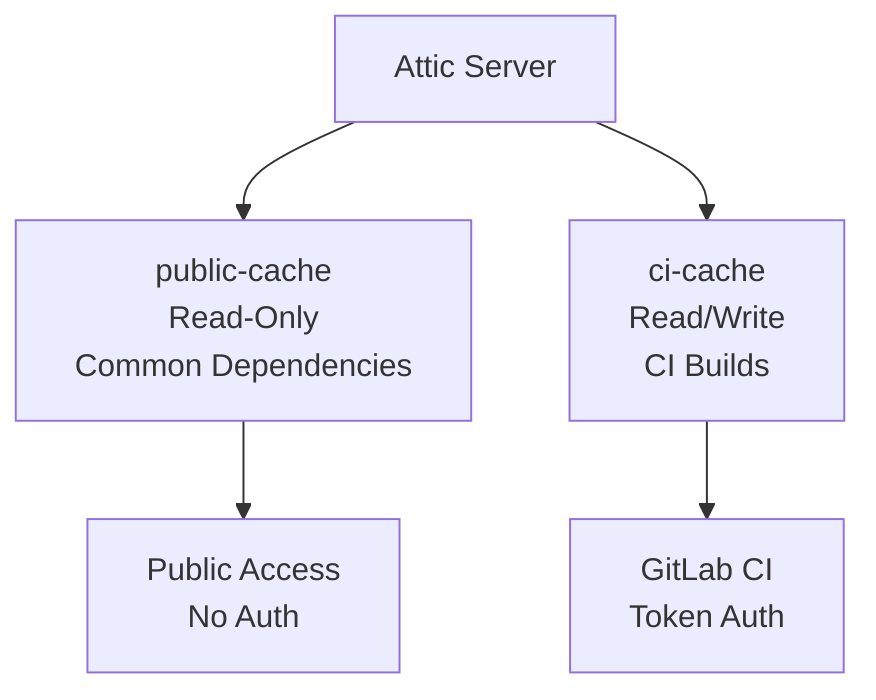

**Checklist:**
- [ ] Generate root admin token
- [ ] Create `public-cache` for common dependencies
- [ ] Create `ci-cache` for CI/CD builds
- [ ] Generate public read-only token for `public-cache`
- [ ] Generate CI token with push/pull for `ci-cache`
- [ ] Store all tokens in 1Password vault
- [ ] Configure cache retention policies (30 days)
- [ ] Test token authentication

**Commands:**
```bash
# Create caches
attic cache create public-cache
attic cache create ci-cache

# Generate tokens
attic token create public-ro --cache public-cache --pull
attic token create ci-full --cache ci-cache --push --pull

# Configure retention
attic cache configure ci-cache --retention-period 30d
```

**Acceptance Criteria:**
- Both caches created and visible
- Tokens generated and stored securely
- Public cache accessible without auth for reads
- CI cache requires token for writes
- Retention policies configured

**Reference:** Attic documentation on cache management

---

#### Issue: Build GitLab CI Container Image

**Title:** Create NixOS-based container for GitLab CI runners  
**Status:** Todo  
**Priority:** High  
**Size:** L  
**Estimate:** 75 minutes  
**Labels:** `area/ci-cd`, `type/infrastructure`, `container/nixos`  
**OpenSpec ID:** `add-gitlab-ci-infrastructure`

**Description:**

Build a NixOS-based container image with Nix, Git, SSH, and Attic client pre-configured for use in GitLab CI pipelines.

**Container Layers:**

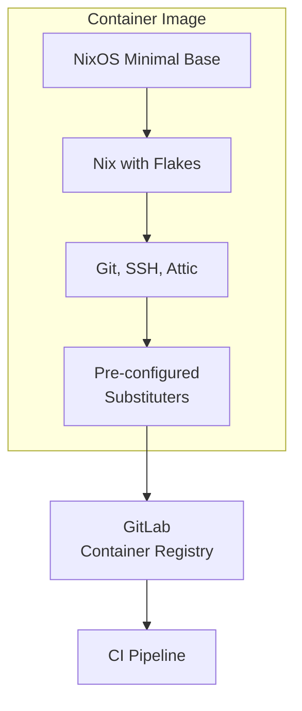

**Checklist:**
- [ ] Create `containers/gitlab-ci/` directory
- [ ] Define container configuration in `default.nix`
- [ ] Include required packages (nix, git, openssh, attic-client)
- [ ] Enable flakes in Nix configuration
- [ ] Pre-configure Attic as substituter
- [ ] Optimize layer structure for caching
- [ ] Build container with `nix build .#gitlab-ci-container`
- [ ] Test container locally
- [ ] Push to GitLab Container Registry
- [ ] Tag as `latest` and version

**Code Snippet:**
```nix
# containers/gitlab-ci/default.nix
{ pkgs, ... }:
pkgs.dockerTools.buildImage {
  name = "pantheros-gitlab-ci";
  tag = "latest";
  
  contents = with pkgs; [
    nix
    git
    openssh
    attic-client
    bash
    coreutils
  ];
  
  config = {
    Env = [
      "NIX_CONFIG=experimental-features = nix-command flakes"
      "ATTIC_SERVER=https://cache.hbohlen.systems"
    ];
    
    Cmd = [ "${pkgs.bash}/bin/bash" ];
  };
  
  runAsRoot = ''
    #!${pkgs.bash}/bin/bash
    mkdir -p /tmp /root/.config/nix
    echo "substituters = https://cache.nixos.org https://cache.hbohlen.systems/public-cache" > /root/.config/nix/nix.conf
  '';
}
```

**Acceptance Criteria:**
- Container builds without errors
- Image size reasonable (<2GB compressed)
- All required tools present in PATH
- Nix commands work inside container
- Attic client configured correctly

---

#### Issue: Create GitLab CI Pipeline Configuration

**Title:** Define .gitlab-ci.yml pipeline stages  
**Status:** Todo  
**Priority:** High  
**Size:** L  
**Estimate:** 90 minutes  
**Labels:** `area/ci-cd`, `type/configuration`, `ci/gitlab`  
**OpenSpec ID:** `add-gitlab-ci-infrastructure`  
**Depends on:** #[CI Container], #[Attic Setup]

**Description:**

Create comprehensive GitLab CI pipeline configuration with build, test, cache, and deploy stages for all NixOS hosts.

**Pipeline Stages:**

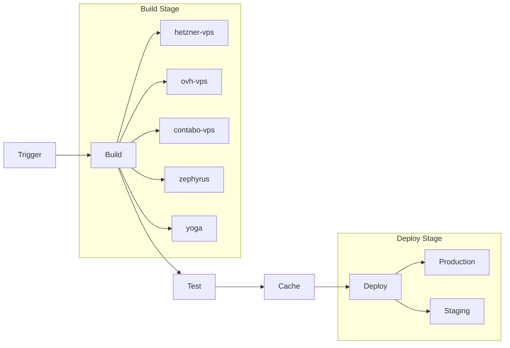

**Checklist:**
- [ ] Create `.gitlab-ci.yml` in repository root
- [ ] Define `build` stage with jobs for each host
- [ ] Define `test` stage with `nix flake check`
- [ ] Define `cache` stage to push to Attic
- [ ] Define `deploy` stage with manual gates
- [ ] Configure CI variables for secrets
- [ ] Set up artifact retention
- [ ] Configure parallel builds
- [ ] Add failure notifications

**Code Snippet:**
```yaml
# .gitlab-ci.yml
stages:
  - build
  - test
  - cache
  - deploy

variables:
  NIX_CONFIG: "experimental-features = nix-command flakes"

.build_template: &build_template
  stage: build
  image: registry.gitlab.com/hbohlen/pantheros/ci:latest
  before_script:
    - attic login ci $ATTIC_CI_TOKEN
  artifacts:
    paths:
      - result
    expire_in: 1 day

build:hetzner-vps:
  <<: *build_template
  script:
    - nix build .#nixosConfigurations.hetzner-vps.config.system.build.toplevel
    - attic push ci-cache result

test:flake-check:
  stage: test
  script:
    - nix flake check

deploy:hetzner:
  stage: deploy
  when: manual
  only:
    - main
  script:
    - ./scripts/deploy-hetzner.sh
```

**Acceptance Criteria:**
- Pipeline configuration valid
- All stages defined correctly
- Builds run in parallel
- Tests gate deployment
- Deployments require manual approval

---

## Phase 4: Enhanced Server Infrastructure

### Epic: Server Fleet Expansion

**Title:** Add Contabo VPS and Optimize Infrastructure  
**Status:** Todo  
**Priority:** Medium  
**Size:** XL  
**Iteration:** Beta  
**OpenSpec IDs:** `add-contabo-vps-server`, `refactor-enhance-infrastructure`

**Description:**

Expand server fleet to include Contabo VPS and implement infrastructure-wide optimizations for performance, reliability, and maintainability.

---

#### Issue: Create Contabo VPS Configuration

**Title:** Set up NixOS configuration for Contabo VPS  
**Status:** Todo  
**Priority:** Medium  
**Size:** M  
**Estimate:** 60 minutes  
**Labels:** `area/infrastructure`, `type/feature`, `host/contabo`  
**OpenSpec ID:** `add-contabo-vps-server`

**Description:**

Create complete NixOS configuration for Contabo VPS server following the same pattern as Hetzner and OVH servers.

**Checklist:**
- [ ] Create directory `hosts/servers/contabo-vps/`
- [ ] Create `default.nix` with base configuration
- [ ] Create `hardware.nix` for Contabo specs
- [ ] Create `disko.nix` for disk partitioning
- [ ] Import shared server modules
- [ ] Configure networking specific to Contabo
- [ ] Add to flake.nix nixosConfigurations
- [ ] Test build with `nix build .#nixosConfigurations.contabo-vps.config.system.build.toplevel`

**Code Snippet:**
```nix
# hosts/servers/contabo-vps/default.nix
{ config, pkgs, ... }:
{
  imports = [
    ./hardware.nix
    ./disko.nix
    ../../../modules
  ];

  networking.hostName = "contabo-vps";
  
  # Contabo-specific configuration
  # ...
}
```

**Acceptance Criteria:**
- Configuration builds without errors
- All shared modules imported
- Contabo-specific settings applied
- Flake check passes

---

## Phase 5: Desktop Experience

### Epic: Advanced Desktop Compositor

**Title:** Configure DankMaterialShell Compositor Features  
**Status:** Todo  
**Priority:** Low  
**Size:** XXL  
**Iteration:** v1.0  
**OpenSpec ID:** `add-dms-compositor-config`  
**Doc Path:** `openspec/changes/add-dms-compositor-config/`

**Description:**

Deep configuration of DankMaterialShell compositor features, IPC interfaces, and visual customization.

**Tasks:** 100 subtasks (deferred to v1.0)

---

### Epic: Material Design Theming

**Title:** Implement Matugen Dynamic Theming  
**Status:** Todo  
**Priority:** Low  
**Size:** XL  
**Iteration:** v1.0  
**OpenSpec ID:** `add-matugen-theming`  
**Doc Path:** `openspec/changes/add-matugen-theming/`

**Description:**

Integrate Matugen for dynamic Material Design 3 color theme generation based on wallpapers.

**Tasks:** 61 subtasks (deferred to v1.0)

---

## Phase 6: Advanced Features

### Epic: BTRFS Optimization

**Title:** Optimize BTRFS for Database and Container Workloads  
**Status:** Research  
**Priority:** Low  
**Size:** L  
**Iteration:** Post-v1  
**OpenSpec IDs:** `optimize-btrfs-postgresql`, `optimize-btrfs-for-podman`

**Description:**

Research and implement BTRFS optimizations for PostgreSQL databases and Podman container storage.

---

#### Decision Issue: DECISION: BTRFS Compression Strategy

**Title:** Choose optimal BTRFS compression algorithm and level  
**Status:** Todo  
**Priority:** Low  
**Size:** M  
**Estimate:** Research  
**Labels:** `type/decision`, `area/storage`, `research`  
**OpenSpec ID:** `recommend-compression-settings`

**Description:**

Evaluate BTRFS compression options (zstd, lzo, zlib) for different use cases and workloads.

**Background:**
BTRFS supports multiple compression algorithms with different tradeoffs between compression ratio, CPU usage, and I/O performance. Need to choose optimal settings for:
- System root filesystem
- PostgreSQL data directory
- Container storage
- Development workspace

**Options:**

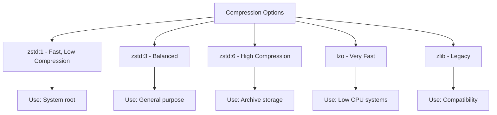

**Option 1: zstd:1**
- **Pros**: Very fast, low CPU overhead, good for root filesystem
- **Cons**: Lower compression ratio (~30-40%)
- **Impact**: Minimal performance impact, moderate space savings

**Option 2: zstd:3**
- **Pros**: Balanced performance/ratio, good general purpose
- **Cons**: Moderate CPU usage
- **Impact**: Good balance for most workloads (~40-50% compression)

**Option 3: zstd:6**
- **Pros**: High compression ratio (~50-60%)
- **Cons**: Higher CPU usage, slower writes
- **Impact**: Best for read-heavy workloads

**Option 4: lzo**
- **Pros**: Very low CPU overhead, fastest
- **Cons**: Lowest compression ratio (~20-30%)
- **Impact**: Good for CPU-constrained systems

**Option 5: Subvolume-Specific**
- **Pros**: Optimize each use case independently
- **Cons**: More complex configuration
- **Impact**: Maximum optimization per workload

**Evaluation Checklist:**
- [ ] Benchmark zstd levels 1, 3, 6 on test data
- [ ] Measure CPU overhead for each option
- [ ] Test database performance with/without compression
- [ ] Evaluate container I/O performance
- [ ] Calculate storage savings for each option
- [ ] Test mixed workload scenarios

**Recommended Decision:** Option 5 (Subvolume-Specific)
- Root filesystem: zstd:1
- PostgreSQL: nocompress or zstd:1
- Containers: zstd:3
- Development: zstd:3
- Archives: zstd:6

**Acceptance Criteria:**
- Benchmarks completed for all options
- Performance impact quantified
- Storage savings measured
- Configuration documented
- Rollback plan defined

---

## Issue Metadata Schema

For GitHub Project Board, each issue should have:

### Status Field
- **Backlog**: Not started, low priority
- **Ready**: Ready to work, dependencies met
- **Researching**: Investigation phase
- **In Progress**: Actively being worked
- **Blocked**: Waiting on dependencies
- **In Review**: Code review or testing
- **Done**: Complete and verified

### Priority Field
- **High**: Critical path, blocks other work
- **Medium**: Important but not blocking
- **Low**: Nice to have, future optimization

### Size Field
- **XS**: 15-20 minutes
- **S**: 20-45 minutes
- **M**: 45-75 minutes
- **L**: 75-90 minutes
- **XL**: Multiple sessions, break down further
- **XXL**: Epic-level, already broken down

### Iteration Field
- **MVP**: Minimum viable product features
- **Beta**: Enhanced functionality
- **v1.0**: Polish and advanced features
- **Post-v1**: Future enhancements
- **Experiment**: Research and investigation

### Labels
- **Area**: `area/infrastructure`, `area/desktop`, `area/ci-cd`, `area/configuration`, etc.
- **Type**: `type/feature`, `type/bug`, `type/research`, `type/decision`, `type/task`, etc.
- **Device**: `device/zephyrus`, `device/yoga`, `host/hetzner`, `host/ovh`, etc.
- **Package**: `package/dms`, `package/ghostty`, `service/postgresql`, etc.

### Custom Fields
- **Spec / Spec ID**: OpenSpec change ID (e.g., `add-gitlab-ci-infrastructure`)
- **Spec Type**: `Proposal`, `Change`, `Decision`, `N/A`
- **Primary Doc**: Link to main spec or doc file
- **Estimate**: Time estimate in minutes
- **Sub-issues Progress**: Auto-calculated from checklist

---

## GitHub Project Board Structure

### Recommended Views

#### 1. Kanban Board (Default)
Columns: Backlog, Ready, In Progress, Blocked, In Review, Done
Group by: Priority
Filter: Current iteration

#### 2. Phase View
Group by: Iteration (MVP, Beta, v1.0)
Filter: Open issues only

#### 3. Area View
Group by: Area label
Filter: Status != Done

#### 4. Dependency View
Table view with Depends On and Blocks fields visible
Sort by: Priority

### Workflows

1. **New Issue**: Automatically moves to Backlog
2. **Dependencies Met**: Move from Backlog to Ready
3. **Started**: Move from Ready to In Progress
4. **PR Opened**: Move to In Review
5. **PR Merged**: Move to Done

---

## Summary Statistics

### Total Issues: 120+
- Phase 1 (Foundation): 0 (complete)
- Phase 2 (Personal Devices): 15 issues
- Phase 3 (CI/CD): 45 issues
- Phase 4 (Server Infrastructure): 25 issues
- Phase 5 (Desktop Experience): 30 issues
- Phase 6 (Advanced Features): 5 decision/research issues

### By Priority:
- High: 45 issues
- Medium: 50 issues
- Low: 25 issues

### By Size:
- XS-S: 60 issues (15-45 min)
- M-L: 50 issues (45-90 min)
- XL+: 10 epics (multiple sessions)

### Estimated Total Effort:
- High priority: ~40 hours
- Medium priority: ~45 hours
- Low priority: ~35 hours
- **Total**: ~120 hours of focused development

---

**Note**: This document provides issue templates. For actual GitHub Project creation:
1. Create issues using these templates
2. Set up GitHub Project board
3. Configure custom fields (Status, Priority, Size, Iteration, Spec ID)
4. Set up labels (area/*, type/*, etc.)
5. Create project views (Kanban, Phase, Area)
6. Link issues to milestones
7. Set up automation rules

**Maintenance**: Update this document as new work items are identified or priorities change.
