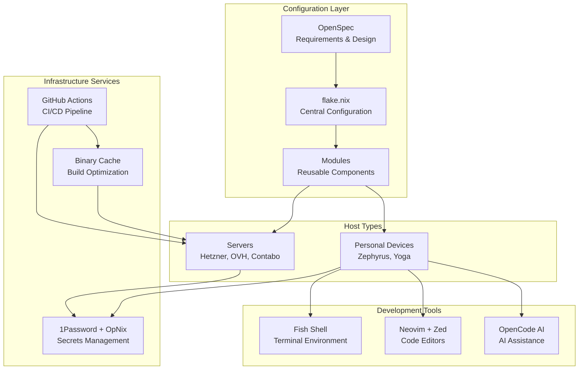
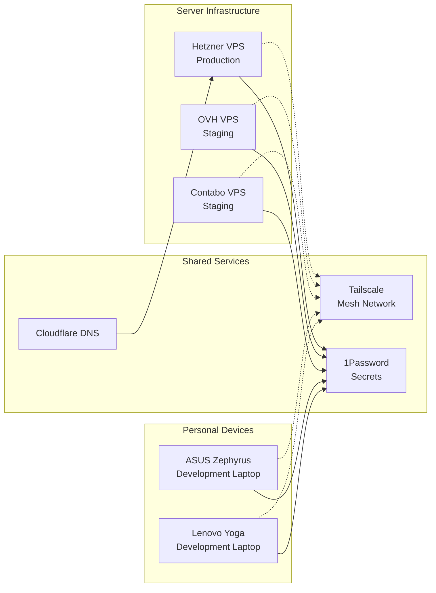
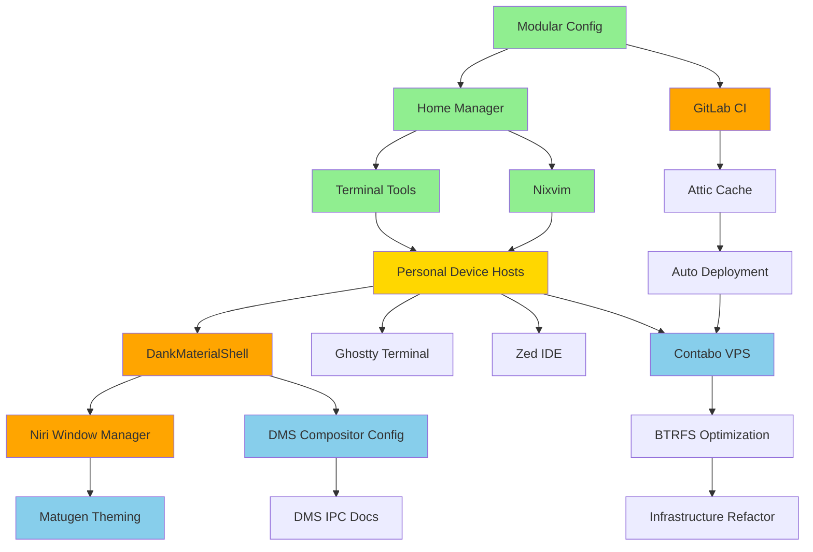
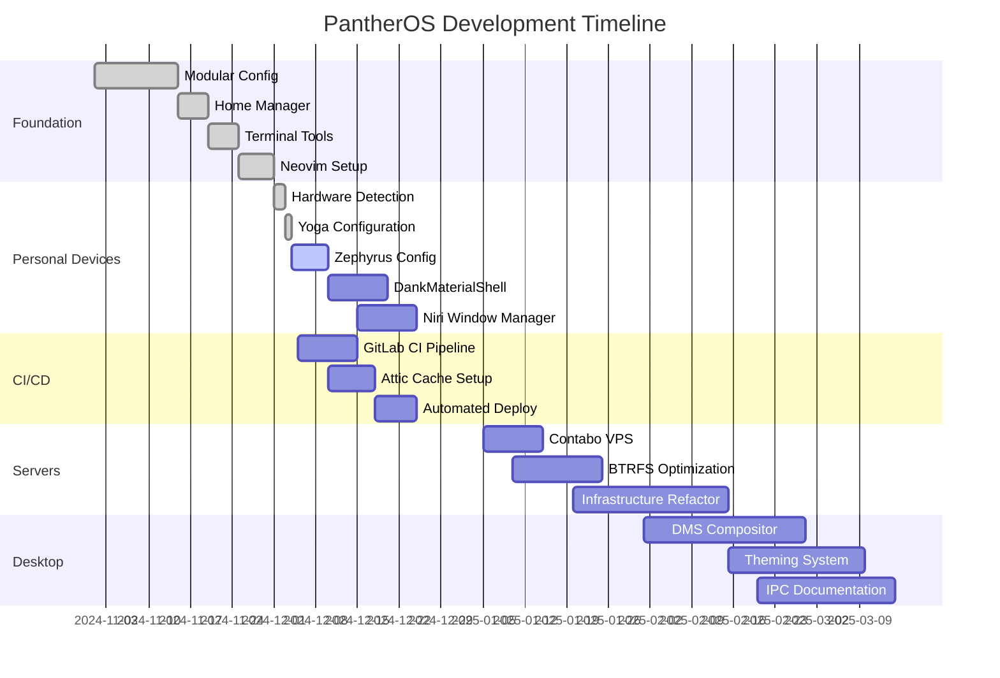

# PantherOS Project Roadmap

> **Last Updated:** 2025-12-04  
> **Status:** Active Development  
> **Project Type:** NixOS Configuration Management

## Executive Summary

PantherOS is a comprehensive NixOS-based system configuration project managing multiple hosts (servers and personal devices) with a focus on declarative configuration, automation, and developer experience. This roadmap outlines the strategic direction, current progress, and planned work across all system components.

## Project Goals

### Core Goals
- **Declarative Infrastructure**: Manage all system configurations through Nix flakes
- **Multi-Host Support**: Support servers (Hetzner, OVH, Contabo) and personal devices (Zephyrus, Yoga)
- **Developer Experience**: Provide excellent tooling and automation for development workflows
- **Security**: Implement secure secrets management and hardened configurations
- **Automation**: CI/CD pipelines for testing and deployment

### Non-Goals
- Gaming optimization (explicitly excluded)
- Multi-cloud orchestration (deferred to later phases)
- Desktop application management beyond development tools

## Architecture Overview

## System Components

## Phases and Milestones

### Phase 1: Foundation ✅ COMPLETE

**Goal**: Establish core configuration structure and basic tooling

**Completed Milestones**:
- ✅ Modular configuration structure
- ✅ Home Manager integration
- ✅ Basic terminal tools (fish, fzf, eza)
- ✅ Neovim/nixvim setup
- ✅ OpenCode AI integration
- ✅ Hardware detection workflow

**OpenSpec Changes**: 
- `create-modular-config` ✅
- `add-home-manager-setup` ✅
- `add-terminal-tools` ✅
- `add-nixvim-setup` ✅
- `add-opencode-ai` ✅

### Phase 2: Personal Device Support 🔄 IN PROGRESS

**Goal**: Full support for personal development laptops

**Status**: Partially complete (Yoga configured, Zephyrus pending hardware scan)

**Milestones**:
- ✅ Hardware detection and facter integration
- ✅ Yoga laptop configuration
- ⏳ Zephyrus laptop configuration (blocked on hardware access)
- ⏳ DankMaterialShell desktop environment
- ⏳ Niri window manager integration
- ⏳ Ghostty terminal emulator
- ⏳ Zed IDE installation

**OpenSpec Changes**:
- `add-personal-device-hosts` 🔄 (50% - Yoga done)
- `add-dank-material-shell` 📋 (0/39 tasks)
- `add-niri-window-manager` 📋 (0/15 tasks)
- `set-ghostty-as-default-terminal` 📋 (0/7 tasks)
- `add-zed-ide` 📋 (0 tasks defined)

### Phase 3: CI/CD Infrastructure 🔄 IN PROGRESS

**Goal**: Automated testing and deployment pipeline

**Status**: GitLab CI planned but not started

**Milestones**:
- ⏳ GitLab CI pipeline configuration
- ⏳ Attic binary cache setup
- ⏳ Automated deployment to servers
- ⏳ Build artifact caching
- ⏳ Integration testing framework

**OpenSpec Changes**:
- `add-gitlab-ci-infrastructure` 🔄 (4/138 tasks)

### Phase 4: Enhanced Server Infrastructure 📋 PLANNED

**Goal**: Expand server fleet and capabilities

**Status**: Not started

**Milestones**:
- 📋 Contabo VPS configuration
- 📋 Multi-server deployment orchestration
- 📋 Container runtime optimization
- 📋 Database optimization (PostgreSQL + BTRFS)
- 📋 System monitoring integration

**OpenSpec Changes**:
- `add-contabo-vps-server` 📋 (0/25 tasks)
- `optimize-btrfs-postgresql` 📋 (0/24 tasks)
- `refactor-enhance-infrastructure` 📋 (45/100 tasks)

### Phase 5: Desktop Experience 📋 PLANNED

**Goal**: Rich desktop environment for personal devices

**Status**: Design phase

**Milestones**:
- 📋 DankMaterialShell compositor configuration
- 📋 IPC documentation and tooling
- 📋 Matugen theming system
- 📋 Complete desktop customization

**OpenSpec Changes**:
- `add-dms-compositor-config` 📋 (0/100 tasks)
- `add-dms-ipc-documentation` 📋 (0/63 tasks)
- `add-matugen-theming` 📋 (0/61 tasks)

### Phase 6: Advanced Features 🔬 RESEARCH

**Goal**: Performance optimization and advanced capabilities

**Status**: Research and design phase

**Milestones**:
- 🔬 BTRFS optimization strategies
- 🔬 Container runtime performance tuning
- 🔬 Snapshot and backup strategy
- 🔬 Hardware-specific optimizations

**OpenSpec Changes**:
- `design-snapshot-backup-strategy` 🔬
- `optimize-btrfs-for-podman` 🔬
- `optimize-btrfs-podman-advanced` 🔬
- `analyze-performance-bottlenecks` 🔬

## Dependency Graph

**Legend**:
- 🟢 Green: Completed
- 🟡 Yellow: In Progress
- 🟠 Orange: Planned - Near Term
- 🔵 Blue: Planned - Future

## Roadmap Timeline

## Next Actions

### Immediate (This Week)
1. Complete Zephyrus hardware scan and configuration
2. Start GitLab CI pipeline setup
3. Deploy DankMaterialShell to Yoga device
4. Create GitHub Project board with all issues

### Short Term (Next 2 Weeks)
1. Complete all Phase 2 personal device tasks
2. Deploy functional GitLab CI pipeline
3. Configure Attic binary cache
4. Add Contabo VPS configuration

### Medium Term (Next Month)
1. Full CI/CD automation operational
2. All three servers in production
3. Desktop environment fully customized
4. Begin BTRFS optimization work

---

**Maintained by**: GitHub Copilot AI Agent  
**Review Cycle**: Weekly  
**Status Updates**: After each phase milestone
