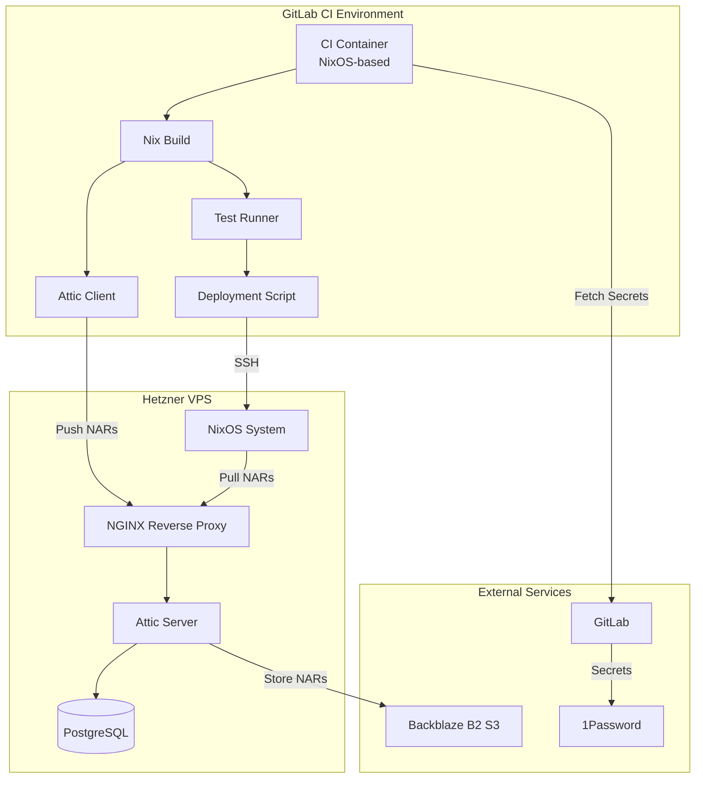
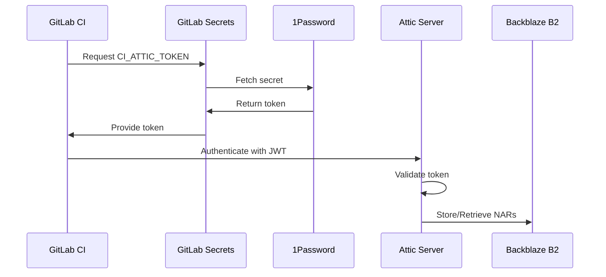

# Design: GitLab CI Infrastructure with Attic Binary Cache

## Technical Architecture

### Component Diagram



## 1. GitLab CI Container

### Container Image Structure

The CI container will be built as a Docker/OCI image using Nix:

```nix
# Pseudocode structure
{
  base = nixos-minimal;
  packages = [
    nix
    git
    openssh
    attic-client
    nixos-rebuild
  ];
  config = {
    nix.settings = {
      experimental-features = ["nix-command" "flakes"];
      substituters = ["https://cache.nixos.org" "https://attic.hetzner-vps.local"];
    };
  };
}
```

### Build Strategy

- Use `dockerTools.buildImage` from nixpkgs
- Layer structure optimized for caching
- Pre-populate with common dependencies
- Size target: <2GB compressed

### CI Pipeline Stages

```yaml
# Conceptual .gitlab-ci.yml structure
stages:
  - build
  - test
  - cache
  - deploy

build:
  - nix build .#nixosConfigurations.hetzner-vps
  
test:
  - nix flake check
  - Run integration tests
  
cache:
  - attic push pantherOS ./result
  
deploy:
  - nixos-rebuild switch --flake .#hetzner-vps --target-host hetzner-vps
```

## 2. Attic Server Configuration

### NixOS Module Integration

Add to `hosts/servers/hetzner-vps/default.nix`:

```nix
services.atticd = {
  enable = true;
  
  # Database configuration
  database = {
    type = "postgresql";
    host = "localhost";
    name = "attic";
  };
  
  # Storage backend
  storage = {
    type = "s3";
    region = "us-west-004";  # Backblaze B2
    bucket = "pantheros-nix-cache";
    endpoint = "s3.us-west-004.backblazeb2.com";
  };
  
  # Server settings
  listen = "[::]:8080";
  api-endpoint = "https://cache.pantheros.dev";
  
  # Compression and chunking
  compression = "zstd";
  chunking = {
    nar-size-threshold = 65536;  # 64 KiB
    min-size = 16384;            # 16 KiB
    avg-size = 65536;            # 64 KiB
    max-size = 262144;           # 256 KiB
  };
};
```

### PostgreSQL Setup

```nix
services.postgresql = {
  enable = true;
  package = pkgs.postgresql_15;
  
  ensureDatabases = [ "attic" ];
  ensureUsers = [{
    name = "atticd";
    ensureDBOwnership = true;
  }];
};
```

### Caddy Reverse Proxy

```nix
services.caddy = {
  enable = true;
  
  virtualHosts."cache.hbohlen.systems" = {
    extraConfig = ''
      # Reverse proxy to Attic server
      reverse_proxy localhost:8080
      
      # Optional: Restrict to Tailscale network
      @tailscale {
        remote_ip 100.64.0.0/10
      }
      # handle @tailscale {
      #   reverse_proxy localhost:8080
      # }
      # respond 403
    '';
  };
};
```

**Benefits of Caddy:**

- Automatic HTTPS with Let's Encrypt (no manual ACME configuration)
- Simpler configuration syntax
- Built-in support for Cloudflare DNS challenges
- Automatic HTTP/2 and HTTP/3 support
- Easy integration with Tailscale for access control

### Backblaze B2 Configuration

**Bucket Settings:**

- Bucket Name: `pantheros-nix-cache`
- Region: `us-west-004`
- Lifecycle Rules: Keep all versions for 30 days, then delete old versions
- Encryption: Server-side encryption enabled

**Access Credentials:**
Stored in 1Password and referenced via OpNix:

```nix
services.onepassword-secrets.secrets = {
  b2-application-key-id = {
    reference = "op://pantherOS/Backblaze-B2/application-key-id";
    path = "/etc/attic/b2-key-id";
  };
  b2-application-key = {
    reference = "op://pantherOS/Backblaze-B2/application-key";
    path = "/etc/attic/b2-key";
  };
};
```

## 3. Cache Management

### Cache Structure

```
pantherOS (root cache)
├── public-cache (public, read-only for anonymous)
│   └── Common NixOS packages
└── ci-cache (private, CI read-write)
    └── Custom builds and configurations
```

### Token Management

**Root Token:** Full administrative access (stored in 1Password)

**CI Token:** Limited to ci-cache with push/pull permissions

```bash
atticadm make-token \
  --sub gitlab-ci \
  --validity '1 year' \
  --pull 'ci-cache' \
  --push 'ci-cache'
```

**Public Token:** Read-only access to public-cache

```bash
atticadm make-token \
  --sub public \
  --validity '10 years' \
  --pull 'public-cache'
```

### Garbage Collection

```nix
systemd.services.attic-gc = {
  description = "Attic garbage collection";
  script = "${pkgs.attic-server}/bin/atticd --mode garbage-collector-once";
  serviceConfig.Type = "oneshot";
};

systemd.timers.attic-gc = {
  wantedBy = [ "timers.target" ];
  timerConfig = {
    OnCalendar = "daily";
    Persistent = true;
  };
};
```

**Retention Policy:**

- ci-cache: 30 days for unused NARs
- public-cache: 90 days for unused NARs

## 4. Deployment Automation

### Deployment Flow

1. **Build Validation:**
   - `nix flake check` passes
   - All integration tests pass
   - Build artifacts cached in Attic

2. **Pre-deployment:**
   - SSH connection test to target host
   - Verify Attic cache accessibility
   - Check disk space on target

3. **Deployment:**
   - Use `nixos-rebuild switch --flake .#hetzner-vps --target-host`
   - Pull from Attic cache for faster deployment
   - Capture deployment logs

4. **Post-deployment:**
   - Verify services are running
   - Run smoke tests
   - Report status back to GitLab

### Deployment Script

```bash
#!/usr/bin/env bash
set -euo pipefail

HOST="hetzner-vps"
FLAKE_REF=".#${HOST}"

# Pre-flight checks
echo "Testing SSH connection..."
ssh root@${HOST} "echo 'Connection successful'"

echo "Checking Attic cache..."
attic cache info ci-cache

# Deploy
echo "Deploying to ${HOST}..."
nixos-rebuild switch \
  --flake "${FLAKE_REF}" \
  --target-host "root@${HOST}" \
  --use-remote-sudo \
  --build-host localhost

# Post-deployment verification
echo "Verifying deployment..."
ssh root@${HOST} "systemctl is-system-running --wait"

echo "Deployment successful!"
```

## 5. Security Model

### Authentication Flow



### Secret Management

**GitLab CI Variables:**

- `CI_ATTIC_TOKEN`: JWT token for Attic cache access
- `DEPLOY_SSH_KEY`: SSH private key for deployment
- `ATTIC_SERVER_URL`: URL of Attic server

**1Password Integration:**
All secrets sourced from 1Password vault `pantherOS`:

- `Attic/ci-token`
- `SSH/deploy-key`
- `Backblaze-B2/application-key-id`
- `Backblaze-B2/application-key`

### Network Security

- Attic server only accessible via HTTPS (NGINX with Let's Encrypt)
- SSH access to Hetzner VPS restricted to Tailscale network
- S3 credentials never exposed in logs or artifacts
- CI container runs with minimal privileges

## 6. Performance Optimization

### Build Caching Strategy

**Layer 1: cache.nixos.org**

- Default upstream cache
- Priority: 40

**Layer 2: Attic public-cache**

- Common pantherOS dependencies
- Priority: 50

**Layer 3: Attic ci-cache**

- Custom builds and configurations
- Priority: 60

### Chunking Configuration

Attic uses content-defined chunking for deduplication:

- **NAR size threshold:** 64 KiB (files smaller than this are not chunked)
- **Average chunk size:** 64 KiB (optimal for network transfer)
- **Min/Max chunk size:** 16 KiB / 256 KiB (prevents extreme fragmentation)

Expected deduplication ratio: 30-50% for typical NixOS configurations

### Network Optimization

- Compression: zstd (fast compression, good ratio)
- Parallel uploads: 4 concurrent streams
- Connection pooling for S3 requests
- CDN consideration for future (Cloudflare R2 or similar)

## 7. Monitoring and Observability

### Metrics to Track

- Build times (with/without cache)
- Cache hit rates
- Storage usage (S3 bucket size)
- Deployment success/failure rates
- Attic server response times

### Logging

- Attic server logs: journald
- CI pipeline logs: GitLab CI artifacts
- Deployment logs: Stored in `/var/log/nixos-rebuild`

## 8. Disaster Recovery

### Backup Strategy

**PostgreSQL Database:**

- Daily automated backups via `services.postgresqlBackup`
- Retention: 30 days
- Stored in separate S3 bucket

**Attic Configuration:**

- NixOS configuration in Git (already versioned)
- Attic server.toml backed up with NixOS config

**S3 Data:**

- Backblaze B2 versioning enabled
- 30-day retention for deleted objects
- Cross-region replication (future enhancement)

### Recovery Procedures

1. **Attic Server Failure:**
   - Redeploy NixOS configuration
   - Restore PostgreSQL from backup
   - S3 data remains intact

2. **S3 Bucket Corruption:**
   - Rebuild cache from source
   - Temporary fallback to cache.nixos.org

3. **Complete Infrastructure Loss:**
   - Rebuild Hetzner VPS from scratch
   - Restore from Git repository
   - Rebuild cache incrementally

## 9. Future Enhancements

### Phase 2 (Post-MVP)

- Multi-host deployment orchestration
- Rollback mechanisms with system generations
- Cache analytics dashboard
- Automated cache warming for common builds

### Phase 3 (Long-term)

- CDN integration for global cache distribution
- Multi-region Attic servers
- Integration with NixOS deployment tools (deploy-rs, colmena)
- Cache sharing between multiple projects

## 10. Open Questions

> [!IMPORTANT]
> **Questions requiring user input:**

1. **GitLab Instance:** Are you using GitLab.com or self-hosted GitLab?
2. **Backblaze B2 Account:** Do you already have a Backblaze account, or should we include setup instructions?
3. **Domain Name:** What domain should be used for the Attic cache? (e.g., `cache.pantheros.dev`)
4. **Deployment Trigger:** Should deployment happen automatically on main branch, or require manual approval?
5. **Testing Scope:** What level of testing is required before deployment? (build-only, integration tests, manual approval?)

## Trade-offs and Alternatives

### Alternative 1: Cachix

**Pros:** Managed service, zero maintenance
**Cons:** Monthly cost, less control, potential vendor lock-in
**Decision:** Self-hosted Attic for cost savings and learning

### Alternative 2: GitHub Actions

**Pros:** Integrated with GitHub, generous free tier
**Cons:** Requires moving from GitLab, different workflow
**Decision:** Stick with GitLab CI (assuming current choice)

### Alternative 3: Local Binary Cache

**Pros:** Simpler setup, no S3 costs
**Cons:** Limited by VPS storage, no redundancy
**Decision:** S3-backed for scalability and durability
