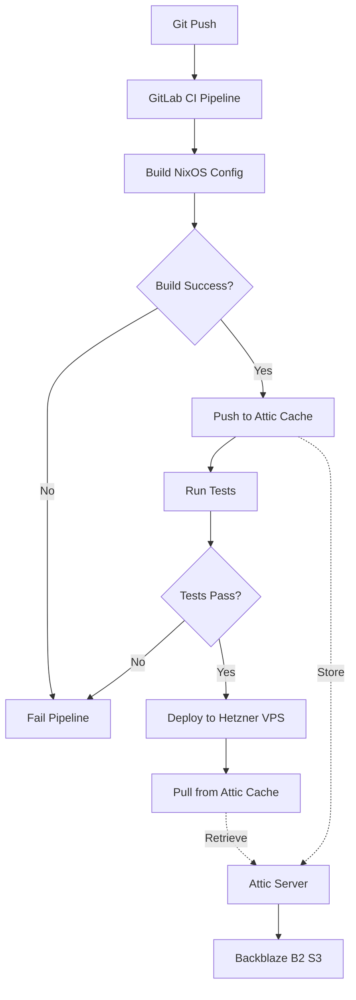

# Proposal: Add GitLab CI Infrastructure with Attic Binary Cache

## Overview

This change adds a comprehensive CI/CD infrastructure for testing and deploying NixOS configurations using GitLab CI. The infrastructure includes:

1. **GitLab CI Container**: A NixOS-based container image for running builds and tests in GitLab CI pipelines
2. **Attic Binary Cache**: A self-hosted Nix binary cache backed by Backblaze B2 S3 storage for faster builds and reduced bandwidth
3. **Automated Deployment**: Pipeline that automatically deploys successful builds to the Hetzner VPS server

## Problem Statement

Currently, there is no automated way to:

- Test NixOS configuration changes before deploying to production hosts
- Cache Nix build artifacts to speed up CI/CD pipelines
- Automatically deploy validated configurations to servers

This creates risk when making configuration changes and leads to slow iteration cycles.

## Goals

1. Enable full NixOS configuration testing in GitLab CI before deployment
2. Reduce CI build times through a private Nix binary cache
3. Automate deployment to Hetzner VPS on successful builds
4. Provide a foundation for future multi-host deployments

## Non-Goals

- Multi-cloud deployment orchestration (future enhancement)
- Rollback mechanisms (can be added later)
- Monitoring and alerting integration (separate concern)

## Architecture Overview

## Key Components

### 1. GitLab CI Container

- Based on NixOS
- Includes Nix with flakes enabled
- Pre-configured with Attic client
- Contains deployment tools (SSH, etc.)

### 2. Attic Server

- Runs on Hetzner VPS
- Uses PostgreSQL for metadata
- Stores NARs in Backblaze B2 S3
- Provides authenticated and public caches

### 3. CI/CD Pipeline

- Build stage: Build NixOS configurations
- Test stage: Run integration tests
- Cache stage: Push artifacts to Attic
- Deploy stage: Deploy to target hosts

## Dependencies

- Existing Hetzner VPS infrastructure
- GitLab account with CI/CD enabled
- Backblaze B2 account for S3 storage
- 1Password for secrets management (already configured)

## Security Considerations

- Attic authentication tokens stored in GitLab CI variables
- SSH deployment keys managed via 1Password
- S3 credentials secured in NixOS configuration
- Public cache for common dependencies, private cache for custom builds

## Timeline Estimate

- Planning: Complete (this proposal)
- Implementation: 2-3 days
- Testing: 1 day
- Documentation: 1 day

## Success Criteria

1. GitLab CI can successfully build all NixOS configurations
2. Attic cache reduces build times by >50% on cache hits
3. Successful builds automatically deploy to Hetzner VPS
4. All components are documented and maintainable
