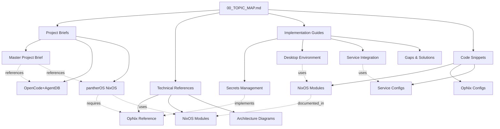

# Topic Map & Navigation Guide

**Document Version**: 1.0  
**Generated**: 2025-11-15  
**Purpose**: AI agent navigation and context retrieval optimization

---

## Quick Navigation

### Project Briefs
- [`01_MASTER_PROJECT_BRIEF.md`](./project_briefs/01_MASTER_PROJECT_BRIEF.md) - Unified project overview
- [`02_OPENCODE_AGENTDB_BRIEF.md`](./project_briefs/02_OPENCODE_AGENTDB_BRIEF.md) - AI infrastructure project
- [`03_PANTHEROS_NIXOS_BRIEF.md`](./project_briefs/03_PANTHEROS_NIXOS_BRIEF.md) - NixOS configuration system

### Technical References
- [`OPNIX_COMPLETE_REFERENCE.md`](./technical_references/OPNIX_COMPLETE_REFERENCE.md) - OpNix comprehensive guide
- [`NIXOS_MODULES_REFERENCE.md`](./technical_references/NIXOS_MODULES_REFERENCE.md) - NixOS modules documentation
- [`ARCHITECTURE_DIAGRAMS.md`](./technical_references/ARCHITECTURE_DIAGRAMS.md) - System architecture visualizations

### Implementation Guides
- [`SECRETS_MANAGEMENT_GUIDE.md`](./implementation_guides/SECRETS_MANAGEMENT_GUIDE.md) - 1Password + OpNix patterns
- [`DESKTOP_ENVIRONMENT_GUIDE.md`](./implementation_guides/DESKTOP_ENVIRONMENT_GUIDE.md) - Niri + DankMaterialShell setup
- [`SERVICE_INTEGRATION_PATTERNS.md`](./implementation_guides/SERVICE_INTEGRATION_PATTERNS.md) - Common service configurations
- [`GAPS_AND_IMPLEMENTATIONS.md`](./implementation_guides/GAPS_AND_IMPLEMENTATIONS.md) - Known gaps with solutions

### Code Snippets
- [`code_snippets/nixos/`](./code_snippets/nixos/) - NixOS module implementations
- [`code_snippets/opnix/`](./code_snippets/opnix/) - OpNix configurations
- [`code_snippets/services/`](./code_snippets/services/) - Service integrations

---

## Document Relationship Diagram



---

## Topic Taxonomy

### Level 1: Projects
```
├── OpenCode + AgentDB Infrastructure
│   ├── Phase 1: Local MVP
│   ├── Phase 2: VPS Deployment
│   ├── Phase 3: Persistent Services
│   └── Phase 4: Web Interface
│
└── pantherOS NixOS Configuration
    ├── Base System (25.05)
    ├── Desktop Environment (Niri + DMS)
    ├── Secrets Management (OpNix)
    ├── Services (Datadog, Tailscale, Attic)
    └── Development Tools (LSP, PM)
```

### Level 2: Core Technologies
```
├── NixOS Ecosystem
│   ├── NixOS 25.05
│   ├── Home Manager
│   ├── Flakes
│   └── Disko
│
├── Secrets Management
│   ├── 1Password
│   ├── OpNix
│   ├── Service Accounts
│   └── SSH Agent
│
├── Desktop Environment
│   ├── Niri Compositor
│   ├── DankMaterialShell
│   ├── Wayland
│   └── Polkit
│
├── Infrastructure Services
│   ├── Tailscale
│   ├── Datadog Agent
│   ├── Attic + Backblaze B2
│   └── PostgreSQL
│
├── Development Environment
│   ├── Fish Shell
│   ├── LSP Servers
│   ├── Package Managers
│   └── Containers (Podman)
│
└── AI Agent Framework
    ├── OpenCode SDK
    ├── AgentDB
    ├── Crawl4ai
    └── Sub-agent Coordination
```

### Level 3: Implementation Patterns
```
├── Secret Provisioning
│   ├── System secrets (NixOS)
│   ├── User secrets (Home Manager)
│   ├── Service account tokens
│   └── File-based injection
│
├── Service Configuration
│   ├── Systemd integration
│   ├── *File options pattern
│   ├── Runtime secret loading
│   └── Restart on change
│
├── Module Organization
│   ├── modules/ (atomic components)
│   ├── profiles/ (composed configurations)
│   ├── hosts/ (per-machine settings)
│   └── home/ (user configurations)
│
└── Testing Strategies
    ├── Pause & test points
    ├── Build-time validation
    ├── Runtime verification
    └── Rollback mechanisms
```

---

## Context Retrieval Guide

### For AI Coding Agents

**When implementing NixOS modules:**
1. Start: [`NIXOS_MODULES_REFERENCE.md`](./technical_references/NIXOS_MODULES_REFERENCE.md)
2. Check: [`code_snippets/nixos/`](./code_snippets/nixos/) for examples
3. Reference: [`03_PANTHEROS_NIXOS_BRIEF.md`](./project_briefs/03_PANTHEROS_NIXOS_BRIEF.md) for structure

**When working with secrets:**
1. Start: [`OPNIX_COMPLETE_REFERENCE.md`](./technical_references/OPNIX_COMPLETE_REFERENCE.md)
2. Check: [`SECRETS_MANAGEMENT_GUIDE.md`](./implementation_guides/SECRETS_MANAGEMENT_GUIDE.md)
3. Examples: [`code_snippets/opnix/`](./code_snippets/opnix/)

**When integrating services:**
1. Start: [`SERVICE_INTEGRATION_PATTERNS.md`](./implementation_guides/SERVICE_INTEGRATION_PATTERNS.md)
2. Check: [`code_snippets/services/`](./code_snippets/services/)
3. Troubleshoot: [`GAPS_AND_IMPLEMENTATIONS.md`](./implementation_guides/GAPS_AND_IMPLEMENTATIONS.md)

**When setting up desktop environment:**
1. Start: [`DESKTOP_ENVIRONMENT_GUIDE.md`](./implementation_guides/DESKTOP_ENVIRONMENT_GUIDE.md)
2. Architecture: [`ARCHITECTURE_DIAGRAMS.md`](./technical_references/ARCHITECTURE_DIAGRAMS.md)
3. Brief: [`03_PANTHEROS_NIXOS_BRIEF.md`](./project_briefs/03_PANTHEROS_NIXOS_BRIEF.md)

---

## Keyword Index

### A-F
- **AgentDB**: [02_OPENCODE_AGENTDB_BRIEF.md](./project_briefs/02_OPENCODE_AGENTDB_BRIEF.md)
- **Attic**: [SERVICE_INTEGRATION_PATTERNS.md](./implementation_guides/SERVICE_INTEGRATION_PATTERNS.md), [code_snippets/services/attic.nix](./code_snippets/services/attic.nix)
- **Browser Toggle**: [code_snippets/nixos/browser.nix](./code_snippets/nixos/browser.nix)
- **Crawl4ai**: [02_OPENCODE_AGENTDB_BRIEF.md](./project_briefs/02_OPENCODE_AGENTDB_BRIEF.md)
- **DankMaterialShell**: [DESKTOP_ENVIRONMENT_GUIDE.md](./implementation_guides/DESKTOP_ENVIRONMENT_GUIDE.md)
- **Datadog**: [code_snippets/services/datadog-agent.nix](./code_snippets/services/datadog-agent.nix)
- **Disko**: [03_PANTHEROS_NIXOS_BRIEF.md](./project_briefs/03_PANTHEROS_NIXOS_BRIEF.md)
- **Fish Shell**: [code_snippets/nixos/fish.nix](./code_snippets/nixos/fish.nix)

### G-N
- **Home Manager**: [NIXOS_MODULES_REFERENCE.md](./technical_references/NIXOS_MODULES_REFERENCE.md)
- **LSP**: [DESKTOP_ENVIRONMENT_GUIDE.md](./implementation_guides/DESKTOP_ENVIRONMENT_GUIDE.md)
- **Niri**: [DESKTOP_ENVIRONMENT_GUIDE.md](./implementation_guides/DESKTOP_ENVIRONMENT_GUIDE.md)
- **NixOS 25.05**: [03_PANTHEROS_NIXOS_BRIEF.md](./project_briefs/03_PANTHEROS_NIXOS_BRIEF.md)

### O-T
- **1Password**: [SECRETS_MANAGEMENT_GUIDE.md](./implementation_guides/SECRETS_MANAGEMENT_GUIDE.md)
- **OpenCode**: [02_OPENCODE_AGENTDB_BRIEF.md](./project_briefs/02_OPENCODE_AGENTDB_BRIEF.md)
- **OpNix**: [OPNIX_COMPLETE_REFERENCE.md](./technical_references/OPNIX_COMPLETE_REFERENCE.md)
- **Podman**: [code_snippets/nixos/podman.nix](./code_snippets/nixos/podman.nix)
- **Polkit**: [wiki_references/POLKIT_WIKI.md](./wiki_references/POLKIT_WIKI.md)
- **Secrets**: [SECRETS_MANAGEMENT_GUIDE.md](./implementation_guides/SECRETS_MANAGEMENT_GUIDE.md)
- **SSH Agent**: [SECRETS_MANAGEMENT_GUIDE.md](./implementation_guides/SECRETS_MANAGEMENT_GUIDE.md)
- **Tailscale**: [code_snippets/services/tailscale.nix](./code_snippets/services/tailscale.nix)

### U-Z
- **VPS Deployment**: [02_OPENCODE_AGENTDB_BRIEF.md](./project_briefs/02_OPENCODE_AGENTDB_BRIEF.md)
- **Wayland**: [DESKTOP_ENVIRONMENT_GUIDE.md](./implementation_guides/DESKTOP_ENVIRONMENT_GUIDE.md)

---

## Document Metadata

| Document | Topics | Complexity | Dependencies |
|----------|--------|-----------|--------------|
| Master Project Brief | Overview, Architecture | Low | None |
| OpenCode+AgentDB | AI, Agents, Knowledge Base | Medium | Python, NixOS |
| pantherOS Brief | NixOS, Configuration | Medium | NixOS 25.05, Flakes |
| OpNix Reference | Secrets, 1Password | Medium | 1Password, OpNix |
| Secrets Guide | Security, Integration | Medium | OpNix, systemd |
| Desktop Guide | UI, Wayland, Niri | High | Niri, DMS, Wayland |
| Service Patterns | Integration, Services | Medium | Various services |
| Architecture Diagrams | Visualization | Low | Mermaid |

---

## Version Control

| Version | Date | Changes |
|---------|------|---------|
| 1.0 | 2025-11-15 | Initial consolidated documentation |

---

## Usage Instructions

### For Initial Context
```
Read: 00_TOPIC_MAP.md (this file) → 01_MASTER_PROJECT_BRIEF.md
```

### For Specific Implementation
```
1. Identify topic in taxonomy above
2. Navigate to relevant guide/reference
3. Check code snippets for examples
4. Review gaps document if issues arise
```

### For Comprehensive Understanding
```
Sequential reading order:
1. 00_TOPIC_MAP.md
2. 01_MASTER_PROJECT_BRIEF.md
3. Relevant project brief (02 or 03)
4. Technical references as needed
5. Implementation guides for specific tasks
```

---

## AI Agent Optimization Notes

- **Token Efficiency**: Each document is self-contained with minimal cross-references
- **Code Separation**: All code snippets extracted to dedicated files with enrichment
- **Hierarchical Structure**: Organized by decreasing abstraction level
- **Mermaid Diagrams**: Visual architecture aids in complex system understanding
- **Keyword Index**: Quick topic lookup without full document scan
- **Pause Points**: Implementation guides include validation checkpoints
