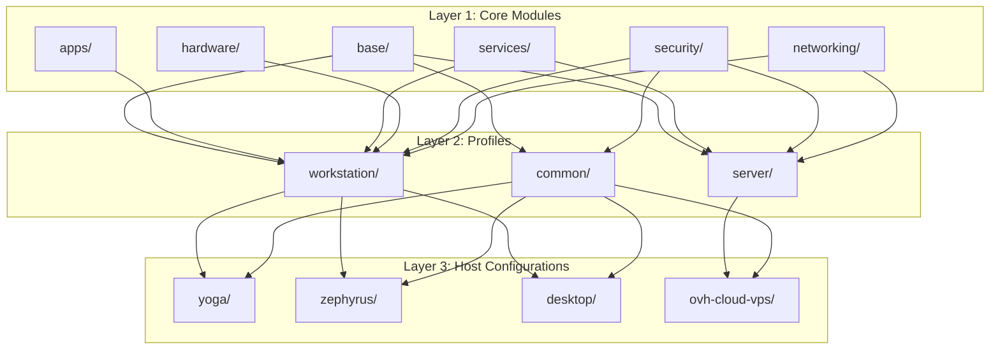
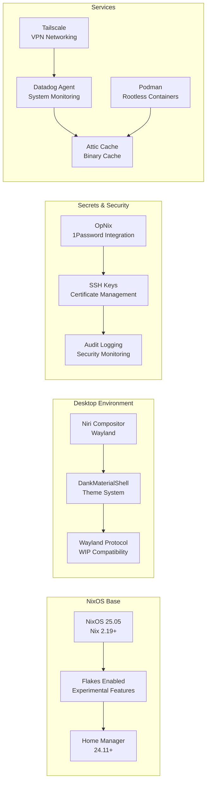
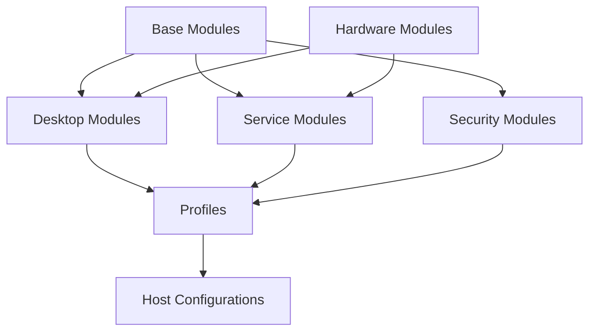

# pantherOS NixOS Configuration - Comprehensive Brief

**Version**: 1.0  
**Last Updated**: 2025-11-15 10:47:11  
**Owner**: pantherOS Project  
**Status**: Implementation guide for NixOS 25.05

---

## Executive Summary

pantherOS is a comprehensive NixOS configuration system designed for reproducible, secure, and extensible workstation and server deployments. It implements a modular architecture with layered configuration management, integrating advanced desktop environments, secure secrets management, and comprehensive service orchestration.

### Key Features
- **Declarative Configuration**: Single flake for all systems
- **Modular Architecture**: Layered module system (modules → profiles → hosts)
- **Desktop Integration**: Niri compositor with DankMaterialShell theming
- **Secrets Management**: OpNix integration with 1Password
- **Hardware Optimization**: Laptop and workstation specific configurations
- **Security First**: Comprehensive hardening and audit capabilities

---

## Architecture Overview

### Layered Configuration System



### System Dependencies



---

## Directory Structure

### Complete pantherOS Repository Structure

```bash
pantherOS/
├── flake.nix                          # Main flake configuration
├── flake.lock                         # Pinned dependency versions
│
├── lib/                               # Utility functions
│   ├── mkSystem.nix                   # System configuration builder
│   ├── mkHome.nix                     # Home Manager configuration builder
│   ├── secrets.nix                    # OpNix helper functions
│   ├── hardware.nix                   # Hardware detection utilities
│   └── validation.nix                 # Configuration validation
│
├── modules/                           # Atomic configuration modules
│   ├── base/                          # Core system modules
│   │   ├── time-locale.nix            # Time zone and locale
│   │   ├── users-groups.nix           # User and group management
│   │   ├── file-systems.nix           # File system configuration
│   │   ├── swap-memory.nix            # Swap and memory management
│   │   └── boot-loader.nix            # Boot loader configuration
│   │
│   ├── hardware/                      # Hardware-specific modules
│   │   ├── laptop/                    # Laptop optimizations
│   │   │   ├── battery.nix            # Battery management
│   │   │   ├── thermal.nix            # Thermal management
│   │   │   ├── touchpad.nix           # Touchpad configuration
│   │   │   ├── keyboard.nix           # Keyboard layout and options
│   │   │   └── display.nix            # Display scaling and rotation
│   │   │
│   │   ├── gpu/                       # Graphics configuration
│   │   │   ├── nvidia.nix             # NVIDIA drivers and CUDA
│   │   │   ├── amd.nix                # AMD GPU configuration
│   │   │   ├── intel.nix              # Intel integrated graphics
│   │   │   └── wayland-gpu.nix        # Wayland-specific GPU setup
│   │   │
│   │   ├── audio/                     # Audio system
│   │   │   ├── pipewire.nix           # PipeWire configuration
│   │   │   ├── bluetooth-audio.nix    # Bluetooth audio support
│   │   │   └── audio-quality.nix      # Audio optimization
│   │   │
│   │   └── connectivity/              # Network connectivity
│   │       ├── wifi.nix               # WiFi drivers and configuration
│   │       ├── bluetooth.nix          # Bluetooth configuration
│   │       ├── usb.nix                # USB device management
│   │       └── thunderbolt.nix        # Thunderbolt support
│   │
│   ├── desktop/                       # Desktop environment modules
│   │   ├── compositor/                # Window manager configuration
│   │   │   ├── niri.nix               # Niri compositor setup
│   │   │   ├── wayland-protocols.nix  # Wayland protocol support
│   │   │   ├── window-management.nix  # Window rules and behavior
│   │   │   └── workspace-management.nix # Workspace configuration
│   │   │
│   │   ├── theming/                   # Theme system
│   │   │   ├── dankmaterialshell.nix  # DMS integration
│   │   │   ├── gtk-themes.nix         # GTK application themes
│   │   │   ├── icon-themes.nix        # Icon pack configuration
│   │   │   ├── font-management.nix    # Font configuration
│   │   │   └── color-schemes.nix      # Color scheme definitions
│   │   │
│   │   ├── applications/              # Desktop applications
│   │   │   ├── browser.nix            # Web browser configuration
│   │   │   ├── file-manager.nix       # File manager setup
│   │   │   ├── terminal.nix           # Terminal configuration
│   │   │   └── text-editor.nix        # Text editor setup
│   │   │
│   │   └── system/                    # System integration
│   │       ├── notifications.nix      # Notification system
│   │       ├── status-bar.nix         # Status bar configuration
│   │       ├── application-launcher.nix # App launcher setup
│   │       └── clipboard.nix          # Clipboard management
│   │
│   ├── apps/                          # Application modules
│   │   ├── development/               # Development tools
│   │   │   ├── ide/                   # IDE configuration
│   │   │   ├── language-tools/        # Language-specific tools
│   │   │   ├── version-control.nix    # Git configuration
│   │   │   └── container-dev.nix      # Container development
│   │   │
│   │   ├── productivity/              # Productivity applications
│   │   ├── communication/             # Communication tools
│   │   └── media/                     # Media applications
│   │
│   ├── services/                      # System services
│   │   ├── networking/                # Network services
│   │   │   ├── tailscale.nix          # Tailscale VPN
│   │   │   ├── vpn.nix                # General VPN configuration
│   │   │   ├── dns.nix                # DNS configuration
│   │   │   └── network-filter.nix     # Network filtering
│   │   │
│   │   ├── monitoring/                # Monitoring and observability
│   │   │   ├── datadog.nix            # Datadog agent
│   │   │   ├── metrics.nix            # Custom metrics
│   │   │   ├── logging.nix            # Log aggregation
│   │   │   └── alerting.nix           # Alert configuration
│   │   │
│   │   ├── containers/                # Container services
│   │   │   ├── podman.nix             # Podman rootless containers
│   │   │   ├── registry.nix           # Container registry
│   │   │   └── container-security.nix # Container security
│   │   │
│   │   ├── cache/                     # Caching services
│   │   │   ├── attic.nix              # Attic binary cache
│   │   │   └── local-cache.nix        # Local build cache
│   │   │
│   │   └── databases/                 # Database services
│   │       ├── postgresql.nix         # PostgreSQL
│   │       └── redis.nix              # Redis
│   │
│   ├── security/                      # Security modules
│   │   ├── firewall/                  # Firewall configuration
│   │   │   ├── nftables.nix           # nftables firewall
│   │   │   ├── rules.nix              # Firewall rules
│   │   │   └── logging.nix            # Firewall logging
│   │   │
│   │   ├── audit/                     # Audit and monitoring
│   │   │   ├── auditd.nix             # Audit daemon
│   │   │   ├── security-logging.nix   # Security event logging
│   │   │   └── intrusion-detection.nix # Intrusion detection
│   │   │
│   │   ├── hardening/                 # System hardening
│   │   │   ├── kernel.nix             # Kernel security parameters
│   │   │   ├── service-hardening.nix  # Service security
│   │   │   └── user-security.nix      # User account security
│   │   │
│   │   └── secrets/                   # Secrets management
│   │       ├── opnix.nix              # OpNix integration
│   │       ├── ssh-hardening.nix      # SSH security
│   │       └── certificate.nix        # Certificate management
│   │
│   └── networking/                    # Networking modules
│       ├── workstation-net.nix        # Workstation network config
│       ├── server-net.nix             # Server network config
│       ├── wifi.nix                   # WiFi configuration
│       └── proxy.nix                  # Proxy configuration
│
├── profiles/                          # Composed configurations
│   ├── common/                        # Common to all systems
│   │   ├── base.nix                   # Base system profile
│   │   ├── time-locale.nix            # Time and locale
│   │   ├── ssd-optimization.nix       # SSD optimization
│   │   └── maintenance.nix            # System maintenance
│   │
│   ├── workstation/                   # Workstation profiles
│   │   ├── base.nix                   # Basic workstation setup
│   │   ├── gui.nix                    # GUI environment
│   │   ├── devtools.nix               # Development tools
│   │   ├── media.nix                  # Media applications
│   │   └── laptop.nix                 # Laptop optimizations
│   │
│   └── server/                        # Server profiles
│       ├── base.nix                   # Basic server setup
│       ├── monitoring.nix             # Monitoring and observability
│       ├── containers.nix             # Container orchestration
│       └── database.nix               # Database services
│
├── hosts/                             # Per-machine configurations
│   ├── yoga/                          # Lenovo Yoga laptop
│   │   ├── hardware-configuration.nix # Hardware-specific config
│   │   ├── configuration.nix          # System configuration
│   │   └── home.nix                   # Home Manager config
│   │
│   ├── zephyrus/                      # ASUS ROG Zephyrus laptop
│   │   ├── hardware-configuration.nix
│   │   ├── configuration.nix
│   │   └── home.nix
│   │
│   ├── desktop/                       # Desktop workstation
│   │   ├── hardware-configuration.nix
│   │   ├── configuration.nix
│   │   └── home.nix
│   │
│   └── ovh-cloud-vps/                 # VPS server
│       ├── hardware-configuration.nix
│       ├── configuration.nix
│       └── home.nix
│
├── home/                              # Home Manager configurations
│   ├── common/                        # Common user configuration
│   │   ├── shells/                    # Shell configurations
│   │   │   ├── fish.nix               # Fish shell setup
│   │   │   ├── zsh.nix                # Zsh configuration
│   │   │   └── bash.nix               # Bash configuration
│   │   │
│   │   ├── editors/                   # Editor configurations
│   │   │   ├── neovim.nix             # Neovim setup
│   │   │   ├── vscode.nix             # VS Code configuration
│   │   │   └── jetbrains.nix          # JetBrains IDEs
│   │   │
│   │   ├── git/                       # Git configuration
│   │   ├── ui/                        # User interface preferences
│   │   └── automation/                # User automation scripts
│   │
│   └── hayden/                        # User-specific configuration
│       └── default.nix                # Main user configuration
│
├── secrets/                           # OpNix configuration
│   ├── map.nix                        # Secret definitions mapping
│   ├── templates/                     # Secret templates
│   └── validation.nix                 # Secret validation
│
└── tests/                             # Configuration testing
    ├── unit/                          # Unit tests for modules
    ├── integration/                   # Integration tests
    └── validation/                    # Configuration validation
```

---

## Module System

### Module Categories

#### Base Modules
Core system functionality required for all configurations:

**Base System (`modules/base/`)**
- `time-locale.nix`: Time zone, locale, and internationalization
- `users-groups.nix`: User accounts, groups, and permissions
- `file-systems.nix`: File system mounting and options
- `swap-memory.nix`: Swap configuration and memory management
- `boot-loader.nix`: Boot loader configuration (systemd-boot/GRUB)

#### Hardware Modules
Hardware-specific optimizations and configurations:

**Laptop Modules (`modules/hardware/laptop/`)**
- `battery.nix`: Battery management and power optimization
- `thermal.nix`: Thermal management and fan control
- `touchpad.nix`: Touchpad configuration and gestures
- `keyboard.nix`: Keyboard layout and backlight control
- `display.nix`: Display scaling, rotation, and multi-monitor setup

**Graphics Modules (`modules/hardware/gpu/`)**
- `nvidia.nix`: NVIDIA drivers, CUDA, and Wayland compatibility
- `amd.nix`: AMD GPU configuration and optimization
- `intel.nix`: Intel integrated graphics setup
- `wayland-gpu.nix`: Wayland-specific GPU optimizations

**Audio Modules (`modules/hardware/audio/`)**
- `pipewire.nix`: PipeWire configuration and setup
- `bluetooth-audio.nix`: Bluetooth audio device support
- `audio-quality.nix`: Audio quality optimization and tuning

#### Desktop Environment Modules
Complete desktop environment integration:

**Compositor (`modules/desktop/compositor/`)**
- `niri.nix`: Niri Wayland compositor configuration
- `wayland-protocols.nix`: Wayland protocol extensions
- `window-management.nix`: Window rules and behavior
- `workspace-management.nix`: Workspace configuration and shortcuts

**Theming (`modules/desktop/theming/`)**
- `dankmaterialshell.nix`: DankMaterialShell integration
- `gtk-themes.nix`: GTK application theming
- `icon-themes.nix`: Icon pack configuration
- `font-management.nix`: Font installation and configuration
- `color-schemes.nix`: Color scheme definitions and application

**Applications (`modules/desktop/applications/`)**
- `browser.nix`: Web browser configuration and extensions
- `file-manager.nix`: File manager setup and customization
- `terminal.nix`: Terminal emulator configuration
- `text-editor.nix`: Text editor setup and plugins

**System Integration (`modules/desktop/system/`)**
- `notifications.nix`: Notification system configuration
- `status-bar.nix`: Status bar and panel setup
- `application-launcher.nix`: Application launcher configuration
- `clipboard.nix`: Clipboard management and history

#### Security Modules
Comprehensive security implementation:

**Firewall (`modules/security/firewall/`)**
- `nftables.nix`: nftables firewall configuration
- `rules.nix`: Firewall rules and policies
- `logging.nix`: Firewall logging and monitoring

**Audit (`modules/security/audit/`)**
- `auditd.nix`: Linux audit daemon configuration
- `security-logging.nix`: Security event logging
- `intrusion-detection.nix`: Intrusion detection setup

**Hardening (`modules/security/hardening/`)**
- `kernel.nix`: Kernel security parameters
- `service-hardening.nix`: Service security hardening
- `user-security.nix`: User account security

**Secrets (`modules/security/secrets/`)**
- `opnix.nix`: OpNix integration for 1Password secrets
- `ssh-hardening.nix`: SSH security configuration
- `certificate.nix`: Certificate management

#### Service Modules
System services and application services:

**Networking (`modules/services/networking/`)**
- `tailscale.nix`: Tailscale VPN configuration
- `vpn.nix`: General VPN client configuration
- `dns.nix`: DNS configuration and filtering
- `network-filter.nix`: Network filtering and QoS

**Monitoring (`modules/services/monitoring/`)**
- `datadog.nix`: Datadog agent configuration
- `metrics.nix`: Custom metrics collection
- `logging.nix`: Centralized logging configuration
- `alerting.nix`: Alert rules and escalation

**Containers (`modules/services/containers/`)**
- `podman.nix`: Podman rootless container runtime
- `registry.nix`: Container registry configuration
- `container-security.nix`: Container security hardening

**Cache (`modules/services/cache/`)**
- `attic.nix`: Attic binary cache setup
- `local-cache.nix`: Local build caching

---

## Host Configurations

### Host-Specific Requirements

#### yoga (Lenovo Yoga Laptop)
**Hardware Profile:**
- CPU: Intel Core i7 (11th gen)
- GPU: Intel Iris Xe + NVIDIA MX450
- RAM: 16GB
- Storage: 512GB NVMe SSD
- Display: 14" FHD (1920x1080) touch-enabled
- Features: 2-in-1 convertible, backlit keyboard, fingerprint reader

**Configuration Priorities:**
1. Battery optimization and power management
2. Touchscreen and pen input support
3. 2-in-1 mode detection and configuration
4. Hybrid GPU switching (Intel/NVIDIA)
5. Thermal management for sustained performance

**Key Modules:**
```nix
{
  imports = [
    <pantherOS/profiles/workstation/base.nix>
    <pantherOS/modules/hardware/laptop/battery.nix>
    <pantherOS/modules/hardware/gpu/nvidia.nix>
    <pantherOS/modules/hardware/display.nix>
    <pantherOS/modules/desktop/compositor/niri.nix>
  ];
  
  hardware.enableAllFirmware = true;
  hardware.nvidia.prime.offload.enable = true;
  
  services.xserver.enable = false;
  services.xserver.xrandrHeads = [ ];
}
```

#### zephyrus (ASUS ROG Zephyrus M16 GU603ZW - 2022)
**Hardware Profile:**
- **Model:** ROG Zephyrus M16 (2022) GU603ZW
- **CPU:** 12th Gen Intel Core i9-12900H (2.5 GHz, 24M Cache, up to 5.0 GHz, 14 cores: 6 P-cores and 8 E-cores)
- **GPU:** NVIDIA GeForce RTX 3070 Ti Laptop GPU (ROG Boost: 1085MHz at 120W, 8GB GDDR6)
- **Memory:** 8GB DDR5 on board + 8GB DDR5-4800 SO-DIMM (Max Capacity: 40GB, dual channel)
- **Storage:** 1TB M.2 NVMe PCIe 4.0 SSD
- **Display:** 16-inch WQXGA (2560 x 1600) 16:10, anti-glare, DCI-P3:100%, 165Hz, 3ms response time, IPS-level, Adaptive-Sync, Pantone Validated, MUX Switch + Optimus, Dolby Vision
- **Features:** Gaming-focused, RGB keyboard, advanced cooling, ROG Nebula Display

**Configuration Priorities:**
1. High-performance RTX 3070 Ti GPU configuration with Wayland support
2. 12th Gen Intel i9 optimization for high-performance workloads
3. 165Hz WQXGA display configuration with color accuracy
4. Advanced thermal management for sustained performance
5. DDR5 memory optimization and dual-channel configuration
6. PCIe 4.0 SSD optimization
7. ROG features integration (RGB, cooling, display)

**Key Modules:**
```nix
{
  imports = [
    <pantherOS/profiles/workstation/base.nix>
    <pantherOS/modules/hardware/gpu/nvidia.nix>
    <pantherOS/modules/hardware/display.nix>
    <pantherOS/services/monitoring/datadog.nix>
  ];
  
  hardware.nvidia.prime.offload.enable = true;
  hardware.nvidia.prime.offload.enableOffloadCmd = true;
  
  services.xserver.enable = false;
  services.xserver.xrandrHeads = [ ];
}
```

#### desktop (Desktop Workstation)
**Hardware Profile:**
- CPU: AMD Ryzen 9 5950X
- GPU: AMD RX 6800 XT
- RAM: 32GB
- Storage: 2TB NVMe SSD + 4TB HDD
- Display: 34" ultrawide (3440x1440)
- Features: Multi-monitor setup, high-performance components

**Configuration Priorities:**
1. Multi-monitor configuration and scaling
2. AMD GPU optimization
3. High-performance CPU configuration
4. Storage optimization (SSD caching)
5. Professional development environment

**Key Modules:**
```nix
{
  imports = [
    <pantherOS/profiles/workstation/devtools.nix>
    <pantherOS/modules/hardware/gpu/amd.nix>
    <pantherOS/modules/desktop/display/multi-monitor.nix>
    <pantherOS/modules/services/containers/podman.nix>
  ];
  
  hardware.cpu.amd.thermalManagement = true;
  hardware.enableAllFirmware = true;
}
```

#### ovh-cloud-vps (VPS Server)
**Hardware Profile:**
- CPU: 4 vCPU (AMD/Intel)
- RAM: 8GB
- Storage: 80GB SSD
- Network: 1Gbps
- OS: NixOS 25.05

**Configuration Priorities:**
1. Minimal server configuration
2. Security hardening
3. Monitoring and alerting
4. Container orchestration
5. Automated backups

**Key Modules:**
```nix
{
  imports = [
    <pantherOS/profiles/server/base.nix>
    <pantherOS/profiles/server/monitoring.nix>
    <pantherOS/modules/security/firewall/nftables.nix>
    <pantherOS/modules/services/containers/podman.nix>
  ];
  
  services.openssh.enable = true;
  services.monitoring.prometheus.enable = true;
  networking.firewall.enable = true;
}
```

---

## Configuration Patterns

### Module Dependencies

#### Dependency Graph


#### Common Import Patterns

**Workstation Base:**
```nix
{
  imports = [
    <pantherOS/profiles/common/base.nix>
    <pantherOS/profiles/workstation/base.nix>
    <pantherOS/modules/desktop/compositor/niri.nix>
    <pantherOS/modules/desktop/theming/dankmaterialshell.nix>
    <pantherOS/modules/apps/development/ide/>
    <pantherOS/modules/security/secrets/opnix.nix>
  ];
}
```

**Server Base:**
```nix
{
  imports = [
    <pantherOS/profiles/common/base.nix>
    <pantherOS/profiles/server/base.nix>
    <pantherOS/modules/security/firewall/nftables.nix>
    <pantherOS/modules/services/monitoring/datadog.nix>
    <pantherOS/modules/services/cache/attic.nix>
  ];
}
```

### Configuration Composition

#### Profile Composition Example
```nix
# profiles/workstation/base.nix
{ config, lib, pkgs, ... }:

{
  imports = [
    ../common/base.nix
  ];
  
  # Enable Wayland desktop environment
  services.xserver.enable = false;
  services.xserver.xrandrHeads = [ ];
  
  # Desktop environment modules
  imports = [
    <pantherOS/modules/desktop/compositor/>
    <pantherOS/modules/desktop/applications/>
    <pantherOS/modules/desktop/system/>
  ];
  
  # Development tools
  imports = [
    <pantherOS/modules/apps/development/>
  ];
  
  # User configuration
  home-manager.users.hayden = {
    imports = [
      <pantherOS/home/common/shells/fish.nix>
      <pantherOS/home/common/editors/neovim.nix>
    ];
  };
}
```

#### Hardware-Specific Configuration
```nix
# hosts/yoga/configuration.nix
{ config, lib, pkgs, ... }:

{
  imports = [
    <pantherOS/profiles/workstation/base.nix>
    <pantherOS/modules/hardware/laptop/>
    <pantherOS/modules/hardware/gpu/nvidia.nix>
  ];
  
  # Hardware-specific options
  hardware.nvidia.prime.offload.enable = true;
  hardware.nvidia.prime.offload.enableOffloadCmd = true;
  
  # Laptop-specific services
  services.tlp.enable = true;
  services.actkbd.enable = true;
}
```

---

## Security Implementation

### Security Layers

#### Layer 1: Base Security
- User account security
- File system permissions
- Basic firewall configuration
- SSH security hardening

#### Layer 2: Network Security
- Tailscale VPN integration
- Firewall rules and filtering
- DNS security configuration
- Network segmentation

#### Layer 3: Service Security
- Service hardening
- Container security
- Certificate management
- Secret management via OpNix

#### Layer 4: Monitoring & Auditing
- Security event logging
- Intrusion detection
- Audit trail maintenance
- Alert configuration

### Security Configuration Example

```nix
# modules/security/hardening/kernel.nix
{ config, lib, pkgs, ... }:

{
  # Kernel security parameters
  boot.kernelParams = [
    "kernel.dmesg_restrict=1"
    "kernel.kptr_restrict=2"
    "kernel.yama.ptrace_scope=1"
    "fs.suid_dumpable=0"
    "fs.protected_hardlinks=1"
    "fs.protected_symlinks=1"
  ];
  
  # Security modules
  boot.kernelModules = [ "apparmor" ];
  security.apparmor.enable = true;
  
  # System hardening
  security.audit.enable = true;
  security.auditd.enable = true;
  security.loginuid = true;
}
```

### Firewall Configuration

```nix
# modules/security/firewall/nftables.nix
{ config, lib, pkgs, ... }:

{
  networking.nftables.enable = true;
  networking.nftables.tables = {
    filter = {
      chains = {
        input = {
          policy = "drop";
          rules = [
            # Allow loopback
            "iifname lo accept"
            # Allow established connections
            "ct state established,related accept"
            # Allow SSH
            "tcp dport 22 accept"
            # Allow Tailscale
            "iifname tailscale0 accept"
          ];
        };
        forward = {
          policy = "drop";
          rules = [
            # Allow forwarding for Tailscale
            "iifname tailscale0 oifname tailscale0 accept"
          ];
        };
        output = {
          policy = "accept";
        };
      };
    };
  };
}
```

---

## Secrets Management

### OpNix Integration

#### Secret Organization
```
op://pantherOS/
├── authentication/
│   ├── tailscale/{authKey,nodeKey}
│   ├── github/{token,webhookSecret}
│   └── ssh/{workstation,server}/{privateKey,publicKey}
├── services/
│   ├── datadog/{apiKey,appKey,hostUrl}
│   ├── minimax/{apiKey,baseUrl,baseAnthropicUrl}
│   └── zai-coding/{apiKey,baseUrl}
├── credentials/
│   ├── cloud/{ovh,hetzner}/{apiKey,secret}
│   ├── storage/{b2,backblaze}/{keyId,appKey}
│   └── databases/{postgresql,redis}/{password,connectionString}
└── certificates/
    ├── ssl/{crt,key}
    └── ca/{crt,key}
```

#### Secret Module Configuration

```nix
# modules/security/secrets/opnix.nix
{ config, lib, pkgs, ... }:

{
  # Enable OpNix
  services.opnix.enable = true;
  services.opnix.vault = "pantherOS";
  
  # Secret mappings
  services.opnix.secrets = {
    # Tailscale authentication
    "tailscale-auth-key" = {
      path = "authentication/tailscale/authKey";
      mode = "0400";
    };
    
    # SSH keys
    "ssh-host-key" = {
      path = "authentication/ssh/workstation/privateKey";
      mode = "0600";
    };
    
    # Service credentials
    "datadog-api-key" = {
      path = "services/datadog/apiKey";
      mode = "0400";
    };
  };
  
  # Environment variable injection
  environment.variables = {
    OP_TAILSCALE_KEY = "@tailscale-auth-key";
    DATADOG_API_KEY = "@datadog-api-key";
  };
}
```

### Secret Usage Patterns

#### Service Configuration
```nix
# Using secrets in service configuration
services.datadog.agent = {
  enable = true;
  apiKeyFile = config.services.opnix.secrets."datadog-api-key".path;
  tags = [
    "role:workstation"
    "host:${config.networking.hostName}"
    "owner:hayden"
  ];
};
```

#### SSH Configuration
```nix
# SSH keys from OpNix
users.users.hayden.openssh.authorizedKeys.keys = [
  (config.services.opnix.secrets."ssh-public-key".content)
];

services.openssh.settings = {
  HostKey = [
    config.services.opnix.secrets."ssh-host-key".path
  ];
};
```

---

## Deployment Workflow

### Build Process

#### 1. Configuration Validation
```bash
# Validate flake configuration
nix flake check

# Validate specific host configuration
nix build .#nixosConfigurations.yoga.config.system.build.toplevel
```

#### 2. Test Deployment
```bash
# Build without switching
nixos-rebuild build --flake .#yoga

# Test in VM (if applicable)
nixos-rebuild test --flake .#yoga
```

#### 3. Production Deployment
```bash
# Switch configuration
sudo nixos-rebuild switch --flake .#yoga

# Rollback if needed
sudo nixos-rebuild switch --flake .#yoga --rollback
```

### Maintenance Workflow

#### Regular Updates
```bash
# Update flake inputs
nix flake update

# Review changes
git diff

# Build and test
nix flake check
nixos-rebuild build --flake .#yoga

# Deploy
sudo nixos-rebuild switch --flake .#yoga
```

#### Configuration Changes
```bash
# 1. Make changes to modules/profiles/hosts
# 2. Test build
nix flake check
nixos-rebuild build --flake .#yoga

# 3. Validate configuration
nixos-rebuild test --flake .#yoga

# 4. Deploy if tests pass
sudo nixos-rebuild switch --flake .#yoga
```

---

## Testing & Validation

### Testing Strategy

#### Unit Testing
- Module-level validation
- Configuration option testing
- Dependency verification

#### Integration Testing
- Profile composition testing
- Host configuration validation
- Service integration verification

#### System Testing
- Build process validation
- Runtime functionality testing
- Performance benchmarking

### Validation Tools

#### NixOS Configuration Validation
```bash
# Configuration syntax validation
nixos-rebuild dry-build --flake .#yoga

# Security validation
nix eval --impure .#nixosConfigurations.yoga.config.security

# Service validation
nix eval --impure .#nixosConfigurations.yoga.config.services
```

#### Custom Validation Scripts
```bash
#!/bin/bash
# validate-configuration.sh

HOST=$1
echo "Validating $HOST configuration..."

# Check flake syntax
nix flake check

# Validate host configuration
nixos-rebuild dry-build --flake .#$HOST

# Run security checks
nix eval --impure .#nixosConfigurations.$HOST.config.security

# Validate secrets
opnix validate

echo "Configuration validation complete for $HOST"
```

---

## Troubleshooting

### Common Issues

#### Build Failures
**Problem**: Configuration fails to build  
**Solution**:
```bash
# Check for syntax errors
nix flake check

# Review specific module
nix eval --impure .#nixosConfigurations.yoga.config

# Check dependencies
nix flake info
```

#### Desktop Environment Issues
**Problem**: Niri compositor fails to start  
**Solution**:
```bash
# Check compositor logs
journalctl -u greetd

# Verify hardware support
nix eval --impure .#nixosConfigurations.yoga.config.hardware

# Fallback configuration
services.xserver.enable = true;
```

#### Secrets Management Issues
**Problem**: OpNix cannot access secrets  
**Solution**:
```bash
# Check OpNix configuration
opnix status

# Validate vault access
op vault get pantherOS

# Re-authenticate
opnix token refresh
```

### Debug Mode

#### Enable Debug Logging
```nix
# In configuration.nix
services.niri.package = pkgs.niri.override {
  debug = true;
};

# Enable Wayland debug
environment.variables.WAYLAND_DEBUG = "1";
```

#### Service Debugging
```bash
# Check service status
systemctl status service-name

# View service logs
journalctl -u service-name -f

# Enable debug mode
systemctl edit service-name
```

---

## Performance Optimization

### Build Performance

#### Parallel Builds
```nix
# In flake.nix
nixConfig = {
  max-jobs = "auto";
  cores = "auto";
  experimental-features = [ "nix-command" "flakes" ];
};
```

#### Remote Builds
```nix
# In flake.nix
nixConfig = {
  build-users-group = "nixbld";
  extra-substituters = [
    "https://cache.nixos.org"
    "https://attic-cache.example.com"
  ];
};
```

### Runtime Performance

#### CPU Optimization
```nix
# CPU governor settings
hardware.cpu.intel.pstate = {
  enable = true;
  force = true;
};

# CPU frequency scaling
hardware.enableAllFirmware = true;
```

#### Memory Optimization
```nix
# Swap configuration
swapDevices = [{
  device = "/dev/swap";
  size = 16 * 1024; # 16GB
}];
```

#### GPU Optimization
```nix
# NVIDIA power management
hardware.nvidia.prime.powerManagement.enable = true;

# AMD GPU optimization
hardware.amdgpu.powerProfile = "high";
```

---

## Maintenance Schedule

### Daily Tasks
- Monitor system logs
- Check service status
- Verify backup completion

### Weekly Tasks
- Update nix flake inputs
- Review security alerts
- Clean temporary files
- Verify monitoring data

### Monthly Tasks
- Full system update
- Security audit
- Performance review
- Configuration backup

### Quarterly Tasks
- Security review and updates
- Performance optimization
- Hardware compatibility review
- Documentation updates

---

## Success Criteria

### Technical Metrics
- Build success rate: 95%+
- Configuration validation: 100%
- Security compliance: CIS Level 1+
- Performance benchmarks: Hardware-specific targets

### Operational Metrics
- Setup time: <2 hours for new deployment
- Maintenance overhead: <1 hour/week
- Security incident rate: 0
- System uptime: 99%+

### User Experience Metrics
- Desktop environment stability: 99%+
- Application compatibility: 90%+
- User satisfaction: High
- Documentation completeness: 90%+

---

## Version History

| Version | Date | Changes |
|---------|------|---------|
| 1.0 | 2025-11-15 | Initial pantherOS NixOS brief |

---

**Next Steps**: Begin implementation of core modules following the architecture defined in this brief. Start with base system modules and progressively add hardware, security, and service modules based on host-specific requirements.