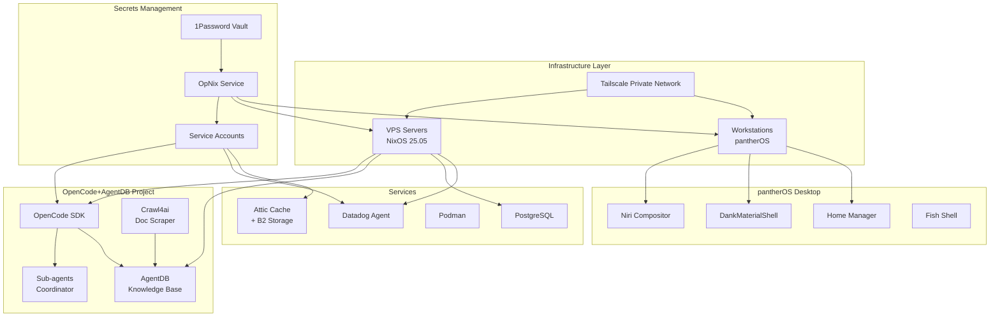
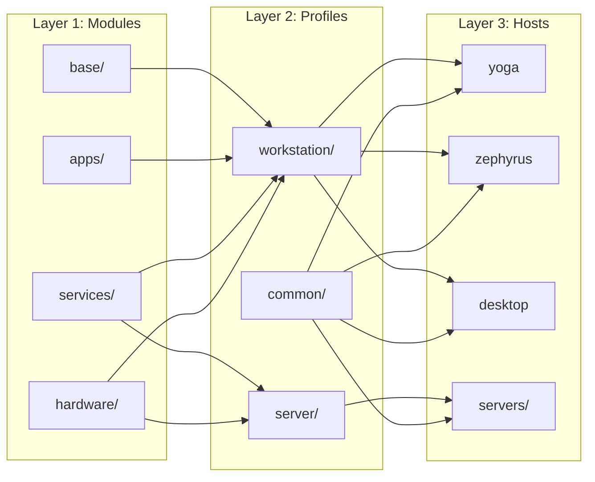
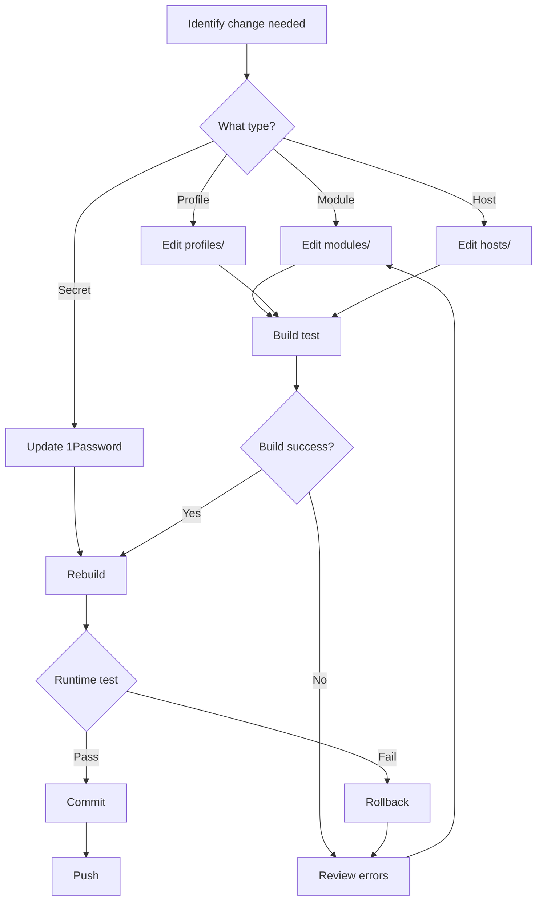

# Master Project Brief

**Version**: 2.0  
**Last Updated**: 2025-11-15  
**Owner**: Hayden  
**Status**: Multi-phase development in progress

---

## Executive Summary

This document provides a unified overview of two interconnected projects that form a comprehensive self-hosted AI agent and NixOS infrastructure ecosystem:

1. **OpenCode + AgentDB Infrastructure**: Self-hosted AI agent framework with persistent knowledge management
2. **pantherOS**: Declarative NixOS configuration system with advanced desktop environment and secrets management

Both projects leverage shared infrastructure (Tailscale, NixOS, 1Password/OpNix) and are designed for reproducibility, security, and extensibility.

---

## System Architecture Overview



---

## Project 1: OpenCode + AgentDB Infrastructure

### Purpose
Build a self-hosted AI agent infrastructure that combines OpenCode (agent framework), AgentDB (knowledge base), and Crawl4ai (documentation scraper) to enable autonomous agents with persistent, automatically-growing knowledge.

### Current Phase
**Phase 1**: Local MVP (5-10 hours)

### Key Technologies
- **OpenCode SDK**: Agent framework (Go/Python/JavaScript)
- **AgentDB**: Vector-capable knowledge base
- **Crawl4ai**: Async documentation scraper
- **PostgreSQL**: Persistent storage
- **NixOS**: Infrastructure as code
- **Tailscale**: Secure private networking

### Success Criteria
- Crawl4ai extracts clean markdown
- Documents stored in AgentDB
- Agents query and utilize knowledge
- Sub-agents coordinate in parallel
- Accessible via SSH/web from any device

### Reference
See [`02_OPENCODE_AGENTDB_BRIEF.md`](./02_OPENCODE_AGENTDB_BRIEF.md) for complete implementation details.

---

## Project 2: pantherOS NixOS Configuration

### Purpose
Declarative, reproducible NixOS configuration system for workstations and servers with advanced desktop environment (Niri + DankMaterialShell), secure secrets management (OpNix), and modular architecture.

### Current Status
**Active Development**: Desktop environment integration, service configurations

### Key Technologies
- **NixOS 25.05**: Base operating system
- **Niri**: Wayland compositor
- **DankMaterialShell**: Greeter + shell
- **OpNix**: 1Password integration for secrets
- **Home Manager**: User environment management
- **Disko**: Declarative disk layouts
- **Podman**: Rootless containers

### System Organization



### Success Criteria
- Single flake for all systems
- Reproducible builds
- Secure secret management
- Clean module separation
- Desktop environment functional
- All services integrated

### Reference
See [`03_PANTHEROS_NIXOS_BRIEF.md`](./03_PANTHEROS_NIXOS_BRIEF.md) for complete configuration details.

---

## Shared Infrastructure

### Tailscale Private Network
- **Purpose**: Secure access to VPS and workstations
- **Integration**: Both projects use Tailscale for networking
- **Secrets**: Auth keys managed via OpNix

### 1Password + OpNix Secrets Management
- **Vault**: `pantherOS`
- **Service Account**: Centralized for all systems
- **Integration**: NixOS and Home Manager modules
- **Pattern**: `op://pantherOS/{service}/{environment}/{field}`

#### Secret Organization
```
op://pantherOS/
├── tailscale-auth-key/authKey
├── github-pat/token
├── datadog/
│   ├── default/{hostUrl,appKey}
│   └── ovh-cloud-vps/apiKey
├── minimax-coding-plan-api/default/{apiKey,baseUrl,baseAnthropicUrl}
├── zai-coding-plan-api/default/{apiKey,baseUrl}
├── attic/b2/{keyId,appKey}
└── ssh/{device}/{privateKey}
```

### VPS Infrastructure
- **Provider**: Hetzner/DigitalOcean
- **OS**: NixOS 25.05
- **Management**: Declarative via flake
- **Access**: SSH via Tailscale
- **Services**: OpenCode, AgentDB, PostgreSQL, Datadog

### Monitoring & Observability
- **Datadog Agent**: System and service metrics
- **Tags**: `role:{workstation|server}`, `provider:{ovh|hetzner}`, `owner:hayden`
- **Integration**: OpNix for API keys

---

## Development Workflow

### Initial Setup
```bash
# 1. Clone repository
git clone <repo-url>
cd pantherOS

# 2. Configure 1Password service account
sudo opnix token set

# 3. Build system configuration
nix build .#nixosConfigurations.{hostname}.config.system.build.toplevel

# 4. Deploy
sudo nixos-rebuild switch --flake .#{hostname}
```

### Making Changes



### Testing Strategy
1. **Build-time**: `nix flake check`
2. **Test deployment**: `nixos-rebuild test`
3. **Validation**: Manual verification of services
4. **Rollback**: `nixos-rebuild switch --rollback` if needed

---

## File Structure

```
pantherOS/
├── flake.nix                          # Main flake with all inputs
├── flake.lock                         # Pinned dependencies
│
├── lib/                               # Helper functions
│   ├── mkSystem.nix                   # System builder
│   ├── mkHome.nix                     # Home manager builder
│   └── secrets.nix                    # OpNix helpers
│
├── modules/                           # Atomic components
│   ├── base/{nix,shell,security}.nix
│   ├── apps/browser.nix
│   ├── containers/podman.nix
│   ├── services/{tailscale,datadog,attic}.nix
│   ├── hardware/{laptop,server}.nix
│   └── networking/{workstation,server}-net.nix
│
├── profiles/                          # Composed configurations
│   ├── workstation/{gui,devtools}.nix
│   ├── server/{base,observability}.nix
│   └── common/{time-locale,ssd-trim}.nix
│
├── hosts/                             # Per-machine configs
│   ├── yoga/
│   ├── zephyrus/
│   ├── desktop/
│   └── servers/ovh-cloud-vps/
│
├── home/                              # Home Manager configs
│   ├── common/{shells,editors,git,ui}.nix
│   └── hayden/default.nix
│
├── secrets/                           # OpNix configuration
│   ├── map.nix                        # Secret definitions
│   └── templates/                     # Secret templates
│
├── opencode-agentdb/                  # Agent infrastructure
│   ├── src/{crawl,agent,db}.py
│   ├── nix/modules/                   # NixOS service modules
│   ├── tests/
│   └── config/
│
└── docs/                              # This documentation
    ├── 00_TOPIC_MAP.md
    ├── project_briefs/
    ├── technical_references/
    ├── implementation_guides/
    └── code_snippets/
```

---

## Dependencies & Requirements

### Software Requirements
- **NixOS**: 25.05 (or nix-darwin for macOS)
- **Flakes**: Enabled (`experimental-features = ["nix-command" "flakes"]`)
- **1Password**: Service account with vault access
- **OpNix**: Installed via flake input
- **Tailscale**: For network access

### Hardware Requirements

**Workstations:**
- CPU: Modern x86_64 or aarch64
- RAM: 8GB+ (16GB recommended)
- Storage: 256GB+ SSD
- GPU: Wayland-compatible for Niri

**VPS Servers:**
- CPU: 2-4 vCPU
- RAM: 4GB+ (8GB for OpenCode+AgentDB)
- Storage: 20GB+ (depends on knowledge base)
- Network: Static IP or DNS

### External Services
- **1Password**: Business/Teams plan with service accounts
- **Tailscale**: Free tier sufficient
- **Datadog**: Pro tier for advanced monitoring (optional)
- **Backblaze B2**: For Attic cache storage
- **OpenCode**: SDK access
- **AgentDB**: Instance at agentdb.ruv.io

---

## Current Priorities

### Phase 1 (Immediate)
- [x] NixOS 25.05 base configuration
- [x] OpNix integration for secrets
- [ ] OpenCode+AgentDB local MVP
- [x] Niri + DankMaterialShell desktop
- [ ] All services operational

### Phase 2 (Next Month)
- [ ] VPS deployment for OpenCode+AgentDB
- [ ] Automated documentation crawling
- [ ] Sub-agent coordination
- [ ] Desktop environment refinement
- [ ] Service monitoring dashboards

### Phase 3 (Future)
- [ ] Web interface for agents
- [ ] Multi-host orchestration
- [ ] Advanced knowledge base queries
- [ ] Custom NixOS modules published
- [ ] Documentation site

---

## Risk Management

### Technical Risks

| Risk | Impact | Mitigation |
|------|--------|-----------|
| OpNix API changes | High | Pin version, wrapper layer |
| AgentDB performance issues | Medium | Vector indexing, caching |
| Niri stability on production | Medium | Fallback compositor configured |
| Secret leaks | Critical | Strict file permissions, audit logs |
| VPS downtime | Medium | Automated backups, monitoring |

### Operational Risks

| Risk | Impact | Mitigation |
|------|--------|-----------|
| 1Password service account expiry | High | Calendar reminders, monitoring |
| Breaking NixOS changes | Medium | Pin nixpkgs, test in VM first |
| Tailscale network issues | Medium | SSH fallback configured |
| Disk space exhaustion | Low | Automated cleanup, monitoring |

---

## Success Metrics

### OpenCode+AgentDB
- Agent response quality with knowledge base
- Sub-agent coordination success rate
- Knowledge base growth rate
- System uptime (target: 99%+)

### pantherOS
- Build reproducibility (target: 100%)
- Secret rotation compliance
- Desktop environment stability
- Module reusability across hosts

---

## Team Collaboration

### For AI Coding Agents
When working on this project:

1. **Read context**: Start with `00_TOPIC_MAP.md` → this file → specific brief
2. **Check existing code**: Review `code_snippets/` for patterns
3. **Follow structure**: Use established module organization
4. **Test incrementally**: Use "pause & test" methodology
5. **Update docs**: Reflect changes in relevant guides

### Communication Patterns
- **Blockers**: Document in `GAPS_AND_IMPLEMENTATIONS.md`
- **Questions**: Reference specific document sections
- **Changes**: Update version history in modified docs
- **Errors**: Include in troubleshooting guides

---

## Quick Reference Links

### Project Briefs
- [OpenCode + AgentDB](./02_OPENCODE_AGENTDB_BRIEF.md)
- [pantherOS NixOS](./03_PANTHEROS_NIXOS_BRIEF.md)

### Technical Documentation
- [OpNix Complete Reference](../technical_references/OPNIX_COMPLETE_REFERENCE.md)
- [NixOS Modules Reference](../technical_references/NIXOS_MODULES_REFERENCE.md)
- [Architecture Diagrams](../technical_references/ARCHITECTURE_DIAGRAMS.md)

### Implementation Guides
- [Secrets Management](../implementation_guides/SECRETS_MANAGEMENT_GUIDE.md)
- [Desktop Environment Setup](../implementation_guides/DESKTOP_ENVIRONMENT_GUIDE.md)
- [Service Integration Patterns](../implementation_guides/SERVICE_INTEGRATION_PATTERNS.md)
- [Gaps & Solutions](../implementation_guides/GAPS_AND_IMPLEMENTATIONS.md)

---

## Version History

| Version | Date | Changes |
|---------|------|---------|
| 2.0 | 2025-11-15 | Consolidated documentation, merged duplicates |
| 1.0 | 2025-11-14 | Initial separate project briefs |

---

**Next Steps**: Review specific project brief for implementation details, then consult technical references and implementation guides as needed.
